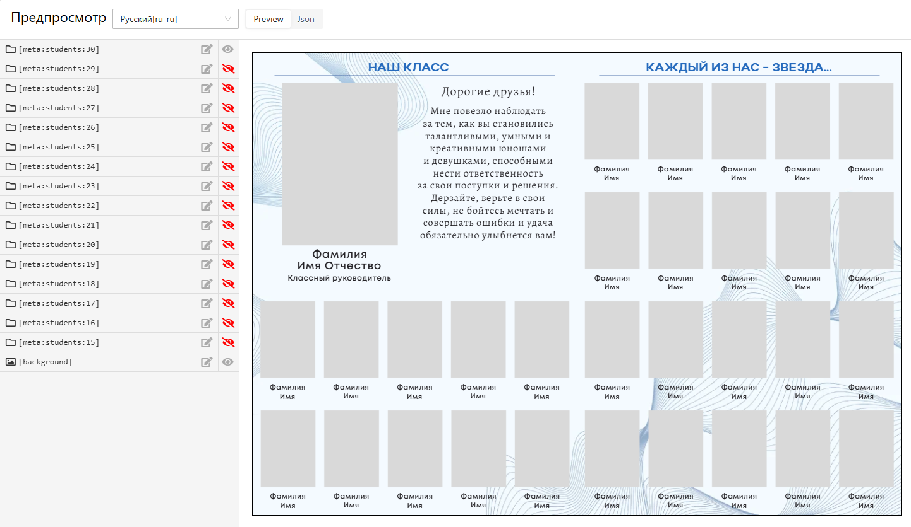

# Общая информация

* В сервисе “Мой Выпускной” генерация альбомов строится на основе __многослойных PSD-файлов__ (макетов). Это позволяет автоматически располагать фотографии в нужные рамки и заменять содержимое текстовых слоев. Каждый слой при этом содержит в названии специальный ключ, определяющий его семантику. В сервисе предусмотрены размещение фотографий следующих типов: __на обложку, персональный портрет, общий портрет (виньетка), педагог, групповой, репортаж, учебное заведение__.
* Набор макетов одной тематики и одного типа продукта называется __шаблоном__. Для каждого выбранного продукта типографии определяется шаблонный дизайн (__пресет__), который в свою очередь состоит из конечного набора макетов одного шаблона. Простыми словами шаблон определяет все возможные комбинации раскладок фотографий, а пресет - определенный их набор.
* В сервисе доступно несколько стандартных шаблонов с различными комбинациями раскладок. Помимо этого в систему [интегрированы шаблоны](/general/third-party-templates) сторонних дизайнеров - [Ксении Федоровой](https://mirramian.art/) и [Ирины Мироновой](https://mironova.studio/). Однако они подключаются по запросу - после покупки на официальном сайте и подтверждения факта оплаты.
* Отдельно стоит отметить, что макеты с табло учеников и педагогов фактически содержат в себе __различные раскладки портретов__. Например, в стандартных шаблонах макеты содержат раскладки от 15 до 30 учеников.

* Мы понимаем, что подготовка макетов со специальной разметкой - это нелегкий труд. Поэтому при подключении к сервису мы бесплатно адаптируем два ваших шаблона. Другие шаблоны также могут быть адаптированы нашей командой, но за дополнительную плату.
* По умолчанию система поддерживает лишь определенный __список шрифтов из набора Google Fonts__, а также некоторые шрифты не из данной коллекции. При этом допускается __загрузка собственных шрифтов__ в систему.
* Также до конца 2025 года в сервисе будет реализована возможность создавать шаблоны прямо в редакторе, в том числе загружая PSD-файлы в качестве заготовок.