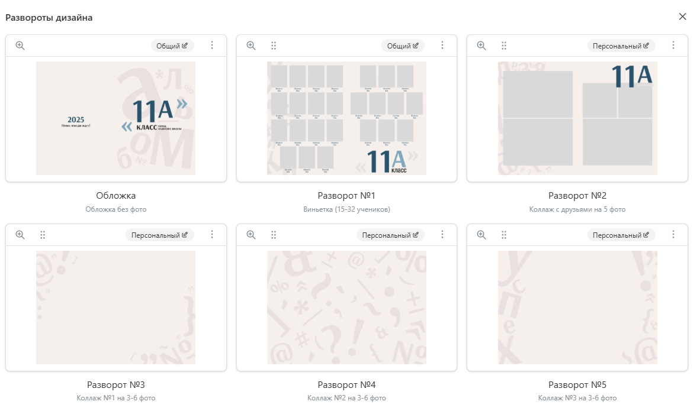
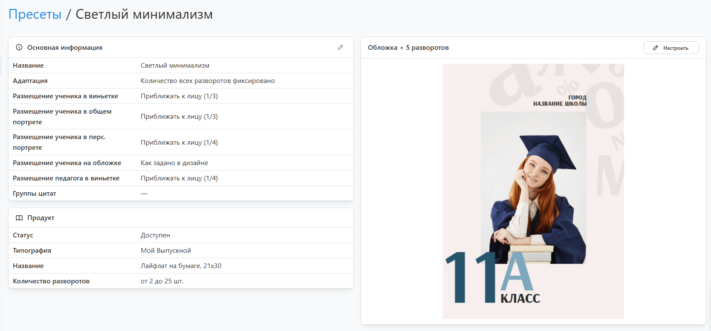

# Настройка пресета

* __Пресет__ - скомпонованный дизайн из макетов выбранного шаблона для определенного продукта типографии с фиксированным количеством разворотов. Использование готовых пресетов избавляет от необходимости для каждого проекта настраивать дизайн заново.
* Основная работа по настройке заключается в выборе для обложки и каждого разворота подходящего макета из шаблона, который в свою очередь выбирался при создании пресета. 

* Если дизайн подразумевает размещение общих портретов наразных страницах (например, от 1 до 4 фото на странице), то при компоновке достаточно добавить лишь один соответствующий макет, а остальные развороты заполнить макетами с рамками для репортажей или коллажами. Далее, при использовании настройки пресета “__Адаптация__” система автоматически добавит необходимое их количество под проект. В одном случае макеты с общими портретами будут замещаться макетами с коллажами или рамками, а в другом - просто добавляться, увеличивая общее количество разворотов в альбоме.
* При размещении портрета на обложку, в общий или персональный портрет сервис по умолчанию приближает его таким образом, чтобы голова была 1/3 по высоте рамки. Плюс к этому алгоритм добивается для всех учеников и педагогов единого размера голов, а также единого их размещения по горизонтали и вертикали. Данную логику позиционирования можно отключить как через специальный ключ в разметке макета (например, для виньеток в полный рост), так и в пресете через настройки "__Размещение ученика/педагога...__". 
* Еще одной настройкой пресета, которая может пригодиться, является задание __групп цитат__. Помимо ввода собственного текста в сервисе предусмотрен выбор цитат либо из группы, указанной в настройках пресета, либо среди всех цитат, соответствующих типу проекта. Использование группы цитат в пресете нужно в том случае, когда стандартные цитаты не подходят по дизайну. Например, если дизайн предполагает размещение цитаты вдоль длинной стороны страницы, т.е. нужны длинные строки текста вместо стандартных коротких.

