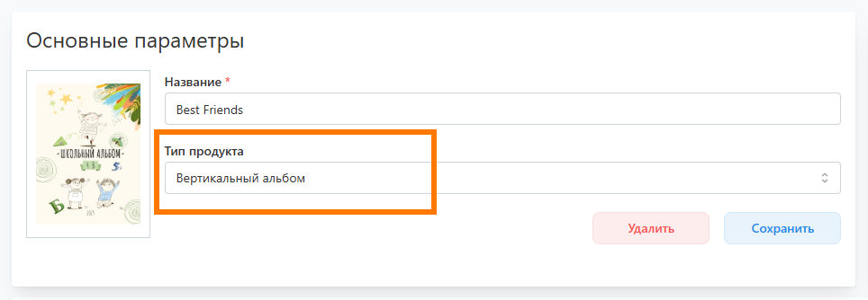

# Работа с шаблонами и пресетами
## Создание собственного шаблона
* Для создания шаблона со своим дизайном необходимо:
    + В разделе "__Дизайны / Шаблоны__" нажать кнопку "__Загрузить свой__" и задать название шаблона.
    
    
    + В открывшейся странице шаблона загрузить PSD-макеты.
    
    
    + Для каждого макета задать характеристики: значение персонализации разворота; набор доступных разворотов
    
* Любой макет можно скачать, заменить на другой и посмотреть структуру слоев.
* 
* Также в настройках шаблона обязательно требуется загрузить обложку и задать “__Тип продукта__”. По умолчанию считается, что шаблон подготавливается для вертикального альбома.
* 

## Добавление шаблона из галереи
* В сервис интегрированы десятки бесплатных и авторских шаблонов от сторонних дизайнеров. Для добавления шаблона из галереи для последующего использования необходимо:
    + В разделе "__Дизайны / Шаблоны__" нажать кнопку "__Добавить из галереи__".
    

    + В открывшемся модальном окне отфильтровать шаблоны по продукту, стоимости и автору.
    

    + Если требуется посмотреть содержимое шаблона, то можно нажать на иконку предпросмотра.
    

    + Для добавления шаблона выделить его и нажать кнопку "__Добавить__".
    
* Для разблокировки авторского шаблона предварительно отправить нам подтверждение факта его покупки.

## Настройка пресета по шаблону
### Создание пресета
* __Пресет__ - скомпонованный дизайн из макетов выбранного шаблона для определенного продукта типографии. Использование готовых пресетов избавляет от необходимости для каждого проекта настраивать дизайн заново.
* Для создания пресета необходимо:
    + В разделе "__Дизайны / Пресеты__" нажать кнопку "__Добавить__".
    

    + В открывшемся модальном окне выбрать продукт, для которого будет создавать пресет, и шаблон.
    
    
    + В открывшемся модальном окне добавить макеты из шаблона, из которых будет состоять дизайн.
    
    
    + На странице пресета нажать иконку карандаша у блока "__Информация__" и задать параметры пресета.
    
    
### Размещение портретов по страницам
* Если дизайн подразумевает размещение общих портретов учеников на разных страницах (например, от 1 до 4 фото на странице), то он может быть скомпоновам двумя способами:
    + В дизайн добавляется необходимое количество различных макетов под определенное количество учеников в проекте. В этом случае последний макет с общими портретами может отличаться от первого, если учеников будет недостаточно. В стандартных и дизайнерских шаблонах заранее подготовлены такие макеты - в них появляются репортажи в местах отсутствия портретов. В итоге после генерации альбома его внешний вид будет идентичен тому, как настроен его дизайн.
    + В дизайн добавляется лишь один макет с общими портретами, а остальные развороты заполняются макетами для репортажей. И включается настройка “__Адаптация__”:
        + __Количество всех разворотов фиксировано__ - в этом случае сервис автоматически увеличит макеты с общими портретами под нужное количество учеников в проекте, убирая при этом развороты с препортажами, чтобы общее количество разворотов осталось изначальным.
        + __Количество репортажных разворотов фиксировано__  - в этом случае сервис автоматически увеличит макеты с общими портретами под нужное количество учеников в проекте, при этом не удаляя развороты с репортажами. Т.е. в данном случае количество разворотов альбома может быть увеличено.
### Размещение портретов в рамках
* В сервисе предусмотрено несколько типов рамок для вставки в них портретных фотографий, однако за логику заполнение рамки отвечает соответствующая настройка (например, "__Размещение ученика в виньетке__"):
    + __Приближать к лицу (1/3)__ - в этом случае сервис приближает фотографию таким образом, чтобы голова занимала 1/3 по высоте рамки и располагалась с небольшим отступом от верхней границы.
    + __Приближать к лицу (1/4)__ - тоже самое, что в пункте выше, но с размещением головы в 1/4 по высоте.
    + __Вставлять оригинал__ - заполнение рамки без увеличения фотографии (например, если требуется размещение портета в полный рост).

### Размещение памятных цитат
* В случае, если дизайн предполагает размещение памятных цитат, то есть три варианта их размещения:
    + Ученик может написать собственный текст.
    + Ученик может выбрать цитату из справочника, если это разрешено настройками сервиса. Справочник цитат формируется в разделе "__Цитаты__".
* Однако не всегда стандартные цитаты по размеру подходят под дизайн (например, дизайн предполагает размещение цитаты вдоль длинной стороны страницы, т.е. нужны длинные строки текста вместо стандартных коротких). В этом случае необходимо:
    + Задать нестандартные цитаты и объединить их в группу.
    + В настройке пресета выбрать эту группу в поле "__Группы цитат__".