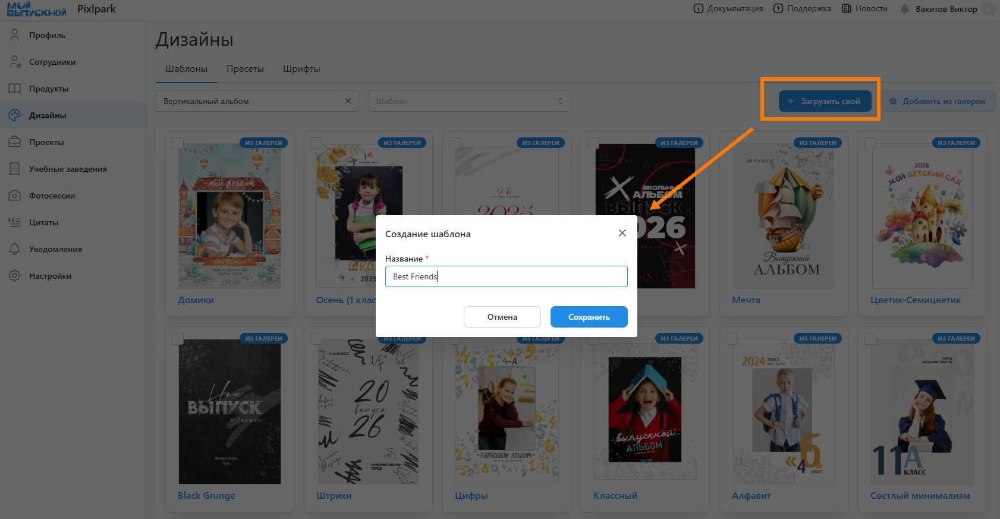
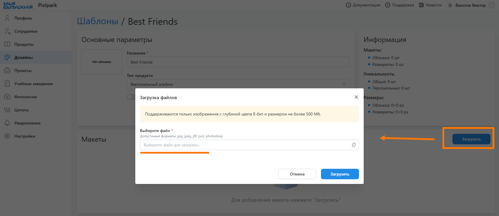
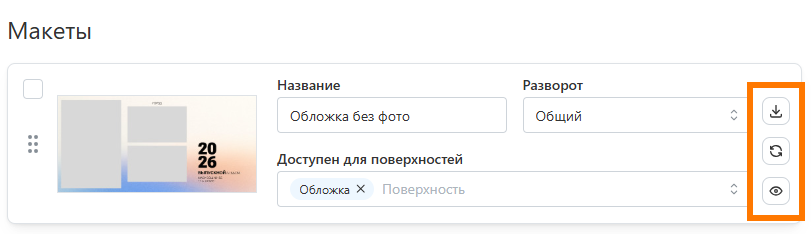
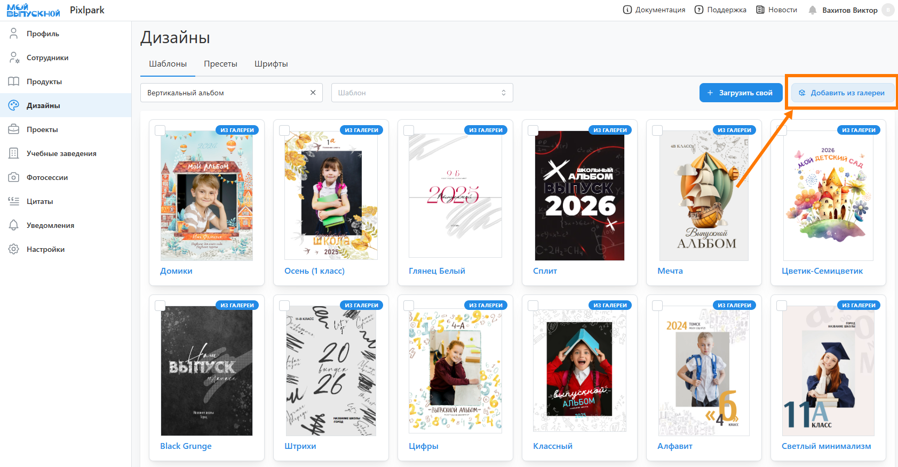
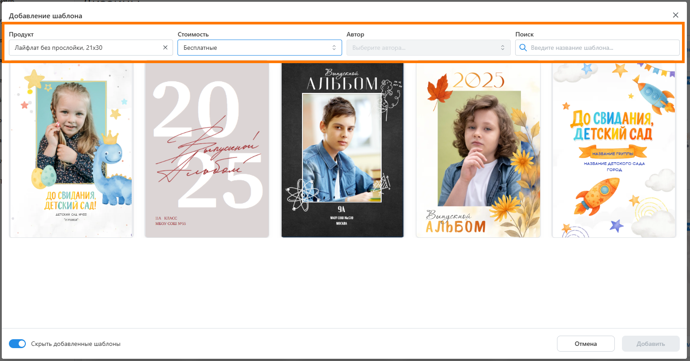
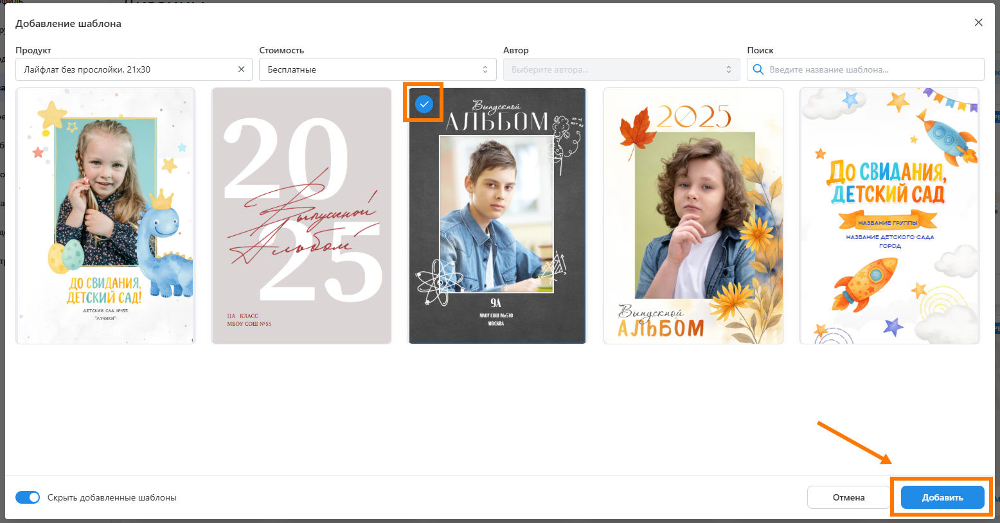
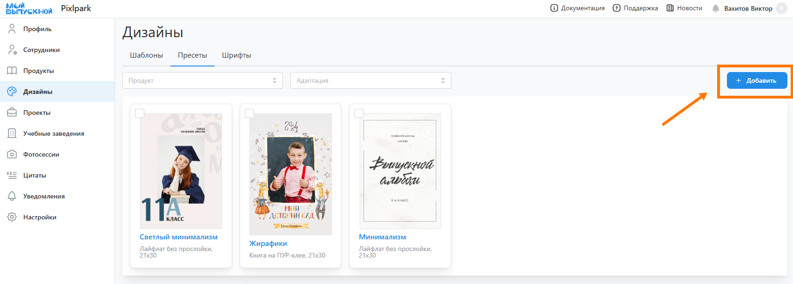
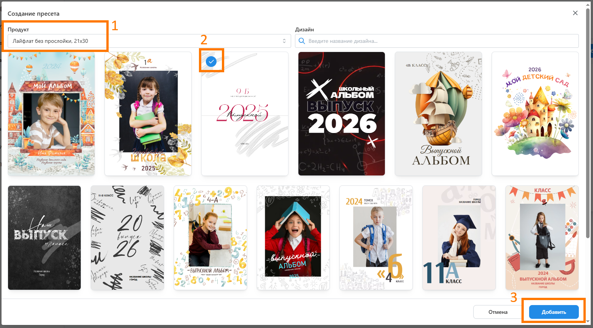
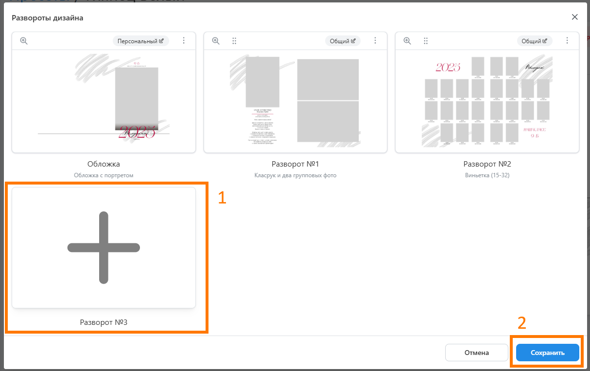
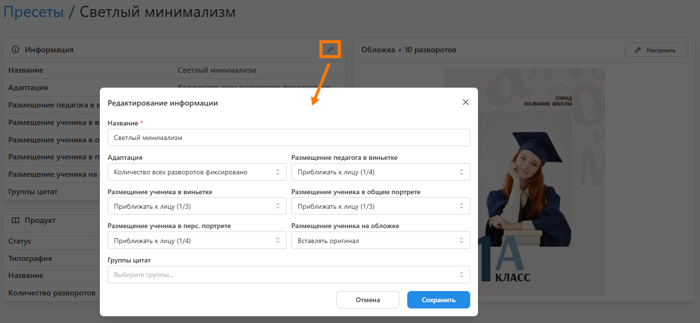

# Работа с шаблонами и пресетами
## Создание собственного шаблона
* Для создания шаблона со своими макетами необходимо:
    + В разделе "__Дизайны / Шаблоны__" нажать кнопку "__Загрузить свой__" и задать название шаблона.
    
    + На странице шаблона указать его параметры:
        + Загрузить обложку (либо она будет создана автоматически при загрузке первого макета);
        + Задать тип продукта и ориентацию, для которого создан шаблон.
        + Задать способ применения макетов: по страницам - для адаптивного дизайна, на весь разворот - если макеты подготовлены в строгом соответствии с требованиями типографии.
        + Задать шаблон с раскладками, если текущий будет содержать лишь обложки, а макеты для разворотов будут использоваться из другого шаблона.
        + Загрузить изображение, которое будет автоматически становиться фоном для макетов шаблона с раскладками.       
    + Загрузить подготовленные PSD-макеты.
        
    + Для каждого макета задать характеристики: значение персонализации и набор доступных разворотов.
    
* Отметим, что любой макет можно скачать, заменить на другой или посмотреть структуру слоев. Последнее удобно для проверки именования слоев, когда при генерации альбома данные размещаются с ошибкой.

## Добавление шаблона из галереи
* Для добавления готового шаблона из галереи необходимо:
    + В разделе "__Дизайны / Шаблоны__" нажать кнопку "__Добавить из галереи__".
    
    + В открывшемся модальном окне отфильтровать шаблоны по типу продукта, тематике и стоимости.
    
    + Если требуется посмотреть содержимое шаблона, то можно нажать на иконку предпросмотра.
    
    + Для добавления шаблона выделить его и нажать кнопку "__Добавить__".
    
* Дл разблокировки возможности добавления авторского шаблона предварительно отправить нам подтверждение факта его покупки на сайте автора.

## Настройка пресета по шаблону
* __Пресет__ - скомпонованный дизайн из макетов выбранного шаблона. Использование готовых пресетов избавляет от необходимости для каждого проекта настраивать дизайн заново.
* Для создания пресета необходимо:
    + В разделе "__Дизайны / Пресеты__" нажать кнопку "__Добавить__".
    
    + В открывшемся модальном окне выбрать шаблон, из макетов которого будет создаваться пресет.
       
    + На следующей этапе скомпоновать дизайн из макетов шаблона.
       
    + На странице пресета в блоке "__Информация__" задать его параметры, ориентируясь на статью по [размещению данных](/faq/settings).
    