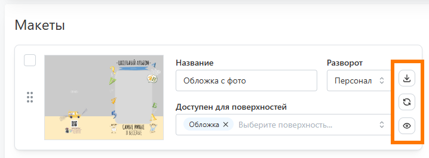
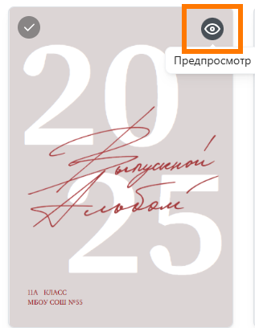

# Работа с шаблонами и пресетами
## Создание собственного шаблона
* Для создания шаблона со своим дизайном необходимо:
    + В разделе "__Дизайны / Шаблоны__" нажать кнопку "__Загрузить свой__" и задать название шаблона.
    

    + В открывшемся окне указать параметры шаблона:
        + Загрузить обложку (либо она будет создана автоматически при загрузке первого макета);
        + Задать тип продукта и ориентацию, для которого создан шаблон.
        + Задать способ применения макетов: по страницам - для адаптивного дизайна, на весь разворот - если макеты подготовлены в строгом соответствии с требованиями типографии.
        + Задать шаблон с раскладками, если текущий будет содержать лишь обложки, а макеты для разворотов будут использоваться из другого шаблона.
        + Загрузить изображение, которое будет автоматически становиться фоном для макетов шаблона с раскладками. 
        
    + Загрузить подготовленные PSD-макеты.
    
    
    + Для каждого макета задать характеристики: значение персонализации и набор доступных разворотов.
    

* Отметим, что любой макет можно скачать, заменить на другой или посмотреть структуру слоев. Последнее удобно для проверки именования слоев, когда при генерации альбома данные размещаются с ошибкой.

## Добавление шаблона из галереи
* В сервис интегрированы десятки бесплатных и авторских шаблонов от сторонних дизайнеров. Для добавления шаблона из галереи и последующего использования необходимо:
    + В разделе "__Дизайны / Шаблоны__" нажать кнопку "__Добавить из галереи__".
    

    + В открывшемся модальном окне отфильтровать шаблоны по продукту и стоимости.
    

    + Если требуется посмотреть содержимое шаблона, то можно нажать на иконку предпросмотра.
    

    + Для добавления шаблона выделить его и нажать кнопку "__Добавить__".
    
* Для разблокировки авторского шаблона предварительно отправить нам подтверждение факта его покупки.

## Настройка пресета по шаблону
* __Пресет__ - скомпонованный дизайн из макетов выбранного шаблона. Использование готовых пресетов избавляет от необходимости для каждого проекта настраивать дизайн заново.
* Для создания пресета необходимо:
    + В разделе "__Дизайны / Пресеты__" нажать кнопку "__Добавить__".
    

    + В открывшемся модальном окне выбрать шаблон, из макетов которого будет создаваться пресет.
    
    
    + На следующей этапе выбрать из макетов шаблона скомпоновать дизайн.
    
    
    + На странице пресета отредактировать настройки в блоке "__Информация__". У нас подготовленны отдельные статьи по [размещению данных]/faq/settings#размещение-данных-в-дизайне() и [работе с цитатами](/faq/settings).
    