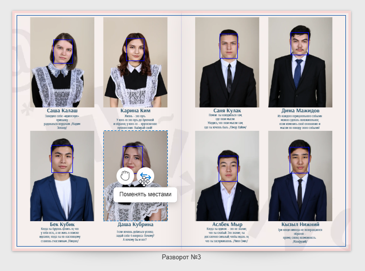
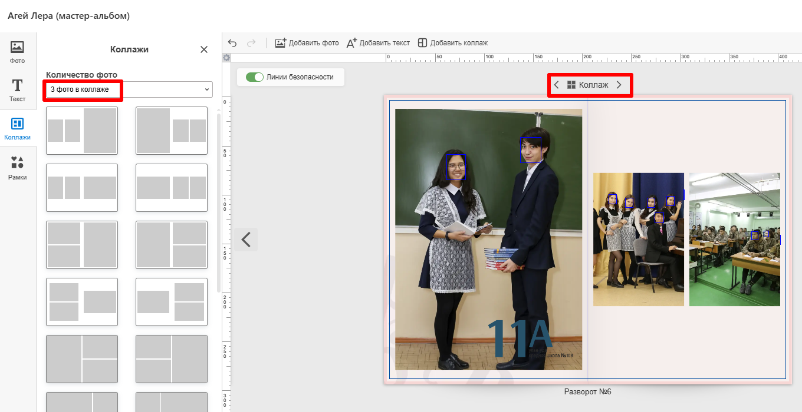
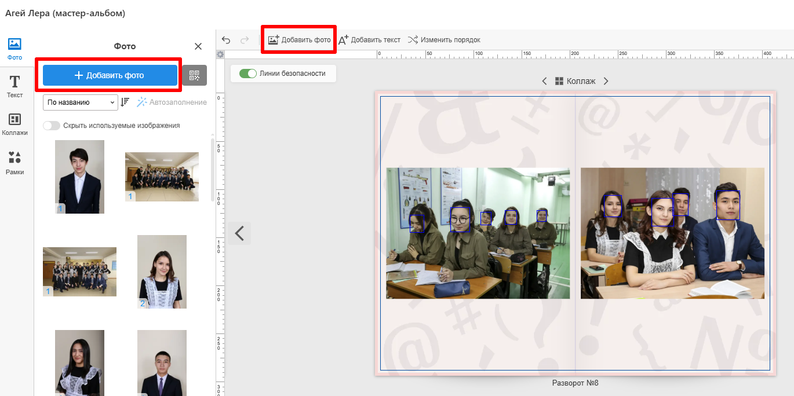
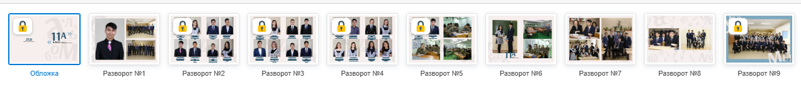

# Работа в редакторе

## Как поменять местами учеников
* Для того чтобы поменять местами двух учеников, необходимо:
    1. Зажать левой кнопкой мыши (или пальцем на мобильных устройствах) кнопку с двумя разнонаправленными стрелочки на фото первого ученика.
    2. Перетащить фотографию до рамки второго ученика и отпустить над ней.
    3. Если рамка второго ученика расположена на другом развороте, то сперва фотографию необходимо перетащить на нужный разворот в панели с разворотами.
* Описанный выше алгоритм заменяет не только фотографии, но и ФИО вместе с цитатами.

## Как поменять местами педагогов
* Поменять местами двух педагогов в дизайне можно несколькими способами:
    1. В разделе "Участники" нажать кнопку "три точки" и выбрать действие "Задать порядок педагогов". В открывшемся окне установить необходимый порядок и запустить генерацию альбомов заново.
    2. Открыть мастер-альбом и поменять местами педагогов путем перетаскивания одной фотографии на другую (аналогично ученикам, см. пункт выше).

## Как изменить раскладку коллажей
* Для изменения раскладки коллажей необходимо:
    1. В панели слева переключиться на вкладку "Коллажи".
    2. Нажать на понравившуюся раскладку - она применится к текущему развороту.
    3. Также можно изменять раскладку через элемент управления "карусель", который расположен над разворотом.
    

## Как добавить фотографию
* Для добавления фотографии необходимо:
    1. В панели слева переключиться на вкладку "Фото" и нажать кнопку "Добавить фото". 
    2. В открывшемся модальном окне либо выбрать снимок из фотосессии, либо загрузить новый (если это позволяет текущее состояние проекта).
    3. Перетащить выбранный снимок из боковой панели на рабочую область.    
     

## Как отредактировать разворот с “замочком”
* Иконка замочка появляется в редакторе у тех разворотов, которые являются общими. А они редактируются только в мастер-альбомах. Соответственно, для внесения правок в такой разворот необходимо:
    1. Открыть мастер-альбом текущего дизайна.
    2. Внести необходимые изменения на развороте.
    3. Сохранить мастер-альбом с нужными параметрами.
     

## Как изменить дизайн виньетки
* Иногда при подготовке дизайна требуется одновременно изменить внешний вид виньетки или всех портретов учеников (даже если они расположены на разных разворотах). Для этого необходимо:
    1. Кликунуть левой кнопкой мыши на интересующий объект: рамку с общим портретом, ФИО или цитату. Таким образом мы выделим интересующий объект.
    2. В панели выше нажать кнопку "__Режим синхронизации__". Данным действием мы указываем, что применяемые изменения над текущим объектом будут применяться и к аналогичным.
    3. Выполнить необходимое действие:
        + Изменить размер или положение рамки с фото.
        + Изменить размер, положение, цвет, шрифт и начертание текста.