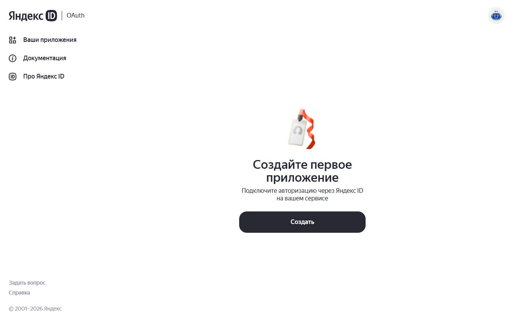
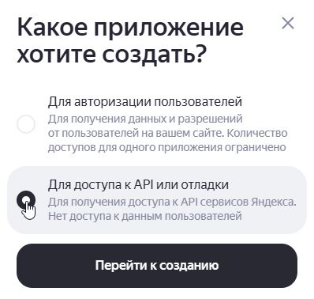
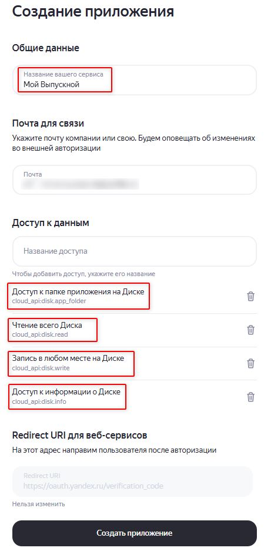
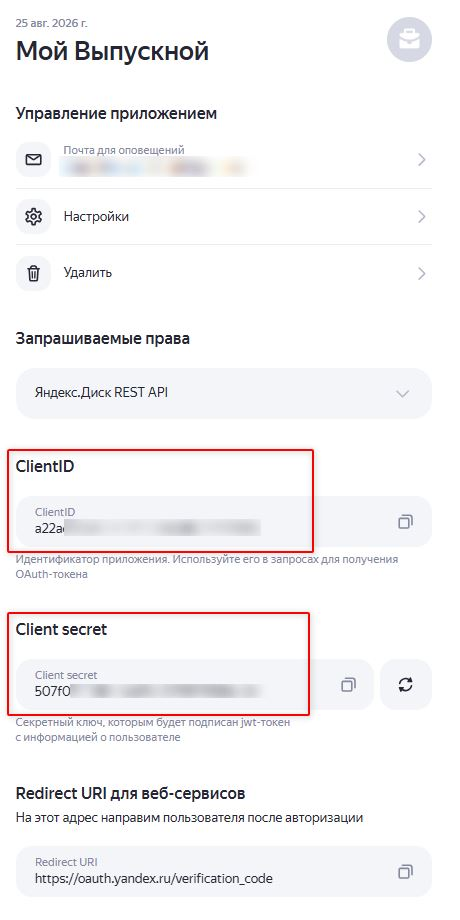
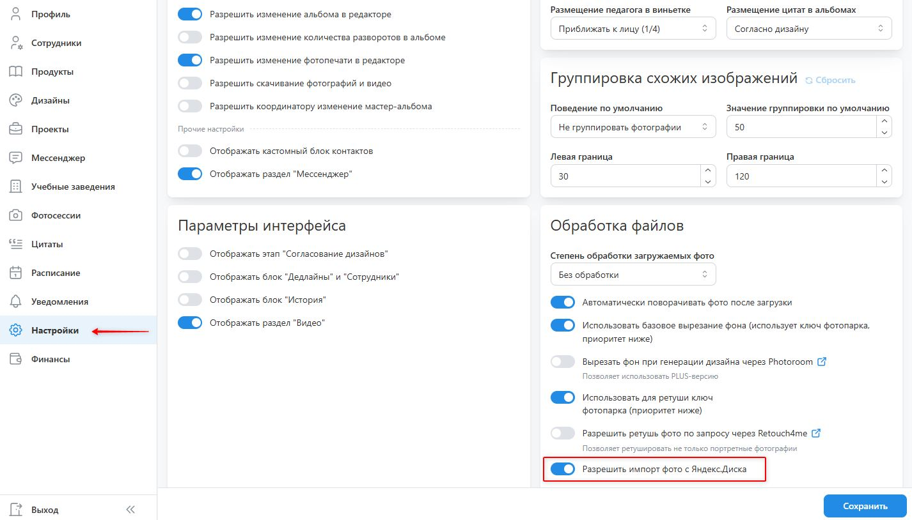
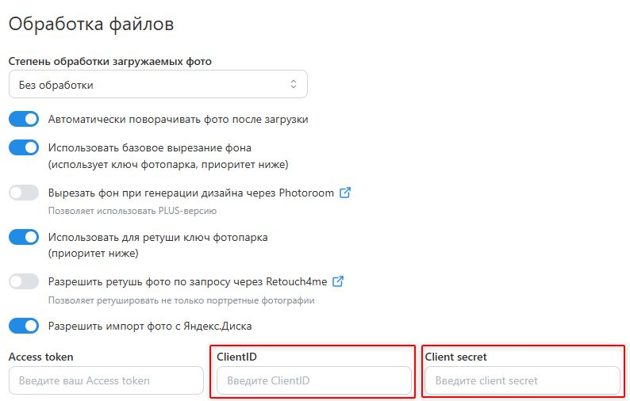
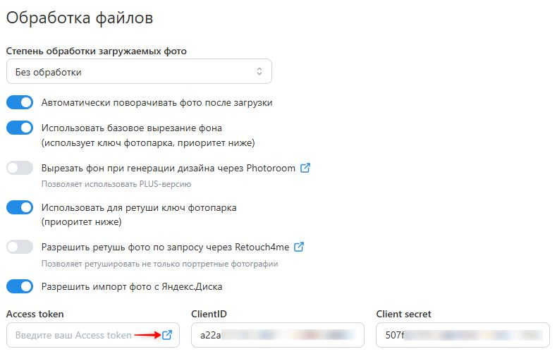
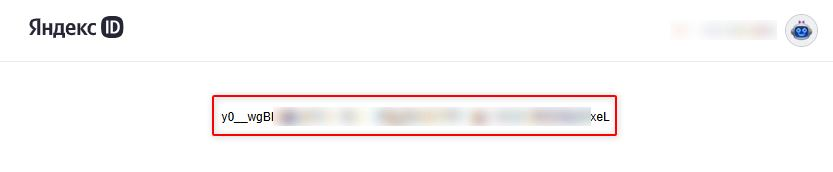
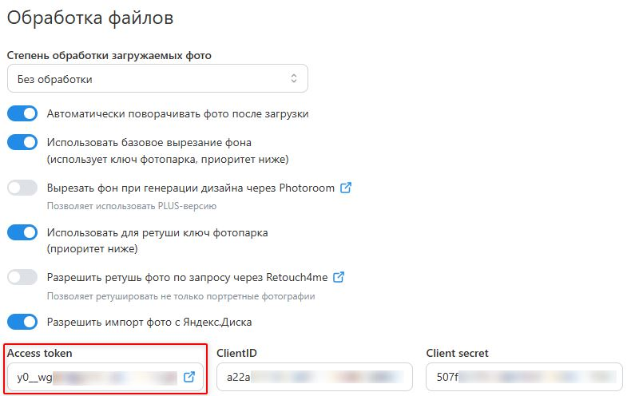
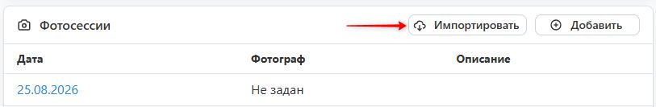

# Сторонние интеграции
### Как подключить Photoroom
* Сервис [__Photoroom__](https://www.photoroom.com/) предназначен для автоматической вырезки фона у фотографий. При этом рамки под фотографии должны иметь специальные ключи:
    + ```[meta:cover without-bg bg-color:#FFFFFF]``` - фотография на обложку, у которой автоматически вырезается фон, а затем он заменяется на указанный цвет;
    + ```[meta:frame without-bg bg-color:#FFFFFF]``` - фотография на общий портрет с аналогичной логикой замены фона;
* Если в ключе не задать цвет, на который заменяется фоновое изображение, то в дизайне в качестве фона будет отображаться фоновая с названием слоя ```[placeholder]``` (подробнее об это можно почитать в разделе [подготовка макета](/design/mocku)).
* Для подключения данного функционала необходимо:
    + Зарегистрироваться в сервисе [Photoroom](https://app.photoroom.com/create).
    + В панели слева нажать "__Настройки__" и в открывшемся модальном окне перейти в "__Панель управления API__".
    + Проскролировать страницу до раздела "__Your plan__" и подключить один из предложенных вариантов тарифа:
        + __Basic__ - подойдет для удаления фона для предпросмотра дизайна, однако будет недостаточно для качественой печати. Поэтому перед утверждением альбома потребуется загрузка обработанных снимков через раздел проекта "__Обработка фото__".
        + __Plus__ - подойдет для удаления фона без необходимости последующей обработки (за счет применения ИИ-алгоритмов).
    + Вернуться на начало страницы до раздела "__API Keys__" и скопировать ключ из поля "__Live__".
    + Открыть панель управления сервисом "__Мой Выпускной__", перейти в раздел "__Настройки__", в блоке "__Обработка файлов__" включить __настройку вырезки фона__ и вставить ранее скопированный ключ. После чего нажать кнопку "__Сохранить__" в правом нижнем углу.
* Отметим, что в проекте в разделе "__Обработка фото__" вы сможете скачать как исходную версию фотографии, так и с вырезанным фоном. Это может потребоваться для корректировки автоматической вырезки фона или цветокоррекции, если изначально загружались файлы без обработки.

### Как подключить Retouch4me
* Сервис [__Retouch4me__](https://retouch4.me/ru) предназначен для автоматической ретуши фотографий.
* Для подключения данного функционала необходимо:
    + Зарегистрироваться в сервисе [Retouch4me](https://retouch4.me/auth?lng=ru).
    + На главной странице личного кабинета нажать кнопку "__Подписаться__" и подключить один из предложенных вариантов тарифа. Они отличаются лишь стоимостью обработки одной фотографии.
    + Обратиться в техническую поддержку за получением __API-ключа__ для облачной ретуши. Это можно сделать либо посредством онлайн-чата на сайте, либо нажав на ссылку "__Поддержка__" в профиле в правом верхнем углу.
    + Открыть панель управления сервисом "__Мой Выпускной__", перейти в раздел "__Настройки__", в блоке "__Обработка файлов__" включить __настройку ретуши фотографий__ и вставить полученный ключ. После чего нажать кнопку "__Сохранить__" в правом нижнем углу.
* После этого в проекте в разделе "__Обработка фото__" появится возможность выбора фотографий для автоматической ретуши.

### Как подключить Яндекс.Диск
* Интеграция с __Яндекс.Диском__ позволяет фотографам загружать фотографии один раз в привычное облачное хранилище, а затем напрямую импортировать их в сервис "__Мой Выпускной__", без повторной загрузки больших объемов файлов. Это экономит время, упрощает работу с большими фотоархивами и позволяет хранить оригиналы в __Яндекс.Диске__, не оплачивая дополнительное файловое хранилище внутри сервиса. 
> Бесплатно сервис "__Мой Выпускной__" предоставляет файловое хранилище объемом до 100 Гб.
* Для настройки интеграции необходимо выполнить следующие действия:
1. Зарегистрируйте приложение в __Яндекс OAuth__.
    1. Откройте [Яндекс OAuth](https://oauth.yandex.ru/).
    2. Создайте приложение.

        После входа в Яндекс OAuth выберите: __Создать приложение__.

        
        При создании приложения Яндекс предлагает выбрать тип приложения. Для интеграции с __Яндекс.Диском__ необходимо выбрать вариант: __Для доступа к API или отладки__

        
    3. Заполните информацию о приложении.

        Укажите:
        * название приложения;
        * контактную электронную почту;
        * необходимые права доступа.

        
    4. Создайте приложение.
2. Скопируйте Client ID и Client secret.

    После создания приложения откройте его страницу в Яндекс OAuth. В свойствах приложения будут отображаться поля:
    * Client ID;
    * Client secret.

    Скопируйте их.

    
3. Откройте настройки интеграции Яндекс.Диска в «Мой Выпускной».

    Настройки интеграции Яндекс.Диска расположены в панели управления сервисом "__Мой Выпускной__", в разделе "__Настройки__", в блоке "__Обработка файлов__", необходимо включить настройку __Разрешить импорт фото с Яндекс.Диска__.

    
4. Вставьте значения Client ID и Client secret в соответствующие поля.

    
5. Пройдите OAuth-авторизацию и получите Access token.

    После указания __Client ID__ и __Client secret__, в поле Access token будетдоступна ссылка для прохождения OAuth-авторизации, необходимо по ней перейти для получения Access token.

    
6. Вставьте полученное значение Access token в соответствующее поле.

    
    
7. Сохраните настройки.

    <!-- Нажмите на кнопку "__Сохранить__" в правом нижнем углу. -->

После этого в проекте в блоке "__Фотосессии__" появится возможность импорта папок фотографий по клику по кнопке "__Импортировать__".

