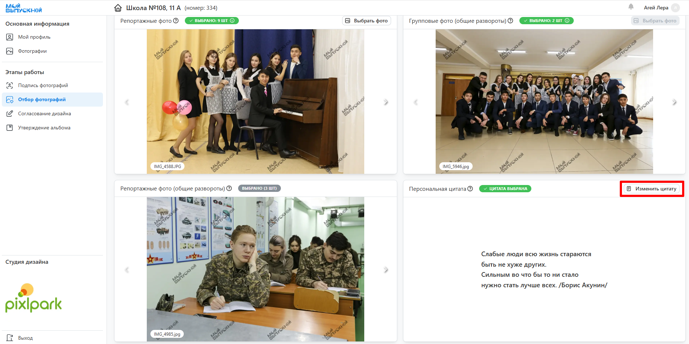

# Работа по проекту

### Как ученикам назначить разные дизайны
* Если ученики заказывают разные продукты или дизайны, необходимо выполнить следующие действия:

1. В проекте во вкладке “__Информация__” в блоке “__Дизайн__” добавить еще один или несколько дизайнов.

2. В профиле ученика во вкладке “__Личная информация__” в настройке “__Дизайн__” выбрать подходящий дизайн.

### Как предоставить доступ координатору
* Для предоставления координатору доступа к проекту необходимо в профиле ученика или педагога во вкладке “__Личная информация__” в настройке "__Доступ к проекту__" выбрать "__В качестве координатора__".    

### Как настроить отправку уведомлений
* Настроить отправку уведомлений можно в разделе "__Уведомления__", которые в свою очередь фильтруются по получателю.

### Как настроить дизайн альбома
#### Общий альбом
* Для генерации общего альбома необходимо, чтобы у всех разворотов проектного дизайна был указан тип "__Общий__". Зачастую такой альбом содержит общие портреты или виньетку, фотографии которых выбираются учениками в ЛК. Остальные фотографии выбираются координатором или фотографом.    

#### Общий альбом с персональным портретом
* Зачастую общий альбом предлагается с большим персональным портретом ученика на обложке или развороте. В этом случае:
    + Обложка с портретом или разворот с персональным портретом у проектного дизайна должен иметь тип "__Персональный__".
    
    + В настройках доступа должен быть отключен выбор персональных репортажей. 
    

#### Персональный альбом
* Для генерации персональных альбомов необходимо, чтобы:
    + Несколько разворотов проектного дизайна должны иметь тип "__Персональный__".
    
    + В настройках доступа должен быть включен выбор персональных репортажей. 

### Как изменить набор цитат
* Если проектный дизайн подразумевает размещение цитаты ученика, то она может быть либо написана вручную, либо выбрана из справочника. Возможность выбора цитаты задается во влкадке "__Информация__" в блоке "__Настройка доступа__".

* Добавить собственную цитату в справочник можно в разделе "__Цитаты / Собственные__". Там же можно выключить отображение стандартных. Если требуется, чтобы цитаты соотносились с конкретным дизайном или пресетом, то для них сперва нужно задать группу, а затем указать эту группу в настройках пресета или проектного дизайна.

