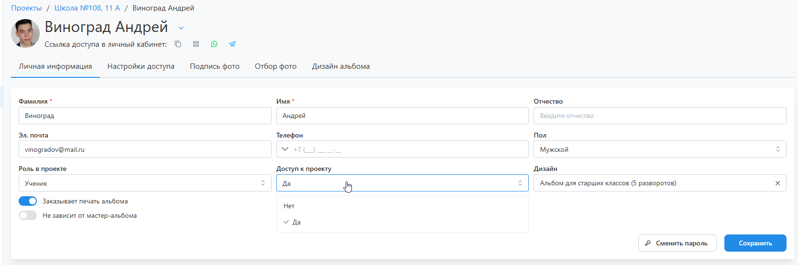

# Работа по проекту

### Как ученикам назначить разные дизайны
* Если какие-либо ученики заказывают разные продукты или дизайны, необходимо выполнить следующие действия.
* __1. Определить в проекте дизайны__: Во вкладке “__Информация__” в блоке “__Дизайн__” добавить второй дизайн - это может быть либо ранее настроенный пресет, либо созданный с нуля дизайн.

* __2. Выбрать ученику дизайн__: В профиле ученика во вкладке “__Личная информация__” в настройке “__Дизайн__” выбрать ранее созданный дизайн. Также не стоит забывать, что для каждого дизайна должен быть выбран мастер-альбом.

### Как предоставить доступ к проекту
* Для предоставления доступа к проекту представителю класса необходимо выполнить следующие действия.
* __1. Открыть доступ к проекту__: Открыть интересующий профиль ученика или педагога и в настройке "__Доступ к проекту__" выбрать значение "__Да__". Для предоставления доступа родителю необходимо выполнить это для его ребенка.
    

* __2. Определить права доступа__: В профиле ученика во вкладке "__Настройка доступа__" определить доступ к управлению проектом:
    + Разрешить подписывать и отбирать фотографии за учеников.
    + Разрешить редактировать, согласовывать и утверждать альбомы.
    

### Как настроить отправку уведомлений
* Настроить отправку уведомлений можно в разделе "__Уведомления__", которые в свою очередь деляться на три типа:
    + Сообщения для сотрудника.
    + Сообщения для координатора.
    + Сообщения для ученика.
* А во вкладке "__История отправки сообщений__" можно отслеживать факт доставки того или иного сообщения.
    

### Как настроить дизайн альбома
#### Общий альбом
* Для генерации общего альбома необходимо, чтобы у всех разворотов проектного дизайна был указан тип "__Общий__". Зачастую такие альбомы содержат виньетки учеников, портреты для которых ученики могут выбирать сами для себя. Остальные снимки выбираются фотографом или координатором во вкладке "__Отбор фото / Общие развороты__".
    

#### Общий альбом с персональным портретом
* Зачастую общий альбом предлагается с персонализацией портретом ученика на обложке или на одном из разворотов. В этом случае:
    + Обложка с фотографией или разворот с рамкой под портрет у проектного дизайна должен иметь тип "__Персональный__".

    + В дополнительной информации должен быть включен автоматический выбор репортажей.

    + В настройках доступа должен быть отключен выбор персональных репортажей. 

* При такой конфигурации портретные снимки может выбирать ученик, фотограф или координатор, а остальные снимки - фотограф или координатор во вкладках "__Общие развороты__" и "__Персональные развороты__" (если на персональном развороте присутстуют рамки под репортажные или групповые фотографии).

#### Персональный альбом
* Для генерации персональных альбомов необходимо, чтобы:
    + Несколько разворотов проектного дизайна имели тип "__Персональный__". Это могут быть обложка, разворот с портретом или развороты с репортажными снимками.

    + В настройках доступа должен быть включен выбор персональных репортажей. 
* При такой конфигурации снимки для персональных разворотов сможет выбирать ученик, фотограф или координатор, а для общих разворотов - фотограф или кординатор.

### Как изменить набор цитат
* Если проектный дизайн подразумевает размещение цитаты ученика, то она может быть либо написана самим учеников, либо выбрана из справочника. Возможность выбора цитаты задается в в блоке "__Настройка доступа__" во влкадке "__Информация__".

* Добавить собственную цитату в справочник можно в разделе "__Цитаты / Собственные__". Там же можно выключить отображение стандартных. Если требуется, чтобы цитаты соотносились с конкретным дизайном или пресетом, то для них сперва нужно задать группы, а затем указать эту группу в настройках пресета или проектного дизайна.

### Как вернуть предыдущую версию альбома
* Раздел находится в разработке.
