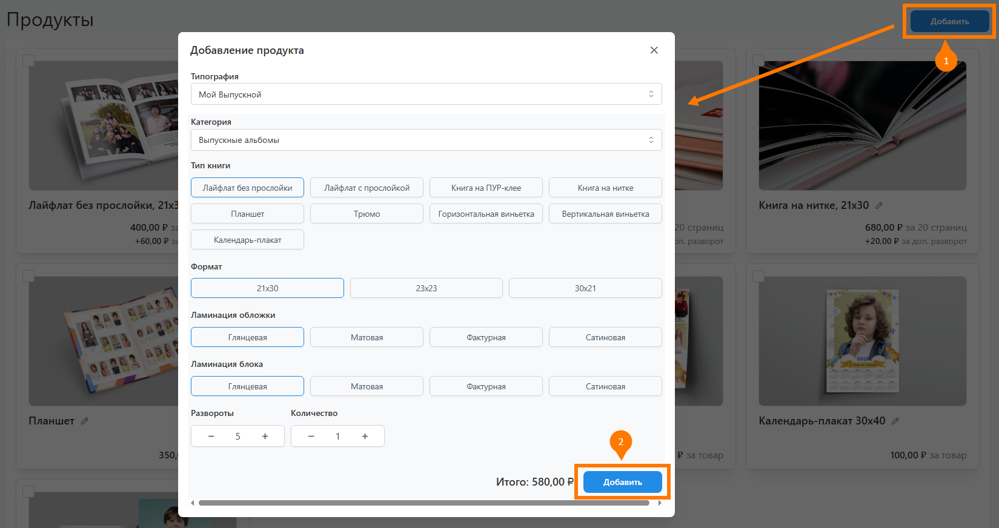
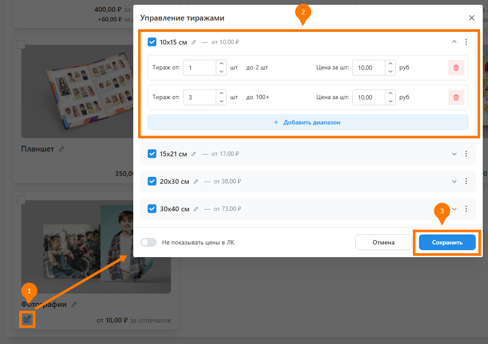
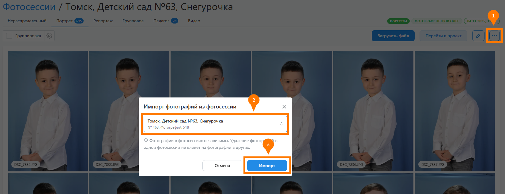
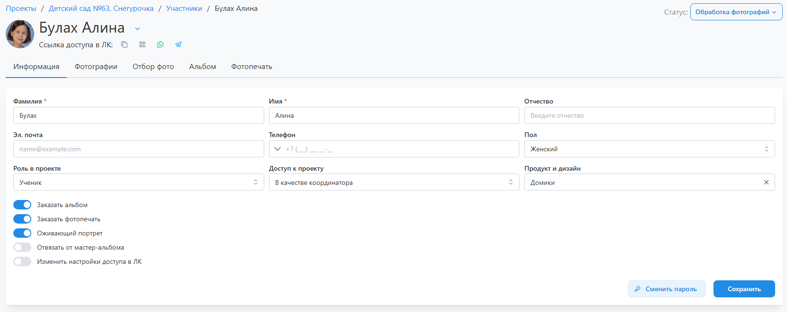

# Работа над проектом

### Как добавить новый продукт
* Для добавления продукта типографии необходимо выполнить следующие действия:
    1. Перейти в раздел "__Продукты__" и нажать кнопку "__Добавить__".    
    2. В открывшемся модальном окне выбрать типографию, категорию, продукт и нажать кнопку "__Добавить__".
    3. У добавленного продукта нажать иконку "__карандаш__", а затем изменить название.
* 

### Как задать цены для фотопечати
* Для настройки цен на фотопечать необходимо выполнить следующие действия:
    1. Перейти в раздел "__Продукты__", найти продукт с фотопечатью и нажать иконку "__карандаш__" справа от цены.
    2. В открывшемся модальном окне __выбрать интересующие форматы__, при необходимости отредактировав их название.
    3. Через кнопку "__три точки__" указать формат, который будет выбираться по умолчанию в личном кабинете.
    4. Настроить диаппазоны тиражей и стоимость за отпечаток в каждом из них. Если минимальное количество отпечатков по формату больше одного, то это значение нужно указать в тираже первого диаппазона.
* 

### Как связать фотосессию с двумя проектами
* Иногда для нескольких классов или групп может проводиться общая фотосессия. Для работы с таким контентом необходимо:
    1. Создать для каждого проекта свою фотосессию.
    2. Загрузить весь материал в одну из них.
    3. В этой фотосессии нажать кнопку "__три точки__" и выбрать действие "__Импортировать фото__".
    4. В открывшемся модальном окне выбрать другую фотосессию, в которую надо продублировать снимки, и нажать кнопку "__Импорт__".
* 

### Как отредактировать профиль ученика
* Для редактирования профиля ученика необходимо нажать на его Фамилию и Имя в разделе "__Участники__" - откроется профиль со следующим содержимым:
    + __Информация__
        + Персональные данные: ФИО, эл. почта, телефон и пол.
        + Роль в проекте: Ученик, Педагог, Классный руководитель (старший воспитатель).
        + Доступ к проекту: В качестве ученика или координатора (ответственого лица с расширенными функциями ЛК).
        + Продукт и дизайн: один из добавленных в проект альбов, который будет формироваться для участника.
        + Отвязать от мастер-альбома: сделать все развороты альбома персональными - ничего не копировать из мастера.
        + Именить настройки доступа в ЛК: переопределить общие настойки доступа в ЛК для участника.
    + __Фотографии__ - набор фотографий с отметками участника.
    + __Отбор фото__ - отбор персональных фотографий для альбома.
    + __Альбом__ - редактирование сформированного альбома.
    + __Фотопечать__ - выбор снимков для печати фотографий.
* 