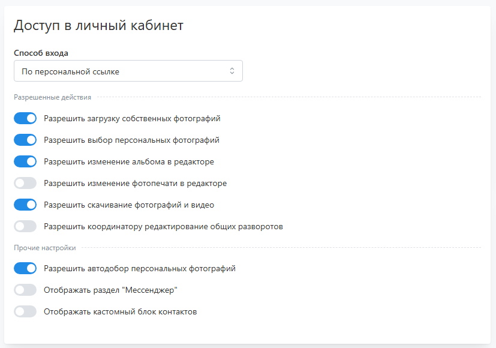
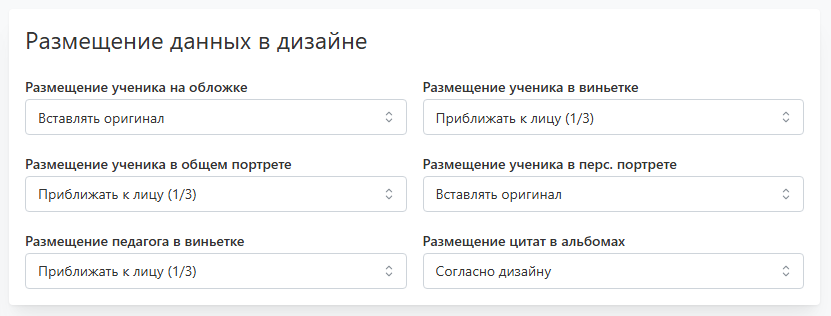
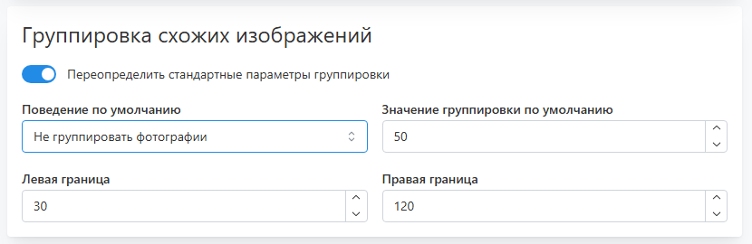
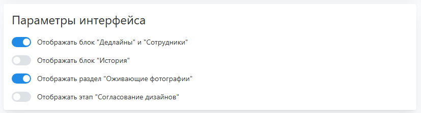
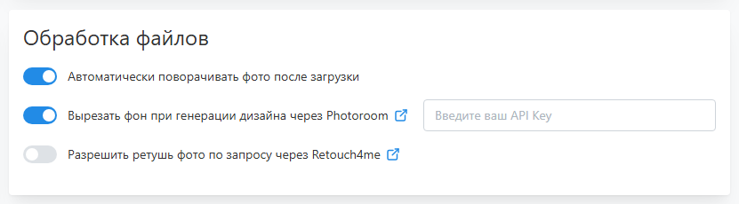

# Общие настройки

## Доступ в личный кабинет
* 
* __Способ входа__
    + __По почте и паролю__ - регистрация происходит с обязательным заданием почты и пароля, по которым в последствии будет осуществляться вход. При переходе по персональной ссылке сервис также потребует указать почту и пароль, если они не заданы.
    + __По персональной ссылке__ - регистрация происходит с присвоением персональной ссылки доступа, а последующий вход будет возможен только через нее. При регистрации по общей ссылке сервис предложил ее продублировать на почту.
    + __Открытый доступ__ - доступ в аккаунт любого ученика по общей ссылке никак не защищен, т.е. сервис позволит сколько угодно раз входить в любой профиль. Это максимально удобный, но менее защищенный режим работы.
* __Разрешить загрузку собственных фотографий__ - разрешить ученику загрузку фото на этапе отбора и в редакторах.
* __Разрешить выбор персональных фотографий__ - разрешить выбор персональные фото на этапе отбора фотографий.
* __Разрешить изменение альбомадизайна в редакторе__ - разрешить изменение альбома в редакторе на этапе утверждения альбомов. 
* __Разрешить изменение фотопечати в редакторе__ - разрешить изменение фото в редакторе фотопечати на этапе отбора.
* __Разрешить скачивание фотографий и видео__ - разрешить скачивание фото и видео, кроме чужих портретов.
* __Разрешить координатору редактирование общих разворотов__ - разрешить координатору изменение мастер-альбома.
* __Разрешить автодобор персональных фотографий__ -  разрешить сервису автоматически добирать персональные репортажи, если их выборано недстаточное количество.
* __Отображать раздел "Мессенджер"__ - отображать раздел обратной связи с фотографом.
* __Отображать кастомный блок контактов__ - отображать кастомную HTML-разметку внизу боковой панели. Обычно используется для вывода дополнительных контактных данных (например, мессенджеров Telegram или MAX).

## Размещение данных в дизайне
* 
* __Размещение ученика на обложке__
    + __Приближение к лицу (1/3)__ - вставлять фотографию с таким приближением, при котором высота головы составляет треть от рамки под фото.
    + __Приближение к лицу (1/4)__ - вставлять фотографию с таким приближением, при котором высота головы составляет четверть от рамки под фото.
    + __Вставлять оригинал__ - вставлять фотографию без приближения, но с заполнением рамки под фото (без полей).
* __Размещение цитаты в альбоме__
    + __Согласно дизайну__ - использовать функционал выбора цитаты с последующим ее размещением в альбоме.
    + __Не использовать__ - отключить выбор и размещение цитаты в альбоме.

## Группировка схожих изображений
* 
* __Поведение по умолчанию__ 
    + __Группировка недоступна__ - функция группировки фото по похожести недоступна.
    + __Не группировать фотографии__ - функция группировки доступна, но не применяется по умолчанию.
    + __Группировать фотографии__ - функция группировки доступна и применяется по умолчанию.
* __Значение группировки по умолчанию__ - критерий, по которому фотографии считаются похожими. Чем ближе значение к левой границе, тем для схожести фотографий требуется меньше отличий. А при приближении значения у правой границе даже разные снимки могут считаться схожими.
* __Левая/правая граница__ - дополнительные настройки алгоритма определения схожести.

## Параметры интерфейса
* 
* __Отображать блок "Дедлайны" и "Сотрудники"__ - отображать в разделе "Настройки" блоки дедлайнов и сотрудников.
* __Отображать блок "История"__ - отображать в разделе "Настройки" блок истории действий.
* __Отображать раздел "Оживающие фотографии"__ - использовать функционал оживающих фотографий.
* __Отображать этап "Согласование дизайнов"__ - использовать дополнительный этап согласования дизайнов перед обработкой фото. Согласованный дизайн на этапе утверждения изменить будет невозможно.

## Обработка файлов
* 
* __Автоматически поворачивать фото после загрузки__ - автоматически поворачивать загруженные фото, если велика вероятность их неправильной ориентации. Такие снимки отображаются в разделе "__Проверка фото__" со значением первого фильтра "__Ошибка ориентации__" и отмечаются специальной иконкой. При ошибочном автоповороте вы сможете исправить ориентацию. Если вы уверены в корректности загружаемых фотографий, данную функцию рекомендуется отключать.
* __Вырезать фон при генерации дизайна через Photoroom__ - автоматически вырезать фото у фотографии при генерации дизайна, если рамка для ее размещения использует ключ ```without-bg```. Подробнее о Photoroom читайте в [статье](/faq/integrations#как-подключить-photoroom).
* __Разрешить ретушь фото по запросу через Retouch4me__ - включить функцию ретуши фотографий в разделе "Обработка фото". Ретушь запускается вручную при выделении снимков. Подробнее о Retouch4me читайте в [статье](/faq/integrations#как-подключить-retouch4me).