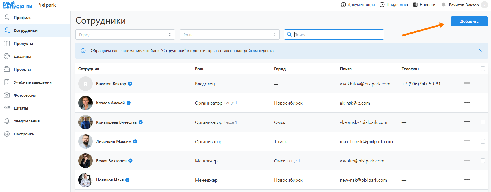

# Групповая работа
## Регистрация сотрудников
* Сервис позволяет организовать производственный процесс не только фотографу-одиночке, но и __команде специалистов с разными зонами ответственности__. В том числе расположенными в разных городах.
* Для этого необходимо:
    + В разделе "__Профиль__" определить список городов присутствия.
        
    + В разделе "__Сотрудники__" завести учетные записи сотрудников.
    

    + У каждого сотрудника указать роли и города присутствия (выбирается из списка выше). Если для сотрудника не задан город, то предполагается, что он работает в любом.
    
## Роли сотрудников
    * __Владелец__ - полный доступ по управлению компанией. Владельцем считается тот, кто зарегистрировал компанию. Он подключает типографии, определяет продуктовую линейку, настраивает систему уведомлений, добавляет собственные цитаты и загружает шаблоны.
    * __Администратор__ - полный доступ по управлению компанией, кроме удаления владельца и компании. Все, что необходимо выполнить владельцу, может быть делегировано администратору.
    * __Организатор__ - проводит встречи с родительским комитетом и заключает договора. После этого всю работу по проекту передает менеджеру. В рамках данной роли предусмотрен следующий доступ:
        + просмотр продуктов без их стоимости (раздел “Продукты”);
        + управление пресетами (раздел “Дизайны”);
        + просмотр учебных заведений (раздел “Учебные заведения”), в которых он работал или работает по проектам;
        + создание новых и управление существующими проектами, в которых он назначен (раздел “Проекты”);
        + создание новых и управление существующими фотосессиями, привязанными к проектам, в которых он назначен.
    * __Менеджер__ - ведет полный цикл работы по подготовке и печати альбомов. В рамках данной роли предусмотрен следующий доступ:
        + просмотр продуктов без их стоимости;
        + управление шаблонами и пресетами;
        + просмотр учебных заведений, в которых он работал по проектам;
        + создание новых и управление существующими проектами, в которых он назначен;
        + создание новых и управление существующими фотосессиями, привязанными к проектам, в которых он назначен.
    * __Фотограф__ - проводит съемки и загружает в систему отснятый материал. В рамках данной роли предусмотрен следующий доступ:
        + редактирование существующих фотосессий, в которых он назначен фотографом;
        + создание новых фотосессий для тех проектов, в которых он назначен или ранее проводил фотосессии.
    * __Ретушер__ - проводит обработку выбранных для альбомов фотографий (вырезка фона, ретушь и цветокоррекция). В рамках данной роли предусмотрен полный доступ к разделу “Фоторетушь” тех проектов, в которых он назначен.
    * __Дизайнер__ - подготавливает шаблоны, пресеты и корректирует сформированные системой дизайны. В рамках данной роли предусмотрен следующий доступ:
        + управление шаблонами и пресетами (раздел “Дизайны”);
        + управление разделом “Дизайн альбома” в профилях учеников тех проектов, в которых он назначен.
    * __Продюсер__ - проверяет работу фотографов. В рамках данной роли предусмотрен только полный доступ к разделу "Фотосессии".
