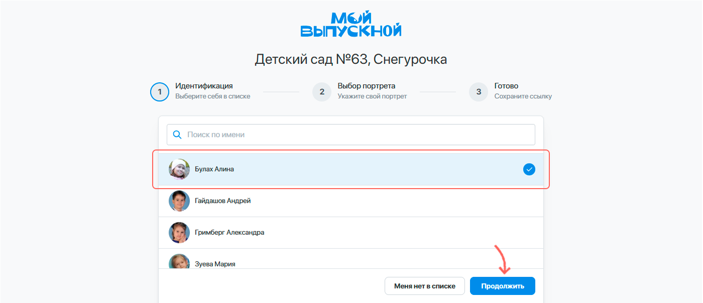
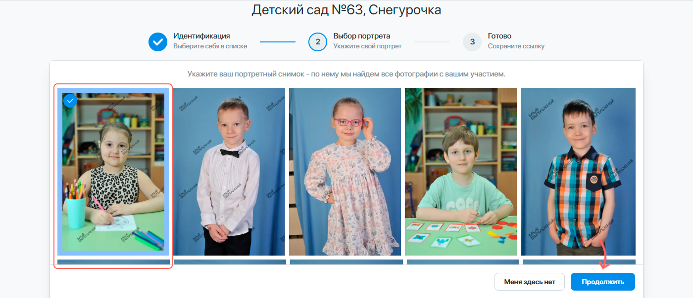
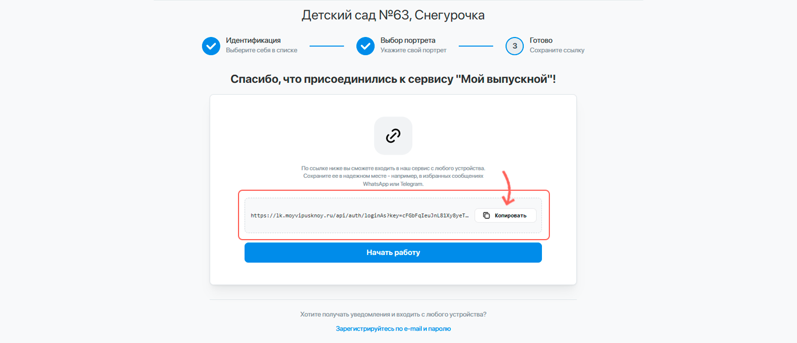
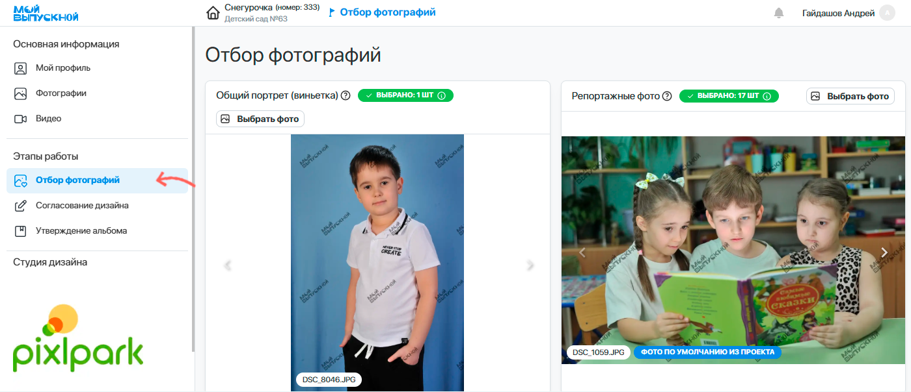
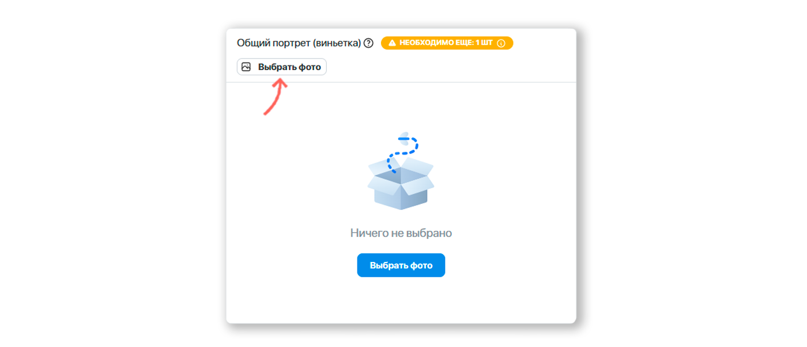
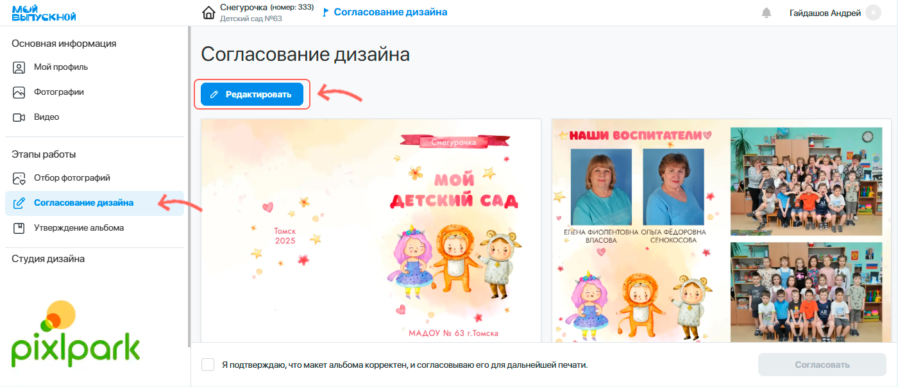
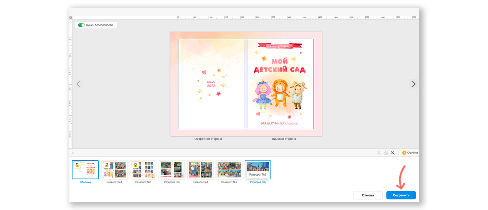
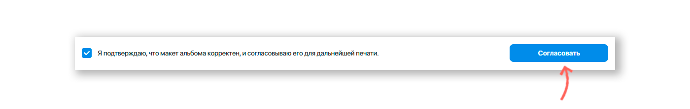
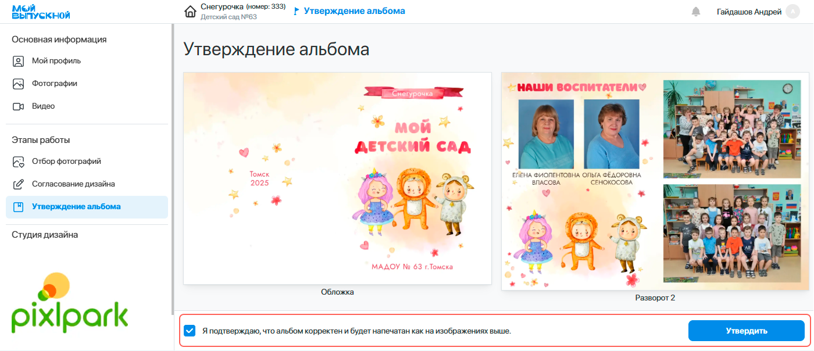

# Кабинет ученика
### Описание
* Сервис “__Мой Выпускной__” предназначен для групповой работы над вашим выпускным альбомом. Обычно весь процесс состоит из нескольких этапов:
    1. __Регистрация__ в личном кабинете.
    2. __Отбор фотографий__ для формирования дизайна.
    3. __Утверждение альбома__ с внесением правок.
* Иногда между отбором фотографий и утверждением альбома может появиться дополнительная стадия - __согласование дизайна__ альбома. В таком случае все правки по дизайну вносятся лишь на этом этапе.
* Сервис позволяет комфортно работать как с мобильного телефона, так и со стационарного компьютера/ноутбука. Если у вас есть компьютер, то мы рекомендуем выбрать именно этот вариант. Однако иллюстрации ниже будут приведены для мобильной версии сервиса, как наиболее используемой.

### Регистрация в ЛК
* Для регистрации в личном кабинете вам необходимо  перейти по предоставленной ссылке и следовать инструкции:
    + На первом этапе потребуется __выбрать себя из списка__, либо указать вашу Фамилию и Имя.  

    

    В зависимости от настроек сервиса также может потребоваться задание эл. почты и пароля, которые вы впоследствии будете использовать для входа в ЛК.
    + На втором этапе нужно __выбрать свой портрет__. Это облегчит последующий процесс отбора фотографий. Если на первом этапе вы задавали эл. почту, то на этом регистрация будет завершена.

    

    + На третьем этапе вам будет предоставлена __персональная ссылка доступа__, по которой вы сможете входить в ЛК с любого устройства. Сохраните ее в нажедном месте. Помимо варианта авторизации по ссылке вы также можете задать эл. почту и пароль для традиционного способа входа.

    
    
### Отбор фотографий
 * Основным этапом в подготовке альбомов является выбор фотографий, из которых будет компоноваться альбом. В соответствующем разделе личного кабинета у вас будет несколько блоков, а их количество зависит от выбранного дизайна, типа альбома и варианта его персонализации. 

 

 Также здесь могут отображаться блоки с фотографиями без выбора - это снимки на общие развороты, которые выбираются фотографом или ответственным лицом.
* Рассмотрим ниже порядок действий по выбору фотографий на примере репортажей:
    + Нажать кнопку "__Выбрать фото__" у данного блока.
    
    + В открывшемся модальном окне по умолчанию будут представлены все ваши снимки определенного типа. Вы можете выбрать любые из них, либо же загрузить собственные, если это разрешено настройками сервиса.
    + Также для удобства выбора фотографий их можно сгруппировать по похожести. В этом случае вместо одной фотографии в списке будет отображаться папка, в которой можно выбрать один или несколько похожих снимков.
    + Отметим, что при выборе фотографий стоит придерживаться рекомендаций по количеству снимков и их ориентации. Это позволит сделать дизайн альбома максимально сбалансированным.
    + После завершения выбора фотографий нажать кнопку "__Сохранить__".
    

### Согласование дизайна
:::info[Информация]
В зависимости от настроек сервиса данный этап может быть опциональным.  Если в личном кабинете отсутствует раздел "__Согласование дизайна__", информацию ниже можно пропустить.
:::
* В соответствующем разделе личного кабинета у вас будет представлен предварительный дизайн альбома, фотографии в котором еще не прошли обработку. 
* Для внесения правок в дизайн необходимо:
    + Нажать кнопку “__Редактировать__” в левом верхнем углу.

    

    +  В открывшемся модальном окне внести правки в дизайн персональных разворотов (без иконки замочка). Например, вы можете поменять набор фотографий, выбрать иные раскладки и применить маски. 
    + После завершения работы нажать кнопку “__Сохранить__”.
    
* Далее потребуется подтвердить корректность дизайна и нажать кнопку "__Согласовать__". Впоследствии внести правки в него самостоятельно будет невозможно. 
  

### Утверждение альбома
* На заключительном этапе в соответствующем разделе личного кабинета вам будет представлен финальный вариант дизайна с отретушированными фотографиями. Отметим, что __альбом будет напечатан именно так, как вы видите__.
* Если дизайн альбома предварительно не проходил этап согласования, то в зависимости от настроек сервиса может быть разрешено внесение правок в дизайн персональных разворотов. Для запуска редактора необходимо нажать кнопку "__Редактировать__", внести правки, а затем нажать "__Сохранить__". 
В редакторе вы сможете поменять набор фотографий, выбрать иные раскладки и применить маски.
* Внимательно просмотрите все развороты альбома и в случае нахождения ошибок / замечаний сообщите об этом ответственному лицу. На этом этапе еще можно будет внести небольшие правки в финальный вариант.
* По завершении проверки потребуется подтвердить корректность альбома и нажать кнопку "__Утвердить__".

  

### Прочие разделы
* В личном кабинете также присутствует несколько дополнительных разделов:
    + “__Мой Профиль__” - для редактирования персональных данных и подключения уведомлений в Telegram.
    + “__Фотографии__” - для просмотра всех снимков с фотосессий и скачивания их единым архивом, если это разрешено.
    + “__Видео__” - для просмотра всех видео-файлов, предназначенных для оживления фотографий.
    + “__Подпись фотографий__” - для подписи себя на репортажных снимках, если сервис не смог вас идентифицировать. В зависимости от настроек сервиса раздел может быть недоступен.