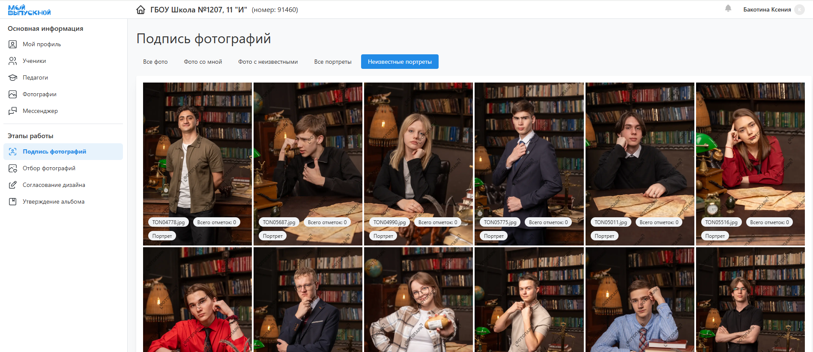

# Кабинет координатора

### Описание
* __Координатор__ - это ответственное лицо со стороны класса/группы, отвечающее за работу над выпускными альбомами. Координатором может выступать глава родительского комитета, классный руководитель, староста или куратор. 
* В зависимости от договоренностей в задачи координатора может входить:
    + Коммуникация между фотографом и учениками (их родителями).
    + Заполнение списка учеников и педагогов, которые будут в дизайне.
    + Подпись портретных снимков для распределения фотографий по ученикам.
    + Отбор фотографий на общие развороты, а также репортажей для автоназначения. 
    + Согласование дизайнов, внесение правок и утверждение альбомов за учеников.
* Для координатора не существует отдельной учетной записи или личного кабинета, данная роль назначается педагогу или ученику. Родитель же работает под учетной записью своего ребенка. При этом набор разделов, их внешний вид и функциональные возможности значительно отличаются.
* Сервис позволяет комфортно работать как с мобильного телефона, так и со стационарного компьютера/ноутбука. Однако мы рекомендуем использовать именно последний вариант.

### Подпись фотографий
* Подпись портретных снимков позволяет соотнести ученика со всеми фотографиями, на которых он присутствует. Это, в свою очередь, облегчает их отбор для формирования альбомов - вместо просмотра сотен снимков можно выбирать из десятка со своим участием.
* В процессе регистрации каждый ученик выбирает свою портретную фотографию, таким образом, запуская процесс подписи. Однако этот механизм не гарантирует 100% результата, т.к.:
    + Не все ученики могут заказывать альбомы.
    + Не все зарегистрируются и выберут свой портрет.
* Поэтому в соответствующем разделе личного кабинета необходимо самостоятельно подписать неизвестные портреты. Для этого необходимо:
    + Открыть вкладку "__Неизвестные портреты__", а затем нажать на первую фотографию.
    + В открывшемся модальном окне справа от снимка выбрать ученика из списка или добавить нового. Нажать "__Сохранить__". Повторить действие для других фотографий.
* Для удобства работы можно предварительно завести списки учеников и педагогов в соответствующих разделах личного кабинета.

### Отбор фотографий
* Одним из основных этапов работы над проектом является отбор фотографий, из которых будут состоять альбомы учеников. Задача координатора в данном случае заключается в содействии по отбору фотографий.
* Для этого в соответствующем разделе личного кабинета представлены несколько вкладок с фотографиями:
    + __Фото учеников/педагогов__ - это все портреты, репортажные и групповые снимки на персональных разворотах для каждого ученика.
    + __Фото на общих разворотах__ - это репортажные и групповые снимки на общих разворотах.
    + __Фото по умолчанию__ - это репортажные и групповые снимки на персональных разворотах, которые будут использоваться, если у ученика либо запрещен выбор, либо фотографии не выбраны.
* Однако если в дизайне все развороты персональные, то вкладка "Фото на общих разворотах" будет отсутствовать.
* Сам процесс выбора фотографий в модальном окне идентичен тому, как если бы их выбирал сам ученик.

### Согласование дизайна
:::info[Информация]
В зависимости от настроек сервиса данный этап может быть опциональным.  Если в личном кабинете отсутствует раздел "__Согласование дизайна__", информацию ниже можно пропустить.
:::
* В соответствующем разделе личного кабинета у вас будет представлены предварительные дизайны альбомов учеников, фотографии в которых еще не прошли обработку. 
* Для внесения правок в дизайн необходимо:
    + Нажать кнопку “__Редактировать__” напротив каждого альбома.
    +  В открывшемся модальном окне внести правки в дизайн персональных разворотов (без иконки замочка). Например, вы можете поменять набор фотографий, выбрать иные раскладки и применить маски. 
    + После завершения работы нажать кнопку “__Сохранить__”.
* Далее потребуется подтвердить корректность дизайна и нажать кнопку "__Утвердить__".
* Затем повторить действия для всех дизайнов.

### Утверждение альбомов   
* На заключительном этапе в соответствующем разделе личного кабинета вам будут представлены финальные варианты дизайнов с отретушированными фотографиями. Отметим, что __альбомы будут напечатаны именно так, как вы видите__.
* Для внесения правок в дизайн необходимо:
    + Нажать кнопку “__Редактировать__” напротив каждого альбома.
    +  В открывшемся модальном окне внести правки в дизайн персональных разворотов (без иконки замочка). Например, вы можете поменять набор фотографий, выбрать иные раскладки и применить маски. 
    + После завершения работы нажать кнопку “__Сохранить__”.
* По завершении проверки  потребуется подтвердить корректность альбома и нажать кнопку "__Утвердить__".
* Затем повторить действия для всех альбомов.

### Прочие разделы
* В личном кабинете также присутствует несколько дополнительных разделов, которых нет у учеников:
    + “__Ученики__” - для формирования списка учеников, которые будут присутствовать в альбомах.
    + “__Педагоги__” - для формирования списка педагогов, которые будут присутствовать в альбомах.
    + “__Мессенджер__” - для коммуникации с фотографов (например, по вопросам ретуши фотографий).