# Кабинет координатора

### Описание
* __Координатор__ - это ответственное лицо со стороны класса/группы, отвечающее за работу над выпускными альбомами. Координатором может выступать глава родительского комитета, классный руководитель, староста или куратор. 
* В зависимости от договоренностей в задачи координатора может входить:
    + Коммуникация между фотографом и учениками (их родителями).
    + Заполнение списка учеников и педагогов, которые будут в дизайне.
    + Подпись портретных снимков для распределения фотографий по ученикам.
    + Отбор фотографий на общие развороты, а также репортажей для автоназначения. 
    + Согласование дизайнов, внесение правок и утверждение альбомов за учеников.
* Для координатора не существует отдельной учетной записи или личного кабинета, данная роль назначается педагогу или ученику. Родитель же работает под учетной записью своего ребенка. При этом набор разделов, их внешний вид и функциональные возможности значительно отличаются.
* Сервис позволяет комфортно работать как с мобильного телефона, так и со стационарного компьютера. Однако мы рекомендуем использовать именно последний вариант.
* 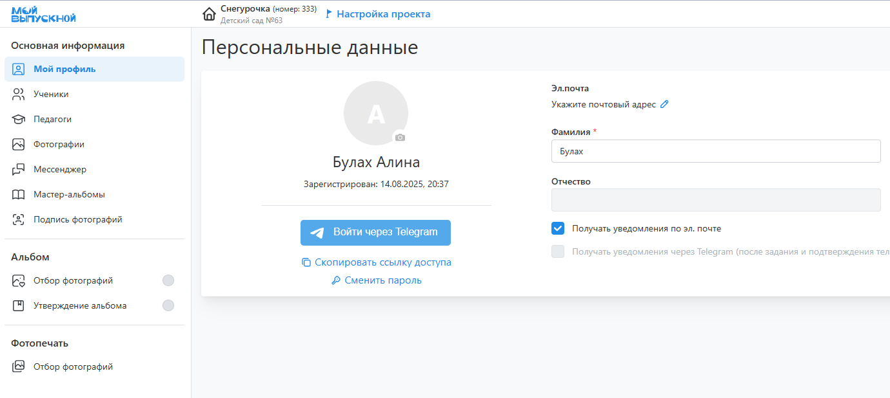

### Подпись фотографий
* После загрузки фотографий в сервис требуется провести __идентификацию учеников__ на портретных или репортажных снимках. Это можно сделать в разделе "__Подпись фотографий__" двумя способами, которые рассмотрим ниже.

#### Вариант 1 
    1. В фильтре выбрать "__Неизвестные портреты__", а затем нажать на первую фотографию.
    2. В модальном окне справа от фото указать ученика, либо выбрав его из списка, либо создав новый аккаунт.
    3. Последовательно повторить действие для всех фотографий фильтра.
* 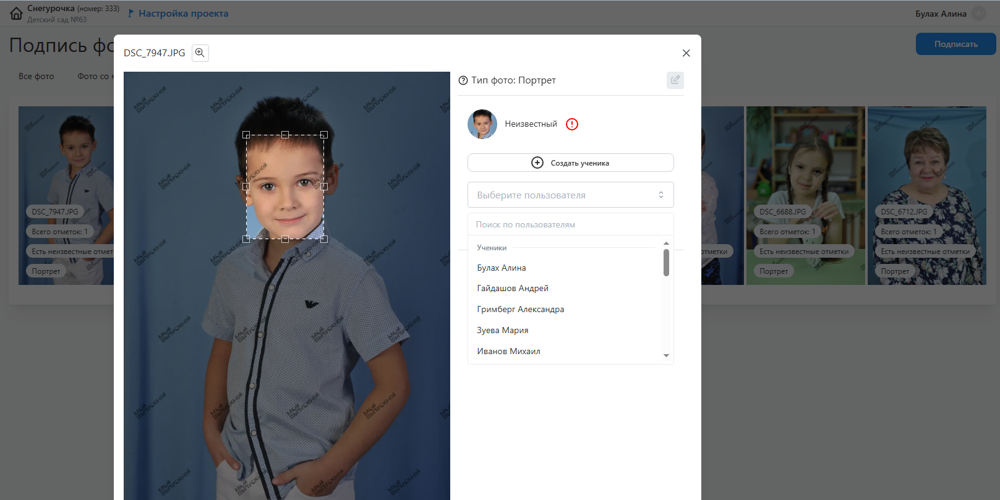

#### Вариант 1 
    1. Нажать кнопку "__Подписать__", расположенную справа от фильтров.
    2. Откроется модальное окно со всеми лицами, найденными на фотографиях с заданным фильтром.
    3. Указать каждого ученика, либо выбрав его из списка, либо задава Фамилию и Имя.
    3. Убрать отметки с найденных лиц, не являющихся учениками.
* 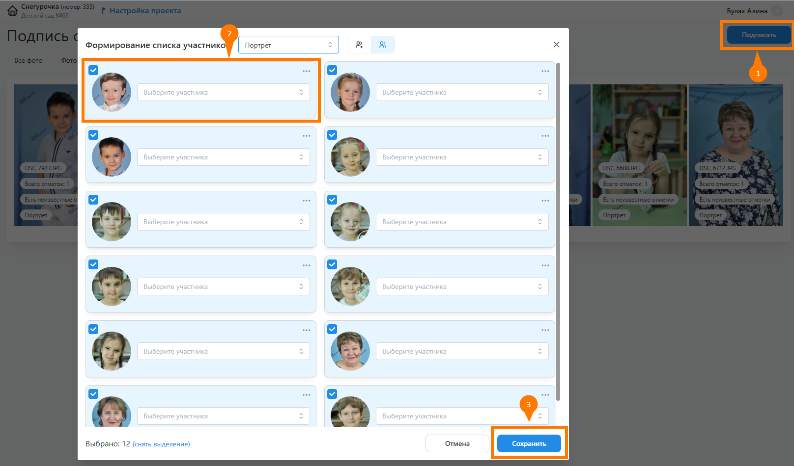
*
* Для удобства работы можно предварительно загрузить в сервис список учеников в excel-файле. Для этого необходимо:
    1. Перейти во вкладку "__Участники__" и нажать кнопку "__Добавить__".
    2. В открывшемся модальном окне выбрать вариант "__Импортировать их Excel__".
    3. Выбрать подготовленный список по шаблону и нажать кнопку "__Добавить__".
* 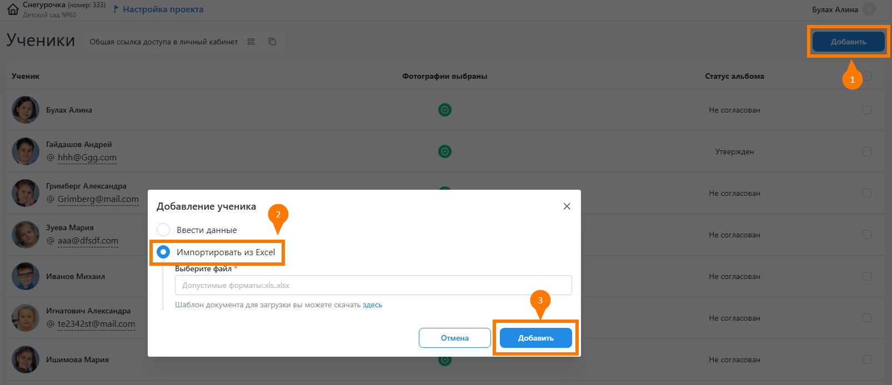

### Отбор фотографий
#### Набор фотографий
* Одним из основных этапов работы над проектом является отбор фотографий, из которых будут состоять альбомы учеников. Задача координатора в данном случае заключается в содействии по отбору фотографий.
* 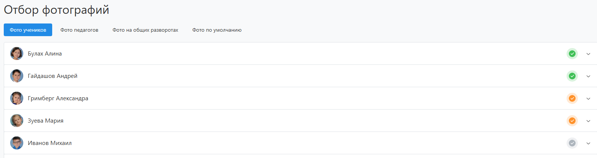
* Для этого в соответствующем разделе личного кабинета представлены несколько вкладок с фотографиями:
    + __Фото учеников/педагогов__ - это портретные, репортажные и групповые снимки для персональных разворотов.
    + __Фото на общих разворотах__ - это репортажные и групповые снимки для общих разворотов. Вкладка будет отсутствовать, если в дизайне все развороты персональные.
    + __Фото по умолчанию__ - это репортажные и групповые снимки для персональных разворотов, которые будут использоваться, если ученику запрещен выбор персональных репортажей.
* Выбираемые общие фотографии во вкладке "Фото по умолчанию" копируются всем участникам. Однако этот выбор может быть изменен. Данный подход упрощает процесс отбора, т.к. групповые фотографии зачастую у всех одинаковые.
* 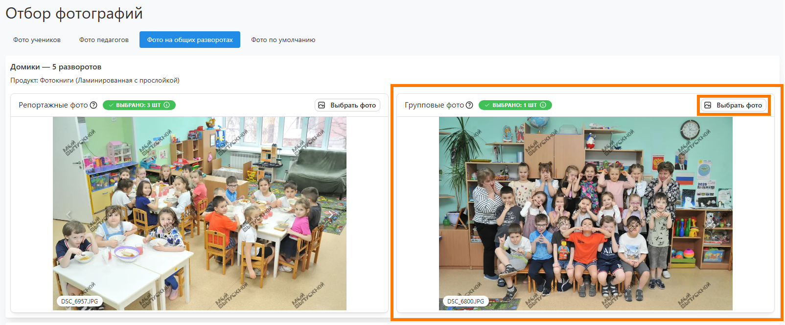

#### Выбор фотографий
* Для отбора фотографий у конретной рамки необходимо:
    1. Нажать кнопку "__Выбрать фото__", откроется модальное окно.
    2. Загрузить собственные снимки, если это разрешено в разделе "Настройка".
    3. Выставить необходимый фильтр по фото и, если требуется, сгруппировать снимки по схожести.
    4. Выделить понравишиеся фотографии и нажать кнопку "__Сохранить__".
    5. Для выбора снимков из группы необходимо нажать на соответствующую иконку.
    6. Если какие-то из снимков уже выбраны для общих разворотов, сервис предупредит об этом.
    7. В нижней части окна так же будет информационное сообщение об ошибках.
* 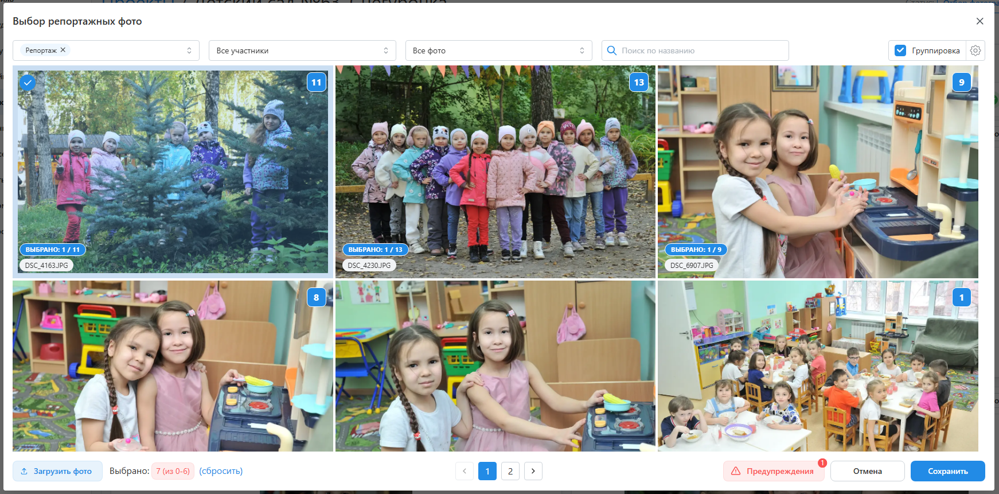

### Согласование дизайна
:::info[Информация]
В зависимости от настроек сервиса данный этап может быть опциональным.  Если в личном кабинете отсутствует раздел "__Согласование дизайна__", информацию ниже можно пропустить.
:::
* В соответствующем разделе личного кабинета вам будут представлены предварительные дизайны альбомов учеников, фотографии в которых еще не прошли обработку. 
* 
* Для внесения правок в дизайн необходимо:
    + Нажать кнопку “__Редактировать__” напротив каждого альбома.
    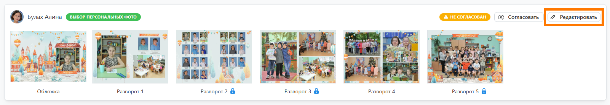
    +  В открывшемся окне внести правки в дизайн персональных разворотов (без замочка). Например, вы можете поменять раскладки и набор фотографий. А по завершению работы нажать кнопку “__Сохранить__”.
    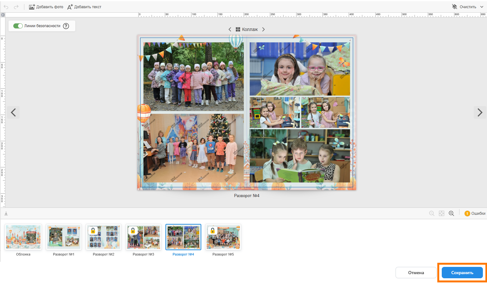
* Далее потребуется согласовать дизайна нажатием кнопки "__Согласовать__".
* 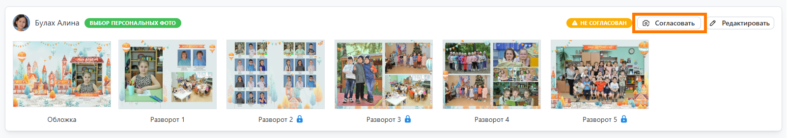
* Затем повторить действия для всех дизайнов.
* Если потребуется изменить дизайн общих разворотов, то это можно сделать в разделе "__Мастер-альбомы__".

### Утверждение альбомов   
* В соответствующем разделе личного кабинета вам будут представлены финальные варианты альбомов с отретушированными фотографиями. 
* 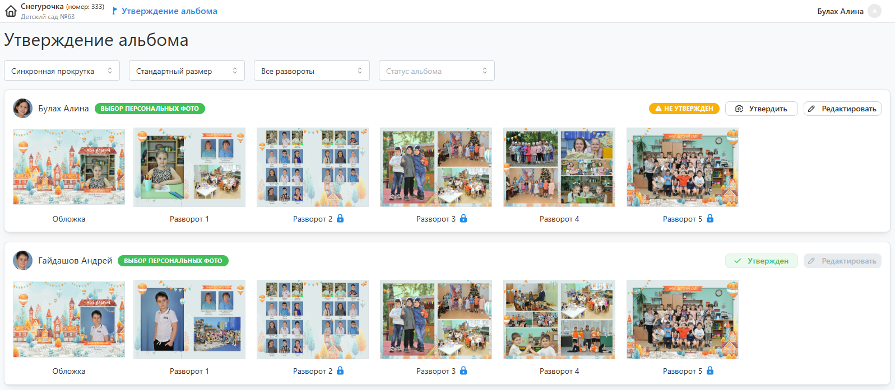
* Для внесения правок в дизайн необходимо:
    + Нажать кнопку “__Редактировать__” напротив каждого альбома.
    
    +  В открывшемся модальном окне внести правки в дизайн персональных разворотов (без иконки замочка). Например, вы можете поменять набор фотографий, выбрать иные раскладки и применить маски. А по завершению работы нажать кнопку “__Сохранить__”.
    
* Далее потребуется утвердить альбом нажатием кнопки “__Утвердить__“.
* 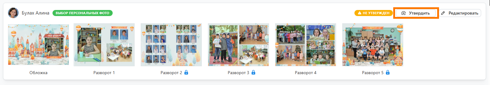
* Затем повторить действия для всех альбомов.
* Если потребуется изменить дизайн общих разворотов, то это можно сделать в разделе “__Мастер-альбомы__“.

### Прочие разделы
* В личном кабинете также присутствует несколько дополнительных разделов, которых нет у учеников:
    + “__Ученики__” - для формирования списка учеников, которые будут присутствовать в альбомах.
    + “__Педагоги__” - для формирования списка педагогов, которые будут присутствовать в альбомах.
    + “__Мессенджер__” - для коммуникации с фотографов (например, по вопросам ретуши фотографий).
    + “__Мастер-альбомы__” - для изменения общих разворотов и общих элементов альбомов.
    + “__Подпись фотографий__” - для идентификации учеников на снимках.