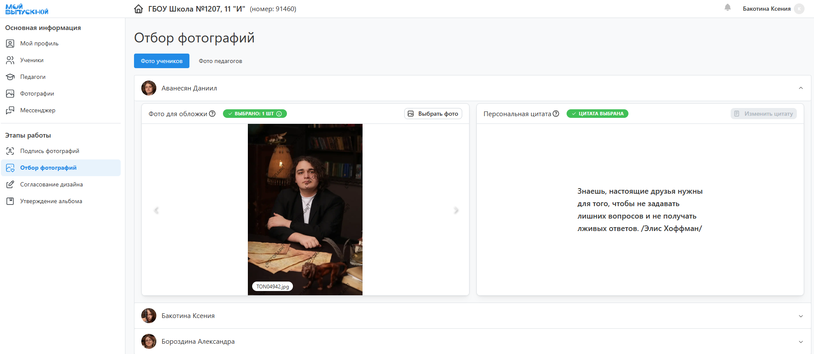
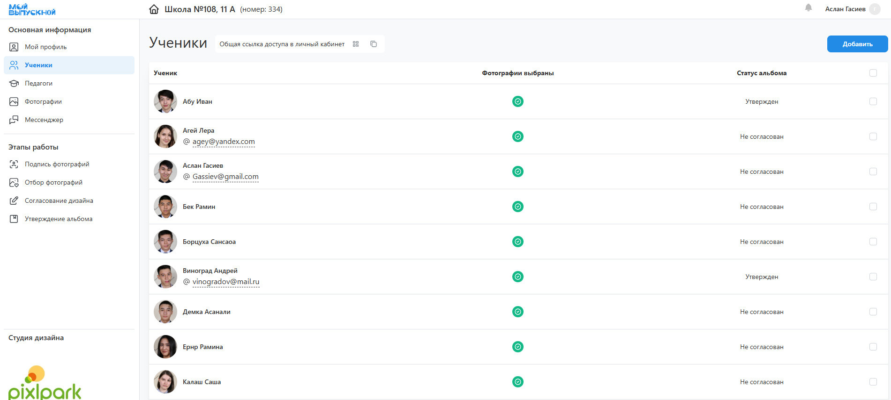
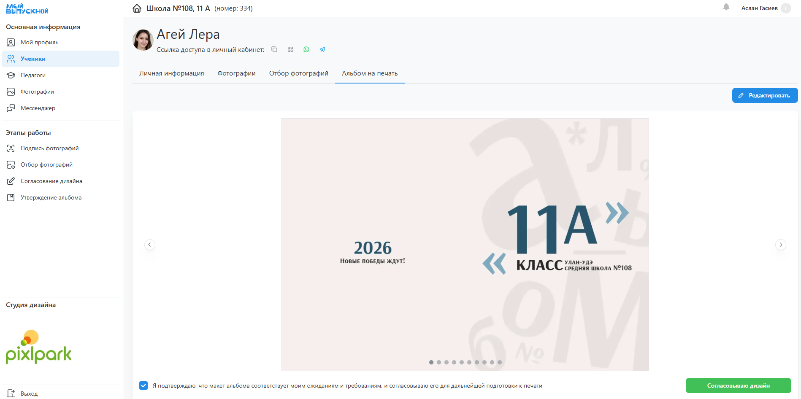
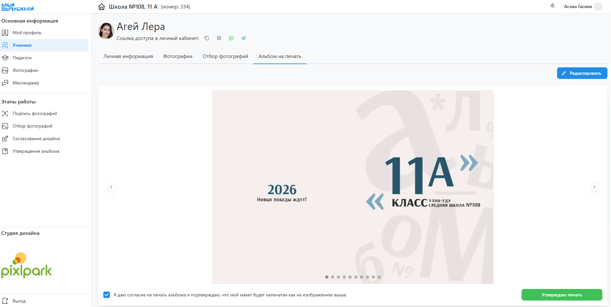

# Кабинет координатора

### Общая информация
* __Координатор__ - это представитель класса/группы, которым может быть глава родительского комитета, классный руководитель, староста или куратор. 
* Для координатора не существует отдельной учетной записи личного кабинета, он работает под учеником или педагогом с расширенными правами доступа.
* Работа координатора заключается в следующем:
    + Коммуникация между менеджером/фотографом и учениками (их родителями).
    + Заполнение списка учеников и педагогов, которые будут в дизайне.
    + Подпись портретных снимков для распределения фотографий по ученикам.
    + Отбор фотографий на общие и персональные развороты по умолчанию. 
    + Согласование дизайнов, внесение правок и утверждение альбомов за учеников.
* Фактически координатор выступает ответственным лицом за работу над проектом со стороны учеников. Поэтому ему необходимо ознакомиться с [принципом работы над проектом](/general), чтобы понимать последовательность этапов работы. Также для координатора предусмотрены дополнительные уведомления, чтобы не допускать проблем и задержек.

### Подпись фотографий
* Подпись портретных снимков позволяет соотнести ученика с набором фотографий, на которых он присутствует. Это, в свою очередь, облегчает их отбор для персональных альбомов - вместо просмотра тысячи снимков можно будет выбирать из десятка со своим участием.
* В процессе регистрации каждый ученик выбирает свою портретную фотографию, таким образом запуская процесс подписи. Однако этот механизм не гарантирует 100% результата, т.к.:
    + Не все ученики могут заказывать альбомы.
    + Не все из заказывающих зарегистрируются и выберут свой портрет.
* Поэтому в личном кабинете координатора в разделе “__Подпись фотографий__” можно самостоятельно подписать портретные снимки всех учеников. Сервис в данном случае покажет по одной фотографии на каждого из них.
* Для удобства подписи зачастую удобнее изначально завести списки учеников и педагогов в соответствующих разделах личного кабинета.

### Отбор фотографий
* Одним из основных этапов работы над проектом является отбор фотографий, из которых будут состоять альбомы учеников. Задача координатора в данном случае заключается в содействии по отбору фотографий.
* Для этого в личном кабинете координатора в разделе “__Отбор фотографий__” представлены несколько групп фотографий:
    + __Общие развороты__ - это репортажные и групповые снимки на общих разворотах.
    + __Персональные развороты__ - это репортажные и групповые снимки на персональных разворотах, которые будут использоваться, если у ученика либо запрещен выбор персональных репортажей, либо фотографии не выбраны.
    + __Фото учеников/педагогов__ - это все портретные, репортажные и групповые снимки на персональных разворотах, которые ученики обычно выбирают самостоятельно.
* Отбор фотографий каждой типа происходит по нажатию кнопки “__Выбрать фото__“, открывающий стандартное модальное окно с фотографиями.

### Согласование дизайнов   
* В зависимости от настроек проекта этап согласования дизайнов может являться как обязательным, так и нет. В случае обязательности задача координатора заключается в том, чтобы к назначенному дедлайну все дизайны были согласованы. Соответственно, если это не сделают ученики, значит это должен сделать за них кординатор.
* Для согласования дизайнов необходимо выполнить следующие действия:
    + Открыть раздел “__Ученики__” и перейти в профиль того, чей альбом еще не согласован (отдельный столбец таблицы).
    + Перейти во вкладку “__Дизайн альбома__“ и ознакомиться с дизайнов.
    + При необходимости открыть редактор и внести правки.
    + Нажать кнопку “__Согласовать дизайн__”.
    + Повторить действие для всех учеников.

### Утверждение альбомов   
* Последним и обязательным этапом работы над проектом является утверждение альбомов, т.к. только утвержденные альбомы будут отправлены в печать. Поэтому, как и в случае с согласованием, координатор обеспечивает завершение этого процесса - либо напоминая ученикам о необходимости утверждения, либо выполняя это за них.
* Для утверждения альбомов необходимо выполнить следующие действия:
    + Открыть раздел “__Ученики__” и перейти в профиль того, чей альбом еще не утвержден (отдельный столбец таблицы).
    + Перейти во вкладку “__Дизайн альбома__“ и ознакомиться с дизайнов.
    + При необходимости открыть редактор и внести правки.
    + Нажать кнопку “__Утвердить альбом__”.
    + Повторить действие для всех учеников.

### Прочее
* Помимо основных разделов в личном кабинете также присутствует несколько дополнительных:
    + “__Мой Профиль__” - редактирование персональных данных, а также подключение Telegram для уведомлений.
    + “__Ученики__” - список учеников с возможностью работы над их альбомами.
    + “__Педагоги__” - список педагогов с возможностью работы над их альбомами.
    + “__Фотографии__” - снимки со всех фотосессий с возможностью скачания единым архивом (если это допускается настройками проекта).
    + “__Мессенджер__” - коммуникация с менеджером/фотографов по вопросам проекта (например, по ретуши фотографий).