# Кабинет ученика
### Описание
* Сервис “__Мой Выпускной__” предназначен для групповой работы над выпускными альбомами или отбором снимков для фотопечати. Обычно весь процесс состоит из нескольких этапов:
    1. __Регистрация__ в личном кабинете.
    2. __Отбор фотографий__ для формирования дизайна или фотопечати.
    3. __Утверждение альбома__ с внесением правок.
* Иногда между отбором фотографий и утверждением альбома может появиться дополнительная стадия - __Cогласование дизайна__ альбома. В таком случае все правки по дизайну вносятся лишь на этом этапе.
* Сервис позволяет комфортно работать как с мобильного телефона, так и со стационарного компьютера. Если у вас есть компьютер, то мы рекомендуем выбрать именно этот вариант. Однако иллюстрации ниже будут приведены для мобильной версии сервиса, как наиболее используемой.

### Регистрация в ЛК
* Для регистрации в личном кабинете вам будет представлена __персональная или общая ссылка доступа__. Рассмотрим ниже особенности их использования.
* При переходе по __персональной ссылке__ регистрация произойдет автоматически и вы сразу попадете в личный кабинет. Последующий вход в личный кабинет нужен будет осуществлять только по этой ссылке.
* При переходе по __общей ссылке__ возможны разные сценарии регистрации. Рассмотрим наиболее популярный:
    + На нулевом этапе потребуется __указать группу__ или класс.
    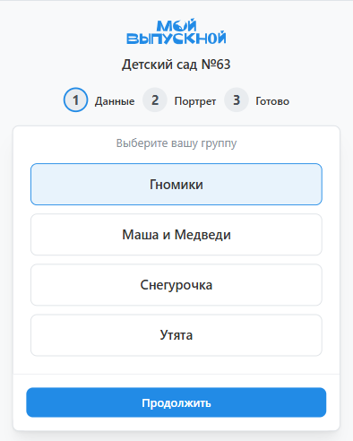
    + На первом этапе потребуется __выбрать портрет__.
    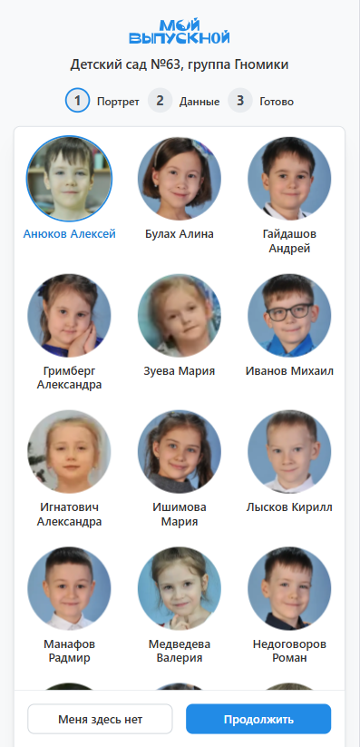
    + На втором - __указать Фамилию и Имя__.
    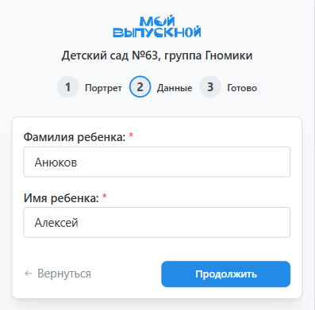
    + На последнем - нажать кнопку "__Начать работу__". И при желании сохранить персональную ссылку.
    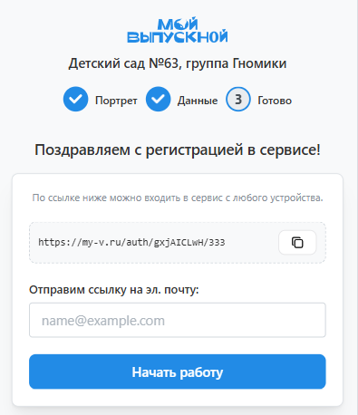

### Отбор фотографий
#### Для альбома
 * Основным этапом в подготовке альбомов является выбор фотографий для его компоновки. В соответствующем разделе личного кабинета будет несколько блоков для фото, количество которых зависит от выбранного дизайна и типа альбома. 
* 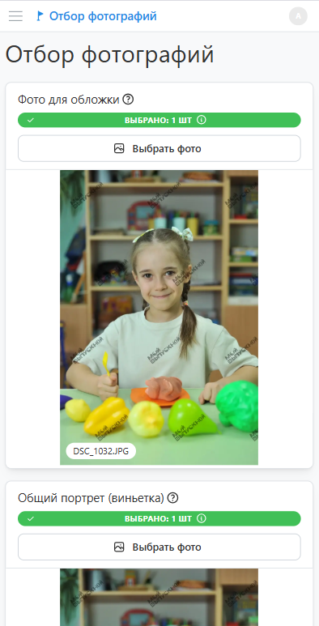
* Выбор фотографий для соответствующего блока осуществляется в модальном окне по нажатию кнопки "__Выбрать фото__". В верхней части окна представлен фильтр, которым удобно пользоваться для групировки или фильтрации снимков.
* 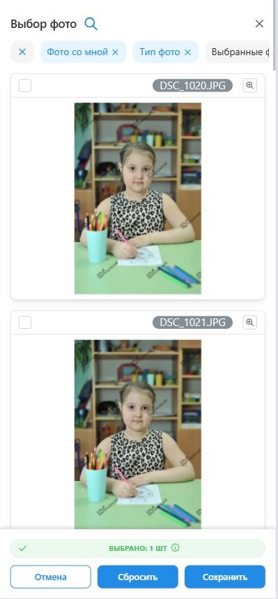

#### Для фотопечати
* Для фотопечати выбор фотографий состоит из нескольких этапов:
    + На первом этапе необходимо __выбрать форматы отпечатков__.
    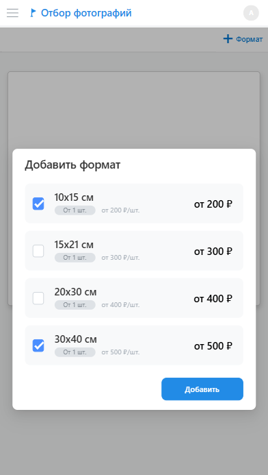
    + На втором - __выбрать фотографии для__ каждого из указанных __форматов__.
    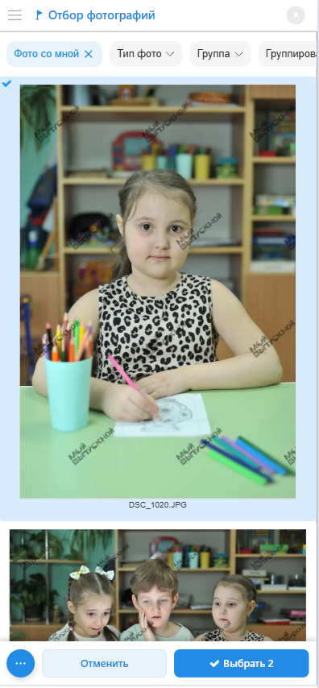
    + На третьем - __подтвердить заказ__.
    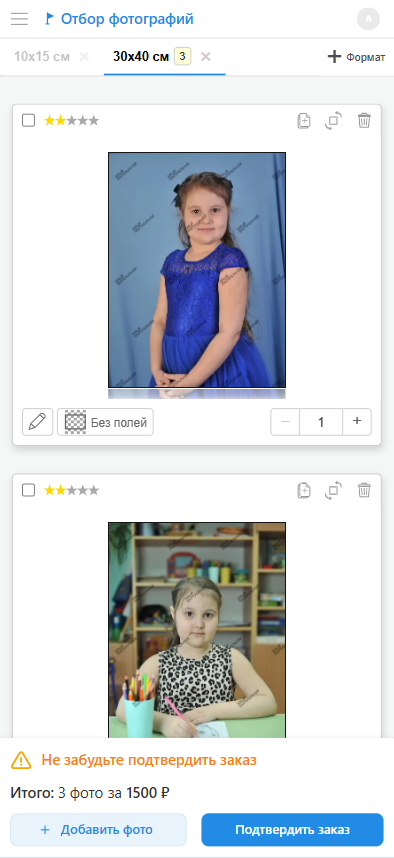

### Согласование дизайна
:::info[Информация]
Если в личном кабинете отсутствует раздел "__Согласование дизайна__", информацию ниже можно пропустить.
:::
* В соответствующем разделе личного кабинета у вас будет представлен предварительный дизайн альбома, фотографии в котором еще не прошли обработку. 
* Для внесения правок в дизайн необходимо:
    + Нажать кнопку “__карандаш__”.
    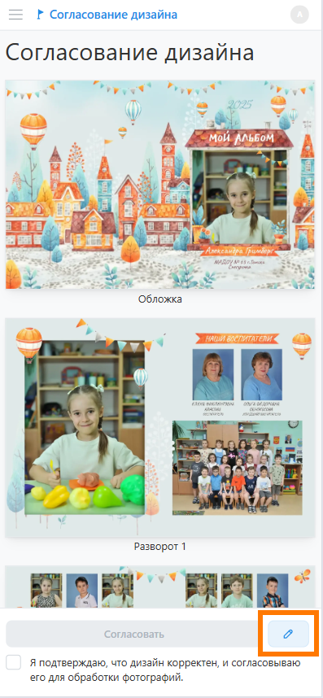
    +  В открывшемся окне внести правки в дизайн персональных разворотов (без замочка). Например, вы можете поменять раскладки и набор фотографий. А по завершению работы нажать кнопку “__Сохранить__”.
    
* Далее потребуется согласовать дизайна нажатием кнопки "__Согласовать__". Впоследствии внести правки в дизайн самостоятельно будет невозможно. 
* 

### Утверждение альбома
* В соответствующем разделе личного кабинета вам будут представлен финальный вариант альбома с отретушированными фотографиями. Отметим, что __альбом будет напечатан именно так, как вы видите__.
* Для внесения правок в дизайн необходимо:
    + Нажать кнопку “__карандаш__”.
    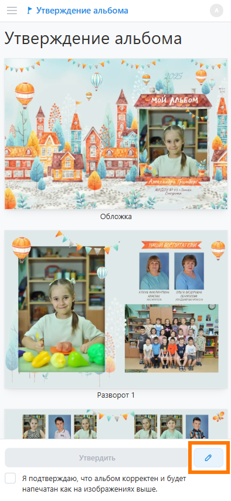
    +  В открывшемся окне внести правки в дизайн персональных разворотов (без замочка). Например, вы можете поменять раскладки и набор фотографий. А по завершению работы нажать кнопку “__Сохранить__”.
    
* Далее потребуется согласовать дизайна нажатием кнопки "__Утвердить__".
* 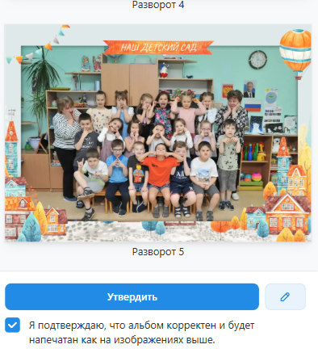

### Прочие разделы
* В личном кабинете также присутствует несколько дополнительных разделов:
    + “__Мой Профиль__” - для редактирования ФИО и подключения уведомлений в Telegram.
    + “__Фотографии__” - для просмотра и скачивания всех фотографий.
    + “__Видео__” - для просмотра всех оживающих видео-файлов.