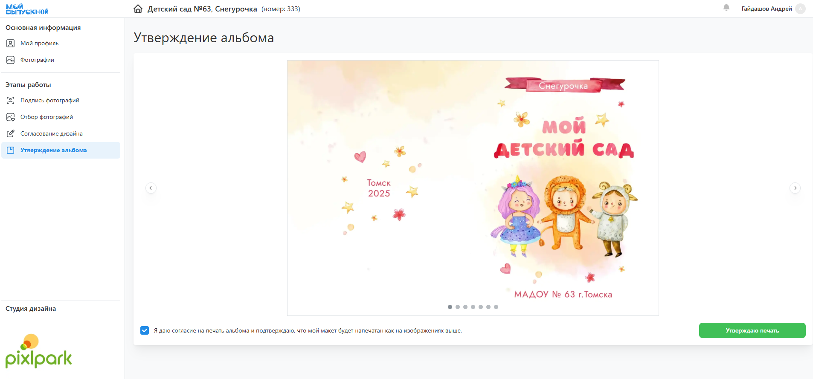

# 9. Утверждение альбомов
* Следующим этапом после обработки снимков и выбора оживающих фотографий является "__Утверждение альбомов__".
* У каждого ученика в личном кабинете в соответствующем разделе отображается готовый для печати альбом. Если ученику разрешено его редактирование и он еще не был согласован, то дизайн можно будет открыть в редакторе и внести финальные правки. Однако, смена фотографий в данном случае ограничивается лишь теми снимками, которые прошли процедуру обработки на предыдущем этапе, т.е. загрузить новые будет нельзя. Если же дизайн был согласован ранее, то функция редактирования будет недоступна. Исключением будет являться координатор - он по прежнему будет иметь возможность внести правки в дизайны учеников вне зависимости от статуса альбома.
* После внесения финальных правок в дизайн ученику необходимо будет нажать кнопку “__Утвердить__”. 

* При переводе проекта в этот статус предусмотрено уведомление координатора и учеников о необходимости утверждения альбомов.
* После утверждения последнего альбома или истечения соответствующего дедлайна статус проекта изменяется на “__Готов к печати__”.
