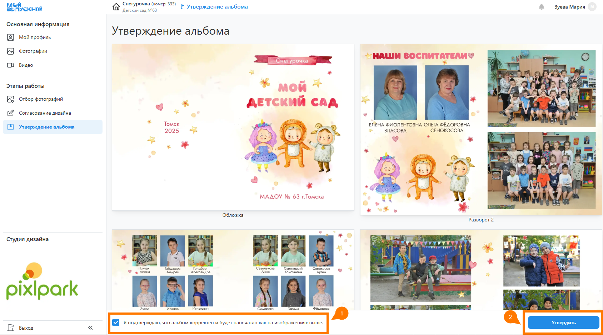
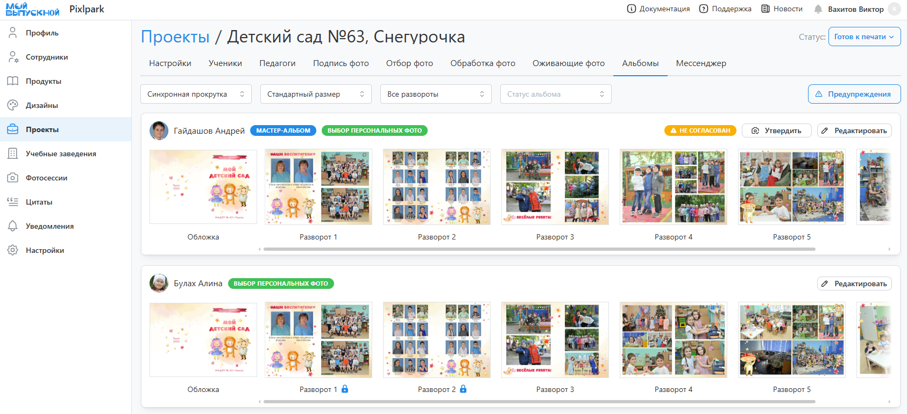
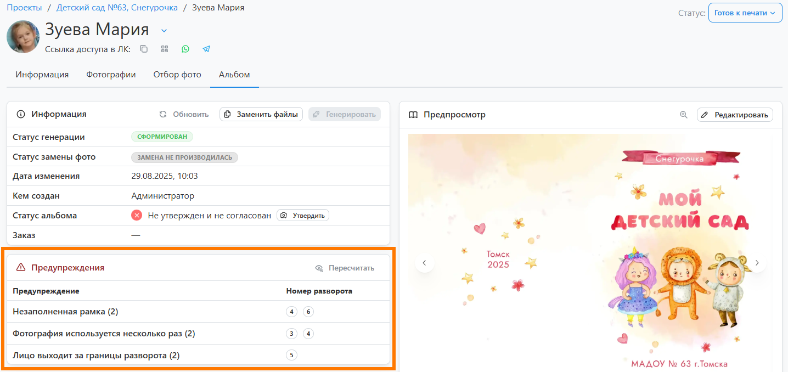

# 6. Утверждение альбомов
* Следующим этапом работы после обработки фотографий и настройки дополненной реальности является "__Утверждение альбомов__", которое осуществляется через __личный кабинет__. Ученики могут проверять и утверждать только персональные альбомы, а координатор - как общий, так и персональные других учеников.
## Проверка учеником
* У каждого ученика в личном кабинете в разделе "__Утверждение альбома__" отображается готовый для печати макет альбом. Если по нему нет замечаний, необходимо подтвердить корректность альбома и нажать кнопку “__Утвердить__”. 

* Если по макету есть замечания, то потребуется внесение правок:
    + Если в проекте не используется этап согласования и разрешено редактирование дизайна, то альбом можно открыть в редакторе, нажав кнопку "__Редактировать__". 
    + Далее в дизайн можно внести правки. Однако смена фотографий в данном случае ограничивается лишь теми снимками, которые прошли процедуру обработки на предыдущем этапе, т.е. загрузить новые будет нельзя. 
    + Если функция редактирования недоступа, то внести правки в дизайн сможет координатор. Если же в проекте отсутствует координатор, то замечания можно написать фотографу через раздел "__Мессенджер__".

## Проверка координатором
* Участник проекта с ролью координатор отвечает за проверку и утверждение всех альбомов. Эта работа проводится в разделе "__Утверждение альбомов__".
* По умолчанию кординатору доступно лишь редактирование персональных разворотов. Однако, в разделе "__Настройка__" можно разрешить редактирование и общих разворотов через мастер-альбом.
* Если в проекте не используются персональные альбомы, то утверждение любого автоматически делает утвержденными все альбомы учеников.

## Проверка фотографом
* Перед печатью фотограф также проводит дополнительную проверку альбомов. Для избежания коллизий (одновременного редактирования альбомов) проект переводится в статус "__Подготовка к печати__". В этом состоянии редактирование альбомов через ЛК будет недоступно. 
* В сервисе предусмотрен автоматический перевод проекта в этот статус после утверждения последнего альбома. Саму проверку можно осуществлять либо в профиле каждого ученика, либо в отдельном разделе "__Подготовка к печати__".
* 
* Данный радел позволяет просматривать превью разворотов, утверждать альбомы и вносить правки через редактор.
* Отдельно стоит отметить удобный фильтр, одной из возможностью которого является отображение только уникальных разворотов всех альбомов. Это значительно упрощает визуальную проверку макетов.
* Помимо отображения превью в сервисе есть автоматическая проверка альбомов и фотопечати на потенциальные ошибки:
    + Использование одной фотографии дважды.
    + Использование фотографии низкого разрешения.
    + Наличие незаполненной рамки для фото.
    + Несоответствие ориентации рамки и фотографии.
    + Обрезка лиц при размещении фотографии в рамке.
* Данные ошибки отображаются в профиле участника и на странице всех альбомов по нажатию кнопку "__Предупреждения__".
* 
