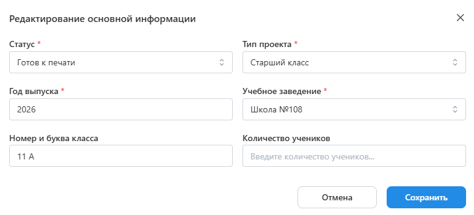
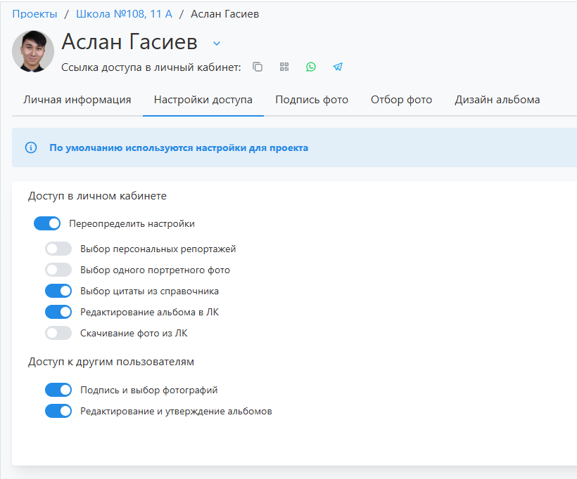

# 1. Настройка проекта
## Описание
* __Проект__ - основной объект сервиса, содержащий всеобъемлющую информацию об учебном коллективе и выпускных альбомах его учеников.
* Одной из осноных характеристик проекта является “__Статус__” - он определяет текущее состояние работы над альбомами и доступный функционал (как в панели управления, так и в ЛК ученика).
* Для создания проекта неободимо перейти в раздел "__Проекты__", нажать кнопку "__Добавить__" и в открывшемся модальном окне задать основные его параметры.
* После создания проекта откроется страница конфигурации - вкладка "__Настройка__", содержащая блоки настроек. Рассмортим их ниже.

## Информация
* Данный блок содержит базовые характеристики, задаваемые при создании проекта. Среди них стоит отметить:
    + __Тип проекта__ - определяет доступный набор цитат для выбора (у которых совпадает "тип проекта").
    + __Количество учеников__ - под это число будет перестраиваться дизайн, если у него включена настройка "__Адаптация__". Если поле не задано, то дизайн будет подстриваться под количество созданных профилей учеников.
    + __Оживающие фотографии__ - включает функционал оживающий фотографий для проекта: загрузку QR-кода для размещения в дизайне и дополнительный раздел по управлению фото-видео. 
    

## Фотосессии
* Данный блок отображает запланированные и проведенные фотосессии по проекту. После создания фотосессии предусмотрено уведомление фотографа, на которого она назначается.

## Дизайны
* Данный блок содержит связки дизайнов и продуктов, которые заказывают ученики. Для настройки дизайна необходимо:
    + Нажать кнопку "__Добавить__".
    + В открывшемся модальном окне в зависимости от значения фильтра "__Источник__" выбрать __шаблон__ или __пресет__, список которых формируется из раздела "__Дизайны__".
    + Если был выбран шаблон, то следующим этапом необходимо __скомпоновать дизайн__ из набора макетов. От того, как собран дизайн, будет зависеть требуемый набор фотографий для отбора на следующем этапе.
* Каждый добавленный дизайн можно отредактироваать через кнопку "__Действия__":
    + __Редактировать развороты__ - изменить компоновку разворотов проектного дизайна (вне зависомости от того, был ли он создан через шаблон или пресет).
    + __Изменить настройки__ - настроить размещение портретов по страницам и в рамках. Подробнее об этом можно прочитать в раделе по [настройке пресетов](/design/template#настройка-пресета-по-шаблону).
    + __Выбрать мастер-альбом__ - выбрать ученика, в чъем альбома будут редактироваться общие разворотыы, виньетки с учениками и педагогами, а также названия учебного заведения и группы. В альбомах других учеников они будут заблокированы.
    + __Сделать основным__ - сделать дизайн применяемым по умолчанию для вновь добавляемых учеников.
* Отметим, что если в проекте несколько, дизайнов то в профиле ученика можно выбрать любой их них. Например, какая-то часть учеником может заказывать трюмо, а другая - многостраничных альбом.

:::tip[Часто задаваемые вопросы]
[Как настроить персональный или общий альбом](/faq/project-work#как-настроить-дизайн-альбома)?
:::

## Дедлайны
* В блоке “__Дедлайны__” задаются крайние сроки для подписи и выбора фотографий, подготовки дазайнов, согласования дизайнов, обработки фотографий и утверждения альбомов. Для каждого события предусмотрены уведомления менеджера, ответственного сотрудника, координатора и учеников. Сами уведомления можно настроить в разделе “Уведомления”.

## Доступ в ЛК
* В блоке “__Настройка доступа__” задаются следующие параметры:
    + Выбор персональных репортажей учениками вместо использования общих фото. Данная настройка доступна только если в дизайне есть персональные развороты.
    + Использование единой фотографий для виньетки, персонального портрета и обложки.
    + Выбор цитаты из справочника готовых, а не только написание собственной.
    + Редактирование персональных разворотов в альбоме.
    + Скачивание всех снимков фотосессий из личного кабинета. По умолчанию скачивание запрещено, а на все фото накладываются водяные знаки.
* Стоит отметить, что в профиле ученика можно переопределить эти настройки в соответствующей вкладке.
  
:::tip[Часто задаваемые вопросы]
[Как настроить отправку уведомлений](/faq/project-work#как-настроить-отправку-уведомлений)?
:::

## История