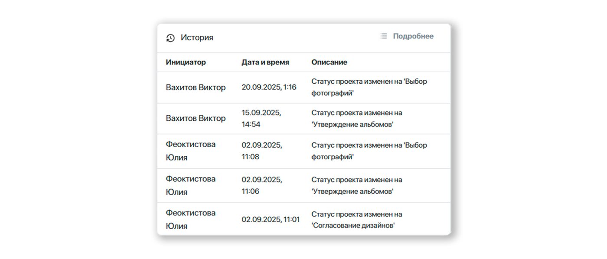

# 1. Настройка проекта
## Описание
* __Проект__ - основной объект сервиса, содержащий всеобъемлющую информацию об учебном коллективе и выпускных альбомах его учеников.
* Одной из основных характеристик проекта является “__Статус__” - он определяет текущее состояние работы над альбомами и доступный функционал (как в панели управления, так и в личном кабинете ученика).
* Для создания проекта необходимо перейти в раздел "__Проекты__", нажать кнопку "__Добавить__" и в открывшемся модальном окне задать основные его параметры.

* После создания проекта откроется страница конфигурации - вкладка "__Настройки__", содержащая блоки настроек. Рассмотрим их ниже.

## Информация
* Данный блок содержит базовые характеристики, задаваемые при создании проекта. Среди них стоит отметить:
    + __Тип проекта__ - определяет доступный набор цитат для выбора (у которых совпадает "тип проекта").
    + __Количество учеников__ - под это число будет перестраиваться дизайн, если у него включена настройка "__Адаптация__". Если поле не задано, то дизайн при включенной настройке будет подстраиваться под количество созданных профилей учеников.
    + __Оживающие фотографии__ - включает функционал оживающих фотографий для проекта: загрузку QR-кода для размещения в дизайне и дополнительный раздел по управлению фото-видео. Данная настройка отображается только если включен соответствующий функционал в настройках сервиса.
    + __Доп. номер__ - содержит дополнительную характеристику проекта. Например, номер договора или идентификатор сделки во внешней CRM-системе.

## Фотосессии
* Данный блок отображает запланированные и проведенные фотосессии по проекту. После создания фотосессии предусмотрено уведомление фотографа, на которого она назначается.

## Дизайны
* Данный блок содержит связки дизайнов и продуктов, которые заказывают ученики. Например, это могут быть: "лайфлат с прослойкой на 10 разворотов с дизайном №1", "лайфлат без прослойки на 5 разворотов с дизайном №1" и "трюмо с дизайном №2".
* Для настройки дизайна необходимо:
    + Нажать кнопку "__Добавить__".

    + В открывшемся модальном окне указать значения фильтра "__Источник__".
    + Выбрать __шаблон__ или __пресет__ из списка, который формируется из раздела "__Дизайны__"

    + Если был выбран шаблон, то следующим этапом необходимо __скомпоновать дизайн__ из набора макетов. От того, как собран дизайн, будет зависеть требуемый набор фотографий для отбора на следующем этапе.

* Каждый добавленный дизайн можно отредактировать через кнопку "__Действия__":
    + __Редактировать развороты__ - изменить компоновку разворотов проектного дизайна (вне зависимости от того, был ли он создан через шаблон или пресет).
    + __Изменить настройки__ - настроить размещение портретов по страницам и в рамках. Подробнее об этом можно прочитать в раделе по [настройке пресетов](/design/template#настройка-пресета-по-шаблону).
    + __Выбрать мастер-альбом__ - выбрать ученика, в чьем альбоме будут редактироваться общие развороты, виньетки с учениками и педагогами, а также названия учебного заведения и группы. В альбомах других учеников они будут заблокированы.
    + __Сделать основным__ - сделать дизайн применяемым по умолчанию для вновь добавляемых учеников.

    

* Отметим, что если в проекте несколько дизайнов, то в профиле ученика можно выбрать любой из них. Например, какая-то часть учеников может заказывать трюмо, а другая - многостраничный альбом.

:::tip[Часто задаваемые вопросы]
[Как настроить персональный или общий альбом](/faq/project-work#как-настроить-дизайн-альбома)?
:::

## Доступ в ЛК
* Данный блок содержит настройки, определяющие доступные функции в личном кабинете ученика:
    + __Выбор персональных фото__ - разрешает выбирать ученику репортажные и групповые фотографии для персональных разворотов.
    + __Редактирование альбома__ - допускает редактирование альбома учеником в разделах "__Согласование дизайна__" и "__Утверждение альбома__".
    + __Ограничение выбора портретов__ - ограничивает выбор портретных фотографий для рамок разного типа. Если настройка включена, то для перечисленных рамок можно будет выбрать лишь один портрет.
    + __Скачивание всех фотографий__ - разрешает скачивание снимков всех фотосессий единым архивом в разделе "__Фотографии__".

    

* Стоит отметить, что в профиле ученика можно переопределить эти настройки в соответствующей вкладке.

## Дедлайны
* Данный блок содержит даты автоматической смены статуса проекта на следующий по списку. Например, дедлайн подписи фотографий задает дату смены статуса на отбор фотографий. 

Отметим, что при смене статуса в сервисе предусмотрена отправка уведомлений. Их можно настроить в разделе “Уведомления”.
:::tip[Часто задаваемые вопросы]
[Как настроить отправку уведомлений](/faq/project-work#как-настроить-отправку-уведомлений)?
:::

## История
* Данный блок содержит историю действий по проекту:
    + Изменение статуса проекта.
    + Изменение проектного дизайна.
    + Изменение набора фотографий для ученика.

* Например, здесь можно отследить, когда ученик изменял набор фотографий определенного типа.

## Заказы
* В данном блоке отображаются заказы на печать альбомов по проекту. Они также дублируются в личном кабинете на сайте типографии. 

* Процесс создания заказа описан в разделе [Оформление заказа](/projects/print-order).