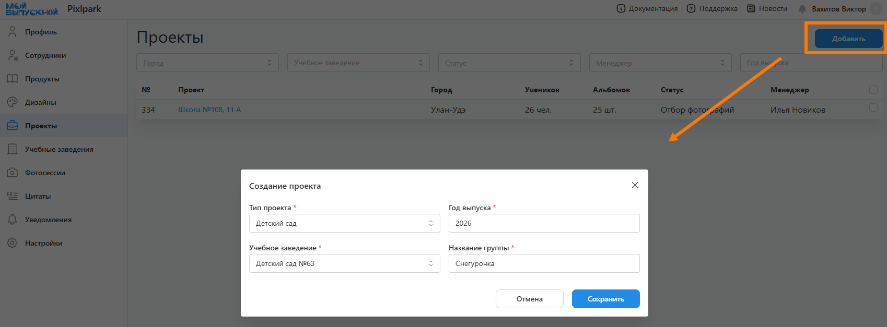
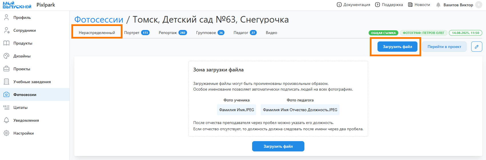
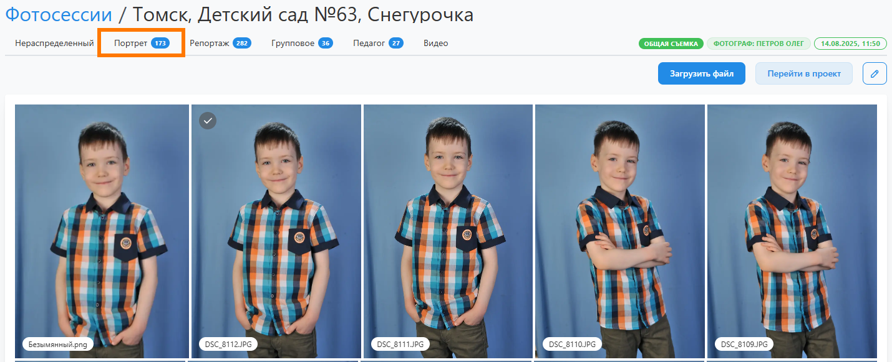
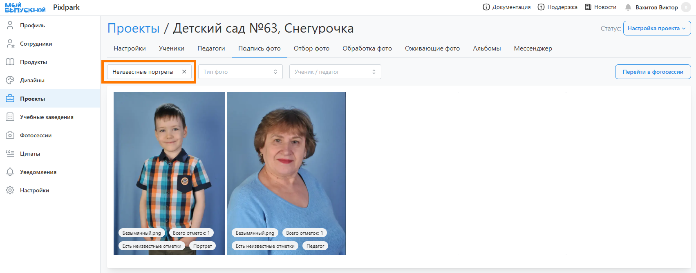
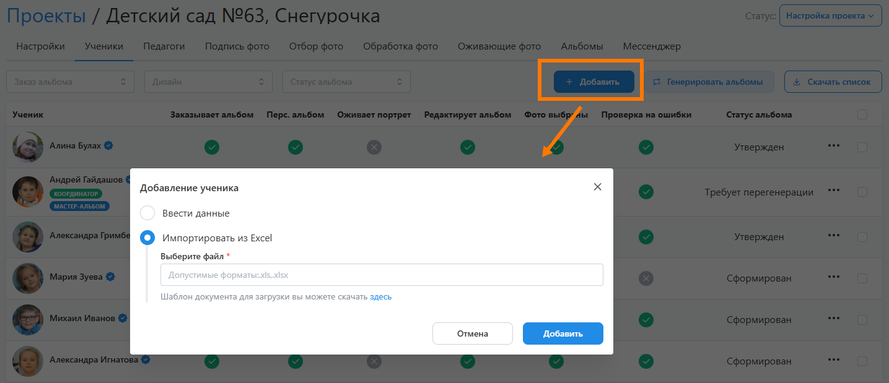

# 1. Настройка проекта
## Создание проекта
### Описание
* __Проект__ - основной объект сервиса, содержащий всеобъемлющую информацию об учебном коллективе и выпускных альбомах его учеников.
* Одной из основных ее характеристик является “__Статус__” - он определяет текущее состояние работы над проектом и доступный функционал (как в панели управления, так и в личном кабинете ученика).
* Для создания проекта необходимо перейти в раздел "__Проекты__", нажать кнопку "__Добавить__" и в открывшемся модальном окне задать основные его параметры.
* 
* После создания проекта откроется страница конфигурации - вкладка "__Настройки__", содержащая блоки параметров. Их необходимо здавать после создания проекта. Рассмотрим их ниже.
* 

### Информация
* Данный блок содержит базовые настройки проекта, среди которых стоит отметить:
    + __Тип проекта__ - определяет возрастную группу учеников.
    + __Оживающие фотографии__ - включает функционал дополненной реальности. При его активации выможете либо использовать встроенный сервис, либо загрузить собственный QR-код для размещения в дизайне.
    + __Доп. номер__ - содержит дополнительную характеристику проекта. Например, номер договора или идентификатор сделки во внешней CRM-системе.
* 

### Доступ в ЛК
* Данный блок содержит настройки доступных функций в личном кабинете:
    + __Доступ в личный кабинет__:
        + __По почте и паролю__ - вход в ЛК по почте и паролю, которые задаются при регистрации.
        + __По персональной ссылке__  - вход в ЛК по уникальной ссылке, которая сообщается при первичном входе.
        + __Открытый доступ__ - вход в ЛК без регистрации, по клилку на профиль любого ученика.
    + __Разрешить скачивание фото и видео__ - разрешает скачивание фотографий и видео, кроме чужих портретов.
    + __Разрешить выбор персональных фото__ - разрешает выбирать ученику репортажные и групповые фотографии для персональных разворотов.
    + __Разрешить изменение дизайнв в редакторе__ - разрешает редактирование альбома.
    + __Ограничить выбор портретных фотографий одним снимком__ - ограничивает выбор портретных фотографий для рамок разного типа. Если настройка включена, то для перечисленных рамок можно будет выбрать лишь один портрет.
* 

### Сотрудники
* Данный блок является опциональным (согласно разделу "__Настройка__") и содержит список назначенных на проект сотрудников. 
* Каждому из них будет отправляться уведомление при назначении и смене статуса проекта, к коотрому он имеет отношение.
* 

### Дедлайны
* Данный блок является опциональным и содержит даты автоматической смены статуса проекта на следующие по списку. Например, дедлайн отбора фотографий задает дату смены статуса на подготовку дизайна. 
* Отметим, что при смене статуса в сервисе предусмотрена отправка уведомлений. Их можно настроить в разделе “Уведомления”.
* 

### История
* Данный блок является опциональным и содержит историю действий по проекту:
    + Изменение статуса проекта.
    + Изменение проектного дизайна.
    + Изменение набора фотографий для ученика.
* Например, здесь можно отследить, когда ученик изменял набор фотографий определенного типа.
* 

### Заказы
* В данном блоке отображаются заказы на печать альбомов или фотографий. Они также дублируются в личном кабинете на сайте типографии. 
* Процесс создания заказа описан в разделе [Оформление заказа](/projects/print-order).
* 

## Настройка продуктов
### Описание
* После задание параметров проекта необходимо перейти в раздел "__Продукты__" для выбора продуктов и соответствующих им дизайнов. Т.е. у каждого ученика может быть свой продукт с персональным дизайном. Но, только один. И в дополнении к нему может быть доступна фотопечать, если она добавлена как продукт. 
* Для упрощения терминологии все продукты с дизайнами будем называть "__альбомами__". Те под этот термим подпадут не только альбомы и трюмо, но и календари с виньетками. 
* Для добавления продукта потребуется нажать соответствующую кнопку. По ее нажатию откроется модальное окно. При этом сам процесс добавления альбома будет состоять из нескольких этапов, коорые рассмотрим ниже.

### Выбор продукта
* На первом этапе потребуется выбрать альбом и задать количество разворотов. Список продуктов формируется на основании данных раздела "__Продукты__".

### Выбор дизайна
* На втором этапе потребуется выбрать __шаблон или пресет__, из которого будет сформирован дизайн - автоматически или вручную. Для автоматическического формирования дизайна обязательно потребуется указать количество учеников.

### Настройка дизайна
* На последнем этапе будет представлен __готовый дизайн__, в который при необходимости можно внести правки:
    + Заменить, добавить или удалить разворот.
    + Назначить разворот персоральным или общим.
    + Задать логику размещения портретов в рамки (вкладка "Настройки").
* Отметим, что если в проекте несколько дизайнов, то в профиле ученика можно выбрать любой из них. Например, какая-то часть учеников может заказывать трюмо, а другая - многостраничный альбом.
* 

## Загрузка фотографий
### Описание
* Фотографии являются основноым строительным материалом для создания альбомов. Они загружаются в отдельные фотосессии, каждая из которых привязывается к одному проекту. Фотосесии можно создавать как из проекта, так и в отдельном разделе "__Фотосессии__", если, например, загрузкой фотографий занимается отдельный сотрудник с рольлью "__фотограф__". 
* Поддерживаются следующие форматы файлов для загрузки:
    + Для фотографий: __JPEG, PNG, HEIC, HEIF, JFIF, PDF, PSD__.
    + Для видео: __MP4, MOV__.
* Рассмотрим далее создание фотосессии из проекта. Для этого перейдем в раздел "__Настройка__" и в блоке "__Фотосессии__" нажмем соответствующую кнопку.
отметим, что после создания фотосессии предусмотрено уведомление фотографа, на которого она назначается.
* 

### Загрузка фото и видео
* После настройки проекта можно перейти к загрузке фотографий. Создать фотосессию можно либо через раздел “__Фотосессии__”, либо через соответствующий блок проекта. 

* Каждая фотосессия фактически является папкой с фотографиями и видео-файлами после съемки.
* Все фотографии делятся на четыре типа:
    + __Портрет__ - портреты учеников;
    + __Педагог__ - портреты педагогов; 
    + __Репортаж__ - сюжетные снимки с одним или несколькими учениками;
    + __Групповое__ - групповые фотографии со всеми учениками.
* Если перед загрузкой файлы не были рассортированы, то их необходимо загружать во вкладку “__Не распределены__”. 
* 
* После завершения загрузки система запустит процесс поиска лиц на фото для последующего распределения файлов по типам по следующей логике:
    + если на снимке находится одно лицо, то фотография считается портретной (в том числе сюда по умолчанию попадают портреты педагогов);
    + если на снимке находится несколько лиц, то фотография считается репортажной;
    + если на снимке находится более 80% лиц, которые есть в фотосессии и в проекте, то фотография считается групповой.
* Также перед загрузкой допускается именовать портреты специальным образом:
    + __Портреты учеников__ - Фамилией и Именем (пример: ```Фамилия Имя.jpg```);
    + __Портреты педагогов__ - Фамилией, Именем, Отчеством и Должностью, где “должность” является необязательной (пример: ```Фамилия Имя Отчество.jpg``` или ```Фамилия Имя Отчество Должность.jpg```).
* В этом случае после загрузки система автоматически создаст в проекте аккаунты учеников и педагогов, а сами ученики будут отмечены на всех фотографиях, где встречаются (на основании подписанного портретного снимка).
* Если перед загрузкой файлы были рассортированы по типам, то их рекомендуется загружать по своим вкладкам.
* 

### Распределение по типам

### Проверка фото

## Добавление учеников
### Добавление учеников
:::info[Информация]
Данный этап работы является опциональным и настраивается в разделе "__Настройка__". По умолчанию он __выключен__.
:::
* Следующим этапом работы над проектом после его настройки и загрузки фотографий является "__Подпись фотографий__" - идентификация учеников на портретных снимках.
* Вне зависимости от активации этапа существует несколько способов подписи фотографий:
    1. Загрузить в фотосессии проименованные портреты через ФИО.
    2. Подписать все уникальные портреты фотографу или координатору.
    3. Оставить выбор своего портрета ученикам при регистрации.
:::tip[Часто задаваемые вопросы]
[Как предоставить доступ к проекту координатору](/faq/project-work#как-предоставить-доступ-к-проекту)?
:::
* Для подписи снимков необходимо:
    + Перейти во вкладку “__Подпись фото__” - здесь отображаются снимки со всех фотосессий, которые можно отфильтровать по наличию ошибок, типу и персонажу (ученику или педагогу).
    + Используя фильтр "__Ошибки__" проверить и исправить все неправильно заданные типы фотографий, последовательно выбирая значения: Фото без типа, Портрет с 2 персонами, Репортаж с 1 персоной.
    + В фильтре "__Ошибки__" выбрать значение "__Неизвестные портреты__", а затем нажать на первую фотографию.
    
    + В открывшемся модальном окне справа от снимка выбрать ученика из списка или добавить нового. Нажать "__Сохранить__". Повторить действие для других фотографий.
    

* Для удобства работы можно предварительно завести списки учеников и педагогов в соответствующих вкладках проекта. Их профили могут быть добавлены вручную, импортированы из excel-файла или автоматически созданы при загрузке поименованных портретов. При этом педагоги в проект могут быть добавлены еще из базы учебных заведений.

* При переводе проекта в этот статус предусмотрено уведомление координатора о необходимости подписать фотографии. Аналогичное уведомление также будет отправлено за сутки до истечения соответствующего дедлайна, если в проекте будут оставаться неподписанные портреты.

### Добавление педагогов

### Работа с группами

### Подпись участников

:::tip[Часто задаваемые вопросы]
[Как настроить персональный или общий альбом](/faq/project-work#как-настроить-дизайн-альбома)?
:::

:::tip[Часто задаваемые вопросы]
[Как настроить отправку уведомлений](/faq/project-work#как-настроить-отправку-уведомлений)?
:::