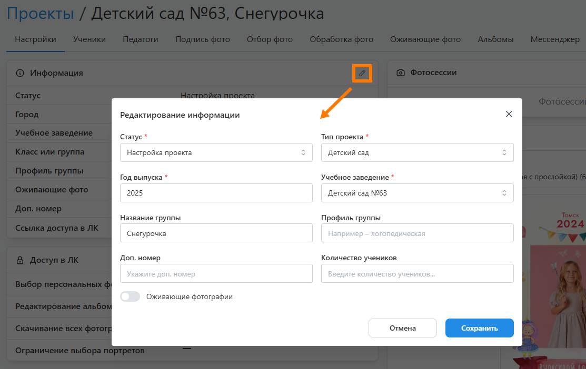
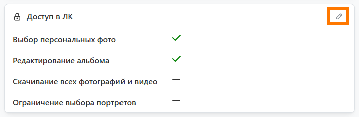
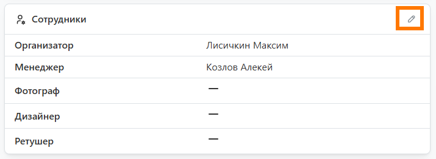

# 1. Настройка проекта
## Создание проекта
### Описание
* Для создания проекта необходимо перейти в раздел "__Проекты__" и нажать кнопку "__Добавить__". В открывшемся модальном окне задать основные его параметры:
    + __Тип проекта__ - определяет возрастную группу учеников.
    + __Год выпуска__ - год выпуска (выставляется по умолчанию).
    + __Учебное заведение__ - название учебного завеления.
    + __Класс / Группа__ - название класса или группы.
* 
* После создания проекта откроется раздел "__Настройки__", содержащий наборы его параметров.  Справа от заголовка будет расположен “__Статус__” - он определяет текущее состояние проекта и доступный функционал (как в панели управления, так и в личном кабинете ученика).

### Информация
* Данный блок содержит базовые настройки проекта, среди которых:
    + __Оживающие фотографии__ - включает функционал дополненной реальности. При его активации допускается загрузка QR-кода для размещения в дизайне, если используется стороннее приложение.
    + __Доп. номер__ - содержит дополнительную характеристику проекта. Например, номер договора или идентификатор сделки во внешней CRM-системе.
* 

### Доступ в ЛК
* Данный блок содержит настройки доступных функций в личном кабинете. Часть из них инициализируются значениями из раздела "__Настройка / Доступ в личный кабинет__". Описание всех параметров есть в статье [Общие настройки](/faq/settings).
* Единственной настройкой, значение которой задется только на уровне проекта, является __ограничение выбора портретов__. Она разрешает для перечисленных портретных рамок выбирать лишь одну фотографию.
* 

### Сотрудники
* Данный блок содержит список сотрудников с соответствующими ролями, каждому из которых будет отправляться уведомление при назначении на проект или смене статуса.
* Блок с сотрудниками нужен только для тех случаев, когда над проектом работает несколько человек. Включить его отображение можно в разделе "__Настройка / Параметры интерфейса__".
* 

### Дедлайны
* Данный блок содержит даты автоматической смены статуса проекта на следующие по списку. Например, дедлайн отбора фотографий задает дату смены статуса на подготовку дизайна. 
* Отметим, что при смене статуса в сервисе предусмотрена отправка уведомлений, которые настраиваются в разделе "__Уведомления__".
* Включить отображение блока с дедлайнами можно в разделе "__Настройка / Параметры интерфейса__".
* 

### История
* Данный блок содержит историю действий по проекту:
    + Изменение статуса проекта.
    + Изменение дизайна.
    + Изменение набора фотографий.
* Например, здесь можно отследить, когда ученик изменял набор фотографий определенного типа.
* Включить отображение блока с историей можно в разделе "__Настройка / Параметры интерфейса__".
* 

### Заказы
* В данном блоке отображаются заказы на печать альбомов или фотографий. Они также дублируются в личном кабинете на сайте типографии. Процесс создания заказа описан в статье [Печать альбомов](/projects/print-order#создание-заказа).
* 

## Настройка продуктов
### Описание
* После задание настроек проекта необходимо перейти в раздел "__Продукты__" и добавить интересующую фотопродукцию. Это могут быть альбомы, трюмо, календари, виньетки и фотографии. Для простоты описания всю продукцию с дизайном в дальнейшем будем называть альбомами.
* 
* Один из добавленных альбомов всегда являться __основным__, именно он формируется для каждого ученика по умолчанию. Указать ученику другой альбом можно в его профиле через настройку "__Продукт и дизайн__".
* 
* На текущий момент ученик через свой личный кабинет может работать только над одним альбомов, при этом выбор снимков для фотопечати ничем не ограничен.
* Процесс добавления альбома инициализируется нажатием кнопки "__+ Альбом__" и состоит из трех этапов, который рассмотрим далее.

### Выбор продукта
* На первом этапе будут представлены альбомы из раздела "__Продукты__". Потребуется выбрать один из них и задать количество разворотов.
* 

### Выбор дизайна
* На втором этапе потребуется выбрать __шаблон или пресет__, из макетов которого будет сформирован дизайн. При выборе шаблона также необходимо будет указать способ формирования дизайн:
    + __автоматически__ - дизайн будет сформирован нейросетью по заданному количеству учеников.
    + __вручную__ - дизайн потребуется скомпоновать вручную на следующем шаге.
* 

### Настройка дизайна
* На последнем этапе будет представлен __готовый дизайн__, если на предыдущем шаге выбирался пресет или автоматический алгоритм формирования. Иначе для каждого разворота альбома придется вручную выбирать макеты шаблона.
* При необходимости вы сможете внести правки:
    + Заменить, добавить или удалить разворот.
    + Назначить разворот персоральным или общим.
    + Задать логику размещения портретов в рамки (вкладка "Настройки").
* 

## Загрузка фото и видео
### Описание
* Фотографии являются основным строительным материалом для создания альбомов. Они загружаются по папкам - фотосессиям, которые изначально связываются с проектом. Фотосесии можно создавать как из проекта, так и в отдельном разделе "__Фотосессии__", если, например, загрузкой фотографий занимается отдельный сотрудник с рольлью "__фотограф__". 
* Поддерживаются следующие форматы файлов для загрузки:
    + Для фотографий: __JPEG, PNG, HEIC, HEIF, JFIF, PDF, PSD__.
    + Для видео: __MP4, MOV__.
* Рассмотрим далее создание фотосессии из проекта. Для этого перейдем в раздел "__Настройки__" и в блоке "__Фотосессии__" нажмем соответствующую кнопку. 

### Загрузка фотографий
* Все фотографии делятся на четыре типа:
    + __Портрет__ - портрет ученика;
    + __Педагог__ - портрет педагога; 
    + __Репортаж__ - сюжетный снимок с одним или несколькими учениками;
    + __Групповое__ - групповая фотография со всеми учениками.
* Если перед загрузкой файлы не были рассортированы, то их необходимо загружать во вкладку “__Не распределены__”. 
* 
* После завершения загрузки система запустит процесс поиска лиц на фото для последующего распределения файлов по типам по следующей логике:
    + если на снимке находится одно лицо, то фотография считается портретной (в том числе портреты педагогов);
    + если на снимке находится несколько лиц, то фотография считается репортажной;
    + если на снимке находится более 80% лиц проекта, то фотография считается групповой.
* Также перед загрузкой допускается именовать портреты специальным образом:
    + __Портреты учеников__ - Фамилией и Именем (пример: ```Фамилия Имя.jpg```);
    + __Портреты педагогов__ - Фамилией, Именем, Отчеством и Должностью, где “должность” является необязательной (пример: ```Фамилия Имя Отчество.jpg``` или ```Фамилия Имя Отчество Должность.jpg```).
* В этом случае после загрузки система автоматически создаст в проекте аккаунты учеников и педагогов, а сами ученики будут отмечены на всех фотографиях, где встречаются (на основании подписанного портретного снимка).
* Если перед загрузкой файлы были рассортированы по типам, то их рекомендуется загружать по своим вкладкам.
* 

### Проверка фото
* После завершения загрузки рекомендуется перейти в раздел "__Проверка фото__" и проверить снимки. Для этого в первом фильтре предусмотрены следующие критерии проверок:
    + __Неизвестные портреты__ - фотографии с типом "портрет" или "педагог", для которых не созданы аккаунты участников.
    + __Фото с неизвестными__ - фотографии, на которых присутствуют неизвестные участники.
    + __Несоответствие типа__ - фотографии, чей тип несоответствует количеству найденных на них участников. Например, портретом всегда считается фотография с одним участником, а репортаж - с несколькими.
    + __Отсутствие участников__ - фотографии, на которых система не смогла обнаружить участников.
    + __Ошибка ориентации__ - фотографии, которые система посчитала некорректно повернутыми. Часть из них система можем повернуть автоматически, если посчитает вероятность ошибки довольно высокой. 
*   
* Для исключения фотографий из списка потенциально ошибочных необходимо их выделить, а затем нажать кнопку "__Исключить из ошибок__".
* 
* Изменить тип фотографий также можно через пакетное действие - "__Изменить тип фото__".
* А для минимизации действий по выделению фотографий можно воспользоваться функцией __группировки по схожести__.
* 

## Добавление участников
### Добавление учеников
* После загрузки и проверки фотографий можно перейти к следующему действию - __идентификации учеников__. Это можно выполнить несколькими способами:
    1. Загрузить в фотосессии проименованные портреты через ФИО (рассмотрели выше).
    2. Оставить задание ФИО и выбор портрета ученикам при регистрации (не требует дополнительных действий).
    3. Подписать портреты учеников фотографу или координатору.
* Во вкладке "__Проверка фото__" подписать портреты учеников можно двумя способами, которые рассмотрим ниже.

#### Вариант 1 
    1. В первом фильтре выбрать "__Неизвестные портреты__", а затем нажать на первую фотографию.
    2. В модальном окне справа от фото указать ученика, либо выбрав его из списка, либо создав новый аккаунт.
    3. Последовательно повторить действие для всех фотографий фильтра.
* 
    
#### Вариант 2 
    1. Нажать кнопку "__Подписать__", расположенную справа от фильтров.
    2. Откроется модальное окно со всеми лицами, найденными на фотографиях с заданным фильтром.
    3. Указать каждого ученика, либо выбрав его из списка, либо задава Фамилию и Имя.
    4. Убрать отметки с найденных лиц, не являющихся учениками.
* 
*
* Для удобства работы можно предварительно загрузить в сервис список учеников в excel-файле. Для этого необходимо:
    1. Перейти во вкладку "__Участники__" и нажать кнопку "__Добавить__".
    2. В открывшемся модальном окне выбрать вариант "__Импортировать их Excel__".
    3. Выбрать подготовленный список по шаблону и нажать кнопку "__Добавить__".
* 

### Добавление педагогов
* Добавление педагогов в проект во многом идентична работе с учениками, однако есть небольшие отличия:
    1. Педагогов в проект могут добавлять только фотограф или координатор, т.е. самостоятельная регистрация исключена.
    2. Педагогов в проект также можно добавить из базы преподавателей учебного заведения. В этом случае они будут добавлены вместе с сохраненными ранее фотографиями.
* 

### Работа с группами
* Часто при продаже только фотографий съемку проводят не в отдельном классе или группе, а во всем учебном заведении. Подобные проекты обычно характеризуются:
    + Большим количеством участников (иногда более 1000 человек).
    + Отсутствием лица, которого можно назначить координатором.
    + Отсутствием списка учеников и возможности их подписи.
    + Невозможностью вести диалог персонально с каждым.
* Для таких случаев предусмотрен дополнительный функционал, который необходимо использовать в несколько этапов:
    1. __Формирование списка групп__
        + В разделе "__Участники__", нажать кнопку "__три точки__" и выбрать действие "__Настроить группы учеников__".
        + В открывшемся модальном окне задать все группы или классы, которые принимали участие в съемках.
        
    2. __Распределение снимков по группам__
        + В разделе "__Проверка фото__", нажать кнопку "__три точки__" и выбрать действие "__Показать времся съемки__".
        + В первом фильтре выбрать "__Фото без группы__" и включить группировку по схожести через кнопку "__Группировка__".
        + Ориентируясь на время выбрать снимки одной группы и перенести в нее через кнопку "__Добавить в группу__".
        + Повторить действия предыдущего пункта. До тех пор, пока не останется нераспределенных фотографий.
        + Нажать кнопку "__Подписать__", а затем без задания имен и фамилий - "__Сохранить__".
        + В процессе создания аккаунтов учеников каждый из них будет связан к его группой.
        
    3. __Работа в личном кабинете__
        + В разделе "__Настройки__" в блоке "__Доступ в ЛК__" определитьм способ входа в личный кабинет (часто для таких проектов используют "__Открытый доступ__").
        + Из блока "__Информация__" скопировать общую ссылку доступа в ЛК и передать __всем ученикам__.
        + Каждый ученик в процессе регистрации последовательно выберет группу, портрет и задаст фамилию с именем.
        + Если в семьей несколько детей, то для добавления в заказ фотографий ученика из другой группы потребуется в фильтре задать интересующие группы и выбрать из них фотографии.
        
