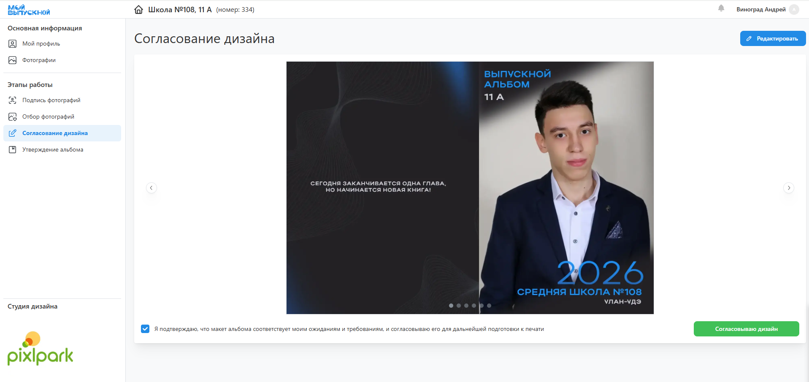

# 6. Согласование дизайнов
:::info[Информация]
Данный этап работы является опциональным. Если его пропусить, то отредактировать альбом можно будет на этапе утверждения (если это допускается настройками проекта).
:::
* Следующий этап после подготовки дизайнов - это "__Согласование дизайнов__" учениками в личном кабинете. В зависимости от настроек сервиса соответствующий раздел ЛК и статус проекта может быть недоступен.
* Если ученику разрешено редактирование альбома, то на данном этапе можно открыть дизайн в редакторе и внести правки на персональных разворотах - например, загрузить дополнительные фотографии или заменить их порядок следования.
* После завершения работы над дизайном ученику необходимо нажать кнопку ”__Согласовать дизайн__”.

* При переводе проекта в этот статус предусмотрено уведомление координатора и учеников о необходимости согласования дизайна. 
* После согласования последнего альбома или истечения соответствующего дедлайна статус проекта изменяется на “__Обработка фотографий__”.
