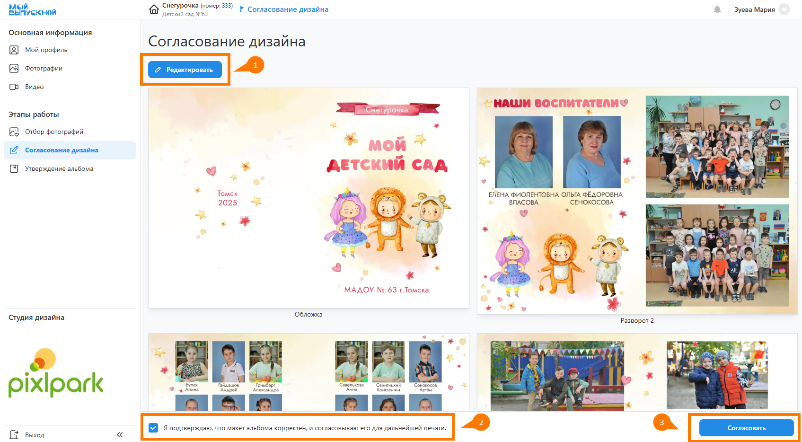

# 6. Согласование дизайнов
:::info[Информация]
Данный этап работы является опциональным и настраивается в разделе "__Настройка__". По умолчанию он __выключен__.
:::
* Следующий этап после подготовки дизайнов - это "__Согласование дизайнов__" учениками в личном кабинете. Включать его имеет смысл в том случае, если вы хотите разделить процессы согласования дизайнов и утверждения альбомов. Ученик не сможет изменить согласованный дизайн на этапе утвержедния. Такая возможность есть лишь координатору.
* Если ученику разрешено редактирование альбома, то на данном этапе можно открыть дизайн в редакторе и внести правки на персональных разворотах - например, загрузить дополнительные фотографии или заменить их порядок следования.
* После завершения работы над дизайном ученику необходимо подтвердить корректность дизайна и нажать кнопку ”__Согласовать__”.
* 
* При переводе проекта в этот статус предусмотрено уведомление координатора и учеников о необходимости согласования дизайна. 
* После согласования последнего альбома или истечения соответствующего дедлайна статус проекта изменяется на “__Обработка фотографий__”.
