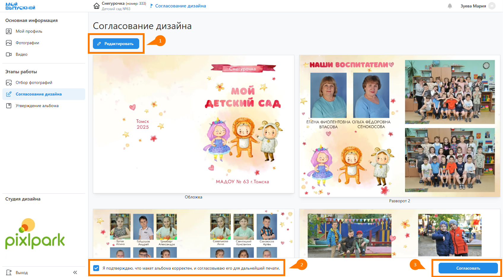

# 5. Подготовка дизайнов
## Генерация мастер-альбома
* Следующим этапом после отбора фотографий является "__Подготовка дизайнов__". Для этого в первую очередь потребуется сформировать мастер-альбом, который содержит:
    + Наименование группы, учебного заведения и года выпуска на персональных разворотах.
    + Общие портреты, ФИО и цитаты на персональных разворотах.
    + Любой контент на общих разворотах.
* Для генерации мастер-альбома необходимо в разделе "__Продукты__" нажать кнопку "__Генерировать__" напротив каждого продукта.
* Также сервис предложит обязательную генерацию мастер-альбома при попытке сгенерировать альбомы участников, если ранее этого не производилось.
* После генерации можно будет внести в альбом необходимые правки, нажав соответствующую кнопку и запустив редактор. 
* При сохранении мастер-альбома все его данные будут перенесены в альбомы участников, если они существуют.

:::tip[Часто задаваемые вопросы]
[Как работать в редакторе](/faq/editor)?
:::

## Генерация альбомов учеников
* Как только мастер-альбома сформирован и отредактирован, можно перейти к формированию персональных альбомов учеников.
* Для этого в разделе "Участники" необходимо нажать кнопку "__Генерировать__" - запустится процесс последовательного формирования альбомов (и даже для тех учеников, кто согласно настройкам не заказывает альбом).
* Отметим, что также существует возможность запускать генерацию альбома во вкладке "__Альбом__" в профиле ученика. Например, это может требоваться после изменения набора выбранных фотографий.

## Генерация альбома педагога
* При запуске общей генерации альбомов всегда формируются и альбомы педагогов, кто согласно настройкам его заказывает.
* Далее, зачастую альбом педагога существенно отличается от альбомов учеников. И это касается не только персональных, но и общих разворотов. А общие развороты, как известно, редактирутются только в мастер-альбоме. Чтобы обойти это ограничение потребуется в профиле педагога отвязать альбома от мастера.
* В этом случае альбом педагога будет жить своей жизнью, а изменения в мастере при сохранении в него переноситься не будут.

## Проверка на ошибки
* После генерации альбомов учеников очень часто требуется проверить, все ли они были сформрованны корректно. Конечно, можно посмотреть альбом в профиле каждого ученика. Но, это неудобно. Для экономии времени по проверке альбомов можно воспользоваться разделом "__Подготовка к печати__".

## Согласование дизайнов
:::info[Информация]
Данный этап работы является опциональным и настраивается в разделе "__Настройка__". По умолчанию он __выключен__.
:::
* Включать данный этап работы имеет только в том случае, если вы хотите разделить процессы согласования дизайнов и утверждения альбомов. 
* Если ученику разрешено редактирование альбома, то на данном этапе он сможет открыть дизайн в редакторе и внести правки на персональных разворотах - например, загрузить дополнительные фотографии или заменить их порядок следования. Но, на этапе утверждения внести правки будет невозможно.
* После завершения работы над дизайном ученику необходимо подтвердить корректность дизайна и нажать кнопку ”__Согласовать__”.
* 