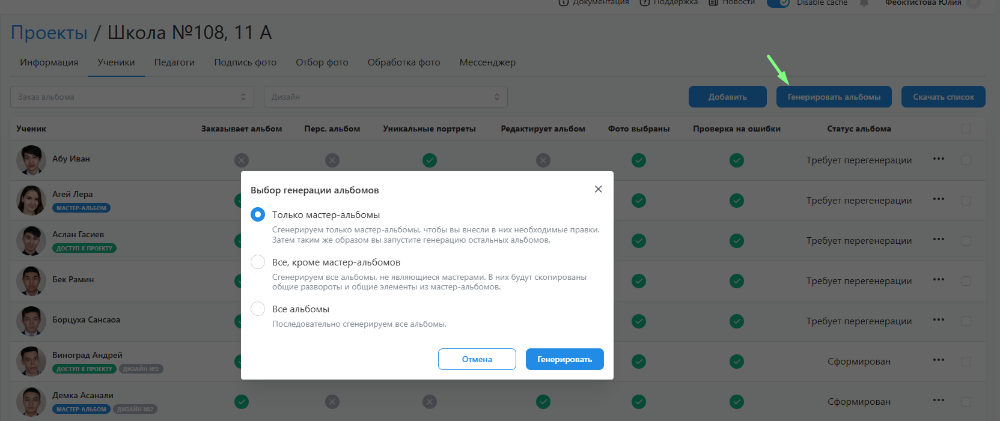
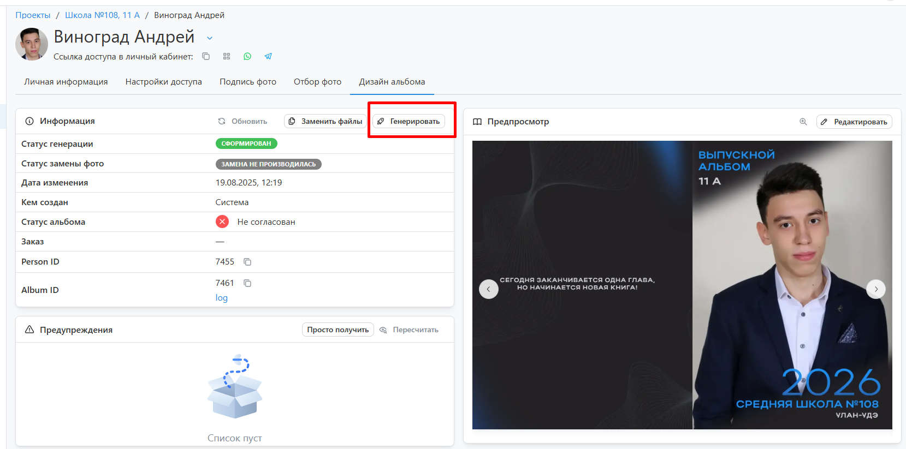

# 5. Подготовка дизайнов
* Следующий этап после отбора фотографий - это __подготовка дизайнов__. Данный процесс выполняется вручную, т.к. в системе не предусмотрена автоматическая генерация альбомов.
* Сгенерировать альбомы можно либо со страницы списка учеников (кнопка в правом верхнем углу), либо в профиле каждого ученика во вкладке “Альбомы на печать”.

* Если в проекте есть назначенные мастер-альбомы и генерация запускается впервые, то система предлагает три варианта формирования дизайнов:
    1. __Только мастер-альбомы__:  В этом случае формируются только мастер-альбомы.
    2. __Все, кроме мастер-альбомов__ : В этом случае мастер-альбомы должны быть уже сформированы; в каждый альбом при генерации из мастера переносятся общие развороты и общие элементы.
    3. __Все альбомы__ : В этом случае последовательно формируются все альбомы, начиная с мастеров.    
* Мы рекомендуем всегда сперва генерировать мастер-альбомы, вносить в них правки, а затем формировать оставшиеся. Это позволит на раннем этапе заметить ошибки, если они были допущены при настройке проекта.
* Вне зависимости от выбранного сценария у вас всегда существует возможность внести правки в дизайн через редактор.
:::tip[Часто задаваемые вопросы]
[Как работать в редакторе](/faq/editor-work)?
:::
* При переводе проекта в этот статус предусмотрено уведомление фотографа о необходимости подготовить дизайны. Аналогичное уведомление также будет отправлено за сутки до истечения соответствующего дедлайна, если у кого-то не будет подготовлен дизайн.
* По истечении дедлайна подготовки дизайнов статус проекта изменяется на __Согласование дизайнов__”.