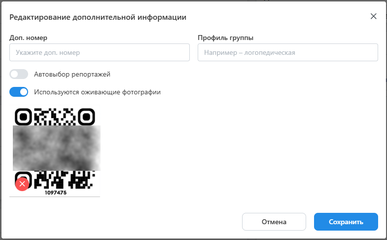
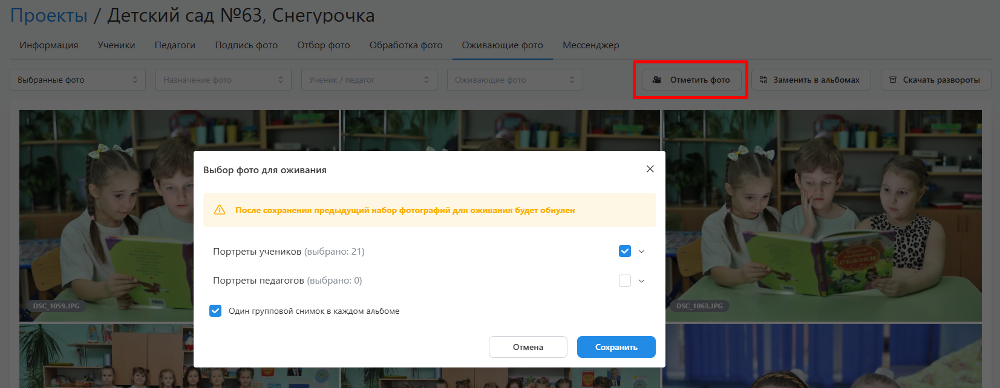
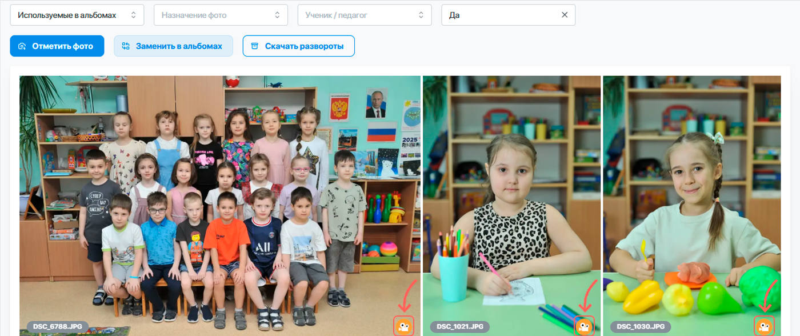

# 8. Оживающие фотографии
:::info[Информация]
Данный этап работы является опциональным, если для фотографий проекта не подготовлены видео-файлы с памятными посланиями учеников.
:::
* Следующим этапом после обработки фотографий является выбор снимков, у которых будет предусмотрен эффект оживания.
* Для этого в проекте выделен раздел “__Оживающие фото__”, который становится доступен при включении соответствующей настройки в блоке “__Дополнительная информация__”.

* Здесь можно как самостоятельно выбрать фотографии, для которых будет рисоваться иконка видеокамеры, так и воспользоваться функцией “__Отметить фото__”. Она позволяет автоматически выбрать по одному портретному снимку каждого ученика/педагога и одну групповую фотографию.

* В автоматическом режиме иконка у портрета рисуется в единственном экземпляре у виньетки или персонального портрета, а у группового снимка - в рамке для группового фото (приоритет отдается рамке на общем развороте).

* После завершения выбора фотографий необходимо нажать кнопку “__Заменить в альбомах__”.
* Для дальнейшей работы по привязке видео к фотографиям можно либо скачать уникальные развороты с расставленными иконками в разрешении 2000px по максимальной стороне, либо после создания заказа скачать архив с файлами для печати в высоком разрешении.
