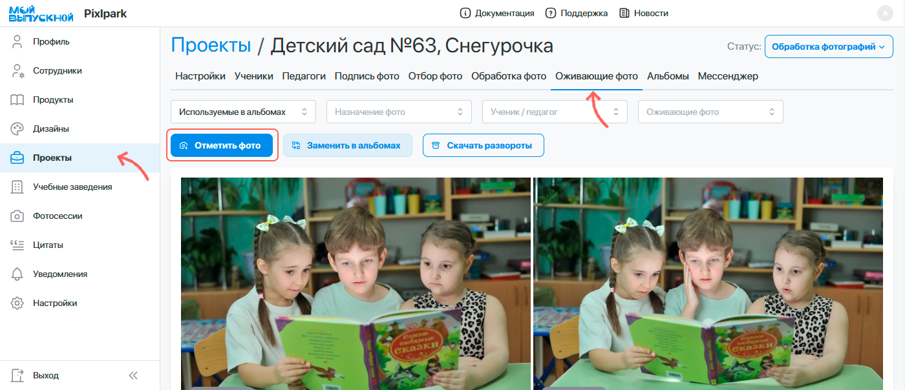
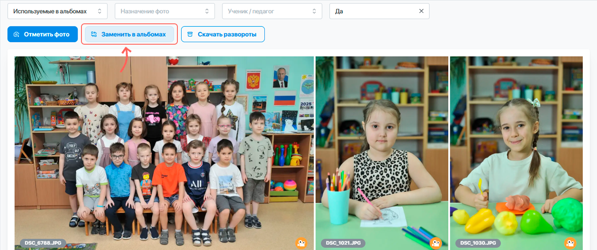

# 8. Оживающие фотографии
:::info[Информация]
Данный этап работы является опциональным, если в настройках сервера или проекта отключена работа с оживающими фотографиями.
:::
* Дополнительным подэтапом обработки фотографий является выбор снимков, у которых будет предусмотрен эффект оживания.
* Для этого в проекте выделен раздел “__Оживающие фото__”, который становится доступен при включении соответствующей настройки в проекте.
* Здесь можно как самостоятельно выбрать фотографии, для которых будет рисоваться иконка видеокамеры, так и воспользоваться функцией “__Отметить фото__”.

 Она позволяет автоматически выбрать по одному портретному снимку каждого ученика/педагога и одну групповую фотографию.

* В автоматическом режиме иконка у портрета рисуется в единственном экземпляре у виньетки или персонального портрета, а у группового снимка - в рамке для группового фото (приоритет отдается рамке на общем развороте).

* После завершения выбора фотографий необходимо нажать кнопку “__Заменить в альбомах__”.

* Для дальнейшей работы по привязке видео к фотографиям необходимо нажать кнопку "__Скачать развороты__" - скачается архив с уникальными разворотами и расставленными иконками в разрешении 2000px по максимальной стороне. Либо после создания заказа скачать архив с файлами для печати в высоком разрешении.
