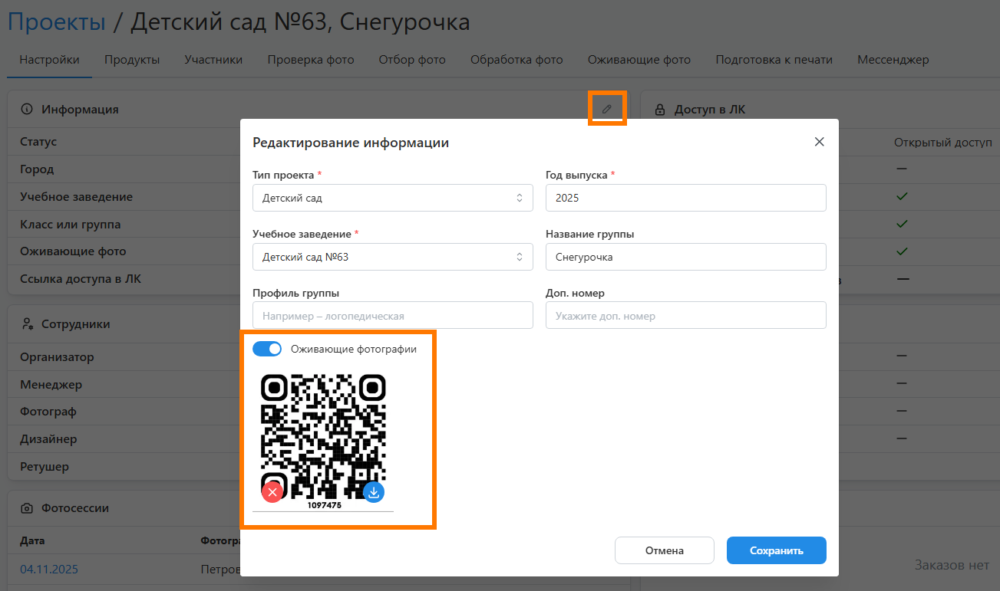
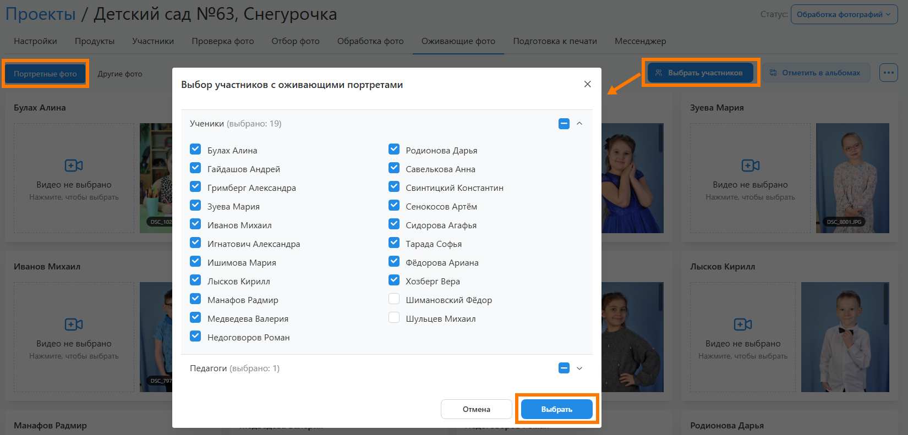
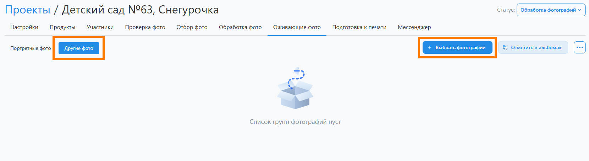
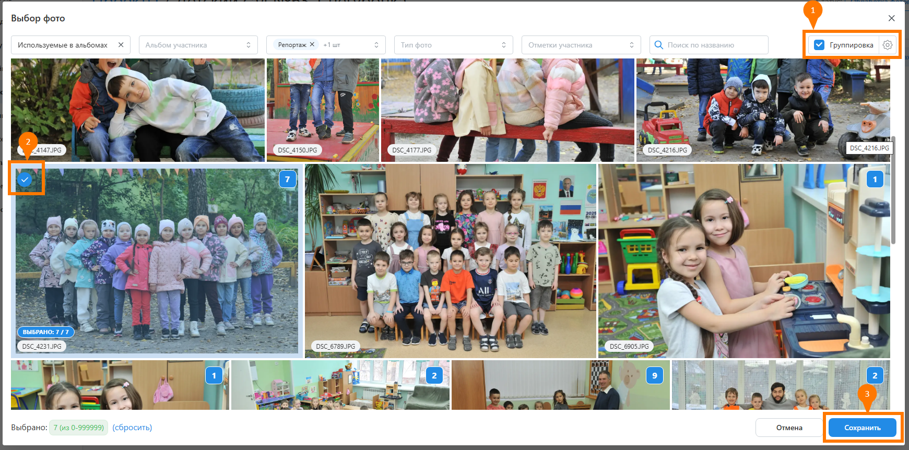
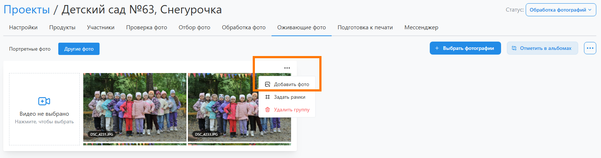
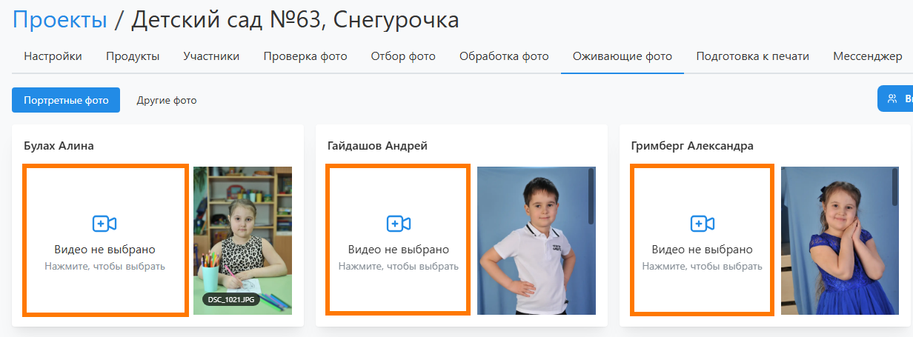
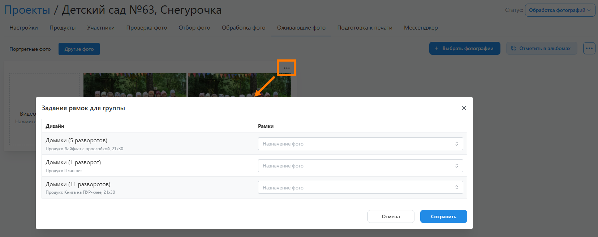
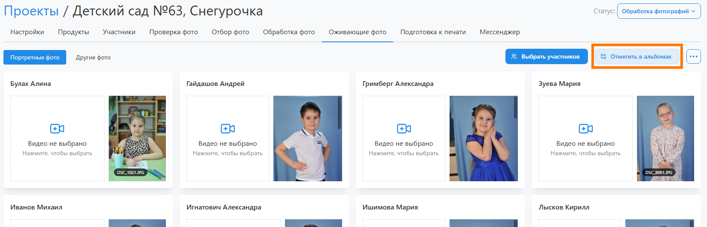
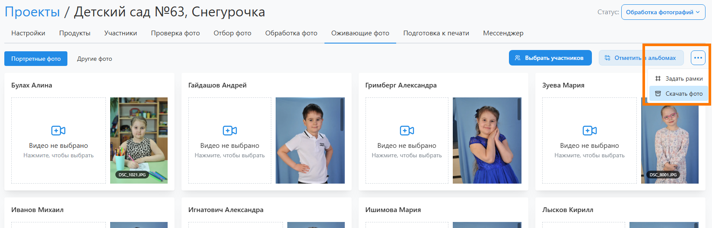

# Оживающие фотографии
### Описание
:::info[Информация]
Данный этап работы является опциональным, если в проекте не используются оживающие фотографии.
:::
* __Оживающие фотографии__ - это один из эффектов __дополненной реальности__, который работает следующим образом:
    + Для фотографий записываются тематические видео. Например, памятные послания учеников самим себе в будущем.
    + На телефон устанавливается специальное приложение. Оно обеспечивает связь фотографиий с их видео-файлами.
    + При наведении приложения на нужную фотографию на месте снимка начинает проигрываться тематическое видео.
* Для работы с дополненной реальностью необходимо:
    1. В разделе "__Настройка / Параметры интерфейса__" включить настройку по отображению раздела оживающих фотографий.
    2. В настройках информации по проекту __включить функционал оживающих фотографий__.
    3. Там же __загрузить QR-код__, если будет использоваться стороннее приложение.
    4. Убедиться, что макет обложки содержит место под QR-код.
* Вся работа с дополненной реальностью ведется в разделе “__Оживающие фото__”. Нет строгого требования по времени, когда она должна быть выполнена. Но, зачастую ее проводят перед тем, как отдать альбомы на утверждение. Рассмотрим шаги, из которых состоит данная работа.
* 

## Выбор фотографий
### Портретные фото
* В первой вкладке необходимо выбрать участников, чьи портреты будут оживать. Это можно сделать двумя способами:
    1. В профиле кажодого ученика включить настройку "__Оживающий портрет__".
    2. Нажать кнопку "__Выбрать участников__" и отметить учеников/педагогов.
* После выбора участников на странице будут отображаться их фотографии, размещаемые в рамках для педагогов и общих портретов учеников.
* 

### Другие фото
* Во второй вкладке необходимо выбрать остальные фотографии, для которых подготовлены видео. Причем схожие фотографии требуется объединять в одну группу, т.к. для них существует одно видео. 
* Для добавления группы и выбора фотографий необходимо:
    1. Нажать кнопку "__Выбать фотографии__", которая создаст группу для схожих фотографий.
    
    2. В модальном окне выбрать схожие снимки, для которых подготовлено видео, и нажать кнопку "__Сохранить__".
    
    3. Для добавления в группу дополнительных фото можно нажать "__три точки__" и выбрать "__Добавить фото__".
    

## Загрузка видео
:::info[Информация]
Данный шаг является опциональным, если используется стороннее приложение дополненной реальности.
:::
* После выбора фотографий необходимо загрузить видео файлы и связать их с портретами и группами похожих снимков.
* Загрузить видео можно как через фотосесии проекта, так и в данном разделе, нажав на кнопку "__Видео не выбрано__". 
* Отметим, что перед загрузкой видео должны быть уже обработаны - выполнен монтаж, цветокоррекция и ретушь.
* 

## Задание рамок
* Для того, чтобы держатель отпечатанного альбома знал, у каких фотографий есть дополненная реальность, обычно в правом нижнем углу у фото рисуется __иконка-маркет__. Для группы схожих снимков, используемых в альбоме, иконка __рисуется только у одной фотографии__.
* В сервисе заложена внутренняя логика по выбору фото для маркировки среди нескольких схожих:
    + Среди портретных снимков выбирается то, которое размещено в рамке для __общего портрета__. Причем приоритет отдается портретам с постраничным размещением, а не виньеткой.
    + Среди групповых снимков выбирается то, которое размещено в рамке для __групповых фото__. 
* Однако такую логику выбора можно переопределить для каждого набора продукт+дизайн, нажав на кнопку "__три точки__" и выбрав "__Задать рамки__".
* 

## Обновление альбомов
* Следующим шагом по работе с дополненной реальностью является разметка иконкой-маркером выбранных фотографий в альбомах. Для этого необходимо нажать кнопку "__Отметить в альбомах__".
* После чего будет запущен __процесс обновления альбомов__, текущее состояние по каждому из которых будет отражаться в профиле участника в __статусе замены фото__.
* По завершению замены можно будет открыть любой альбом и убедиться в корректности расставления иконки-маркера.
* 

## Инициализация приложения
### Стороннее приложение
* В случае использования стороннего приложения потребуется загрузить в него видео файлы и фрагменты дизайнов, которые свяжутся с видео.
* Вы можете либо самостоятельно вырезать эти элементы из превью или макетов отрендеренных альбомов в заказе, либо воспользоваться функцией "__Скачать фото__" (кнопка "__три точки__").
* В этом случае сервис упакует в архив уникальные фрагменты дизайнов с размещенными на фото иконками-маркерами.
* 
### Встроенное приложение
* Если используется встроенное приложение, то ничего дополнительно делать не нужно - сервис автоматически выгрузит в него все необходимые данные.