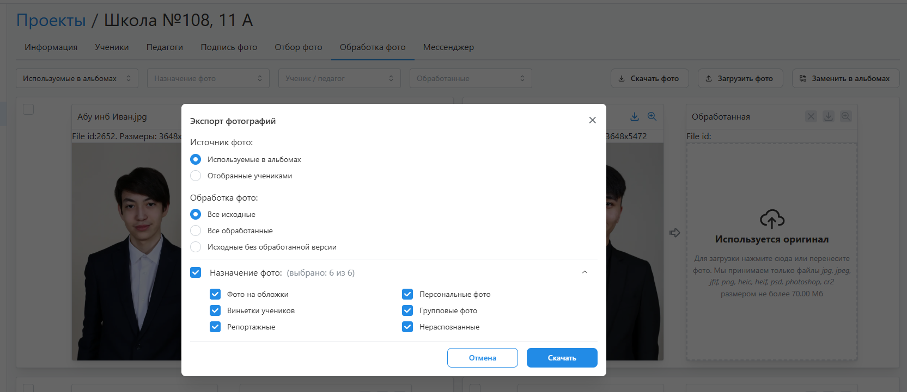

# 7. Обработка фотографий
:::info[Информация]
Данный этап работы является опциональным, если  в фотосессии изначально загружались обработанные фотографии, а ученики не добавляли собственные.
:::
* Следующим этапом после согласования дизайнов является обработка фотографий.
* Фотографии, подлежащие дальнейшей обработке, расположены во вкладке “__Обработка фото__”. Они разделяются на два набора:
    1. __Выбранные фотографии__.
    2. __Используемые в альбомах__ - фотографии, которые остались в альбомах после их редактирования (какие-то файлы могли быть удалены из дизайнов, а какие-то загружены дополнительно).
* Для обработки фотографий необходимо:
    1. Скачать их поштучно или массово через кнопку “__Скачать фото__”.
    2. Провести обработку файлов, не изменяя их названия.
    3. Затем загрузить обратно через кнопку “__Загрузить фото__”.
    4. В конце нажать кнопку “__Заменить в альбомах__“. Если пропорция обработанных снимков была изменена более чем на 10%, то система предложит обновить раскладки коллажей, если они использовались в дизайнах.

    
    
* Скачивать выбранные, а не используемые в альбомах, фотографии имеет смысл только в том случае, если вы хотите на этапе согласования дизайнов показывать альбомы с обработанными снимками. Либо, например, если планируете распараллелить процесс работы над проектом и обработки фотографий. Однако в этом случае после редактирования дизайнов учениками вам придется заново скачать и обработать файлы, которые были добавлены вручную через редактор.
* При скачивании фотографий есть возможность указать конкретные типы файлов. Например, не скачивать портреты, если они изначально загружались отретушированные. Либо же наоборот - скачивать портреты для ретуши, а все остальные файлы - для цветокоррекции.
:::tip[Часто задаваемые вопросы]
[Как подключить сервисы вырезки фона и ретуши](/faq/integrations)?
:::
* При переводе проекта в этот статус предусмотрено уведомление сотрудника с ролью “Ретушер”, если он назначен на проект. 
* По истечении дедлайна обработки фотографий статус проекта изменяется на “__Утверждение альбомов__”.
