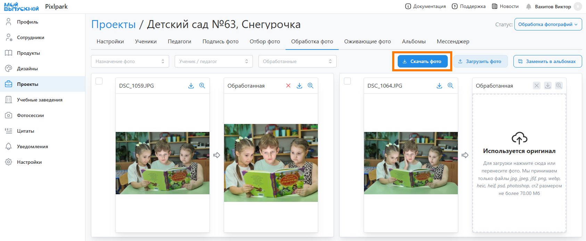
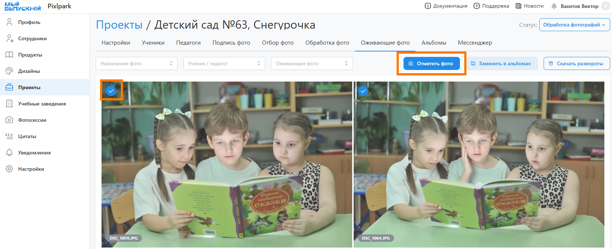

# 7. Обработка фотографий
## Ретушь фотографии
:::info[Информация]
Данный этап является опциональным, если в фотосессии загружались обработанные снимки.
:::
* Следующим этапом после согласования дизайнов является "__Обработка фотографий__", которые были выбраны на предыдущем этапе.
* Для замены фотографий в альбомах необходимо:
    + Перейти в раздел "__Обработка фото__" и нажать кнопку "__Скачать фото__" в правом верхнем углу.
   
    + В открывшемся модальном окне задать параметры интерсующих фотографий и нажать кнопку "__Скачать__". По умолчанию в архиве портретные фотографии помещаются в одну папку, а остальные снимки - в другую.
    
    + Обработать скачанные файлы, не изменяя их названия, и загрузить обратно через кнопку “__Загрузить фото__”.
    
    + В конце нажать кнопку “__Заменить в альбомах__“. Если пропорция обработанных снимков была изменена более чем на 10%, то сервис предложит обновить раскладки коллажей, если они использовались в дизайнах.
    
* Для оптимизации обработки фотографий можно подключить внешние сервисы ретуши и вырезки фона, о чем мы написали в [отдельной статье](/faq/integrations).

## Оживающие фотографии
:::info[Информация]
Данный этап работы является опциональным, если в проекте используются оживающие фотографии.
:::
* Если в проекте используется дополненная реальность, то необходимо перейти в раздел “__Оживающие фото__”, состоящий из двух вкладок:
    + __Портетные фото__ - общие портретные снимки учеников, у которых включена настройка оживающих фото в профиле.
    + __Другие фото__ - иные снимки, для которые подготовлены оживающие видео

* Здесь можно как самостоятельно выбрать фотографии, для которых будет рисоваться иконка видеокамеры, так и воспользоваться функцией “__Отметить фото__”.
* 
 Она позволяет автоматически выбрать по одному портретному снимку каждого ученика/педагога и одну групповую фотографию.
 * 
* В автоматическом режиме иконка у портрета рисуется в единственном экземпляре у виньетки или персонального портрета, а у группового снимка - в рамке для группового фото (приоритет отдается рамке на общем развороте).
* После завершения выбора фотографий необходимо нажать кнопку “__Заменить в альбомах__”.
* 
* Для дальнейшей работы по привязке видео к фотографиям необходимо нажать кнопку "__Скачать развороты__" - скачается архив с уникальными разворотами и расставленными иконками в разрешении 2000px по максимальной стороне. Либо после создания заказа скачать архив с файлами для печати в высоком разрешении.
