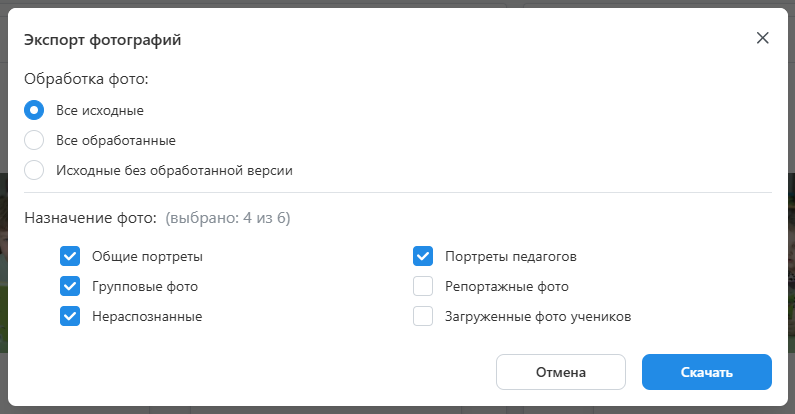

# 7. Обработка фотографий
## Ретушь фотографии
:::info[Информация]
Данный этап работы является опциональным, если в фотосессии изначально загружались обработанные снимки.
:::
* Следующим этапом после согласования дизайнов является "__Обработка фотографий__", которые были выбраны на предыдущем этапе.
* Для замены фотографий в альбомах необходимо:
    + Перейти в проекте в раздел "__Обработка фото__" и нажать кнопку "__Скачать фото__" в правом верхнем углу.
   

    + В открывшемся модальном окне задать параметры интерсующих фотографий и нажать кнопку "__Скачать__". В назначении фото, например, можно выбрать лишь портретные снимки для цветокоррекции и ретуши. Либо, например, все остальные снимки только для цветокоррекции.
    
    + Обработать скачанные файлы, не изменяя их названия, и загрузить обратно через кнопку “__Загрузить фото__”.
    
    + В конце нажать кнопку “__Заменить в альбомах__“. Если пропорция обработанных снимков была изменена более чем на 10%, то сервис предложит обновить раскладки коллажей, если они использовались в дизайнах.
    
:::tip[Часто задаваемые вопросы]
[Как подключить сервисы вырезки фона и ретуши](/faq/integrations)?
:::
* При переводе проекта в этот статус предусмотрено уведомление сотрудника с ролью “__Ретушер__”, если он назначен на проект. По истечении дедлайна обработки фотографий статус проекта изменяется на “__Утверждение альбомов__”.

## Оживающие фотографии
:::info[Информация]
Данный этап работы является опциональным и настраивается в разделе "__Настройка__" и в информации о проекте.
:::
* Дополнительным подэтапом обработки фотографий является выбор снимков, у которых будет предусмотрен эффект оживания.
* Для этого в проекте выделен раздел “__Оживающие фото__”, который становится доступен при включении соответствующей настройки в проекте.
* Здесь можно как самостоятельно выбрать фотографии, для которых будет рисоваться иконка видеокамеры, так и воспользоваться функцией “__Отметить фото__”.
* 
 Она позволяет автоматически выбрать по одному портретному снимку каждого ученика/педагога и одну групповую фотографию.
 * 
* В автоматическом режиме иконка у портрета рисуется в единственном экземпляре у виньетки или персонального портрета, а у группового снимка - в рамке для группового фото (приоритет отдается рамке на общем развороте).
* После завершения выбора фотографий необходимо нажать кнопку “__Заменить в альбомах__”.
* 
* Для дальнейшей работы по привязке видео к фотографиям необходимо нажать кнопку "__Скачать развороты__" - скачается архив с уникальными разворотами и расставленными иконками в разрешении 2000px по максимальной стороне. Либо после создания заказа скачать архив с файлами для печати в высоком разрешении.
