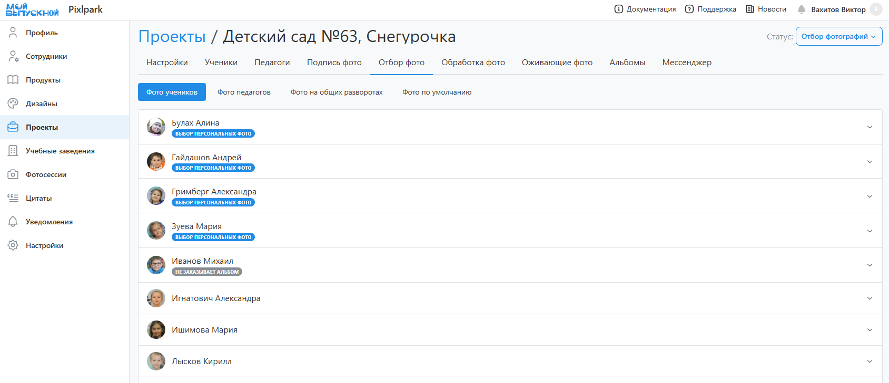
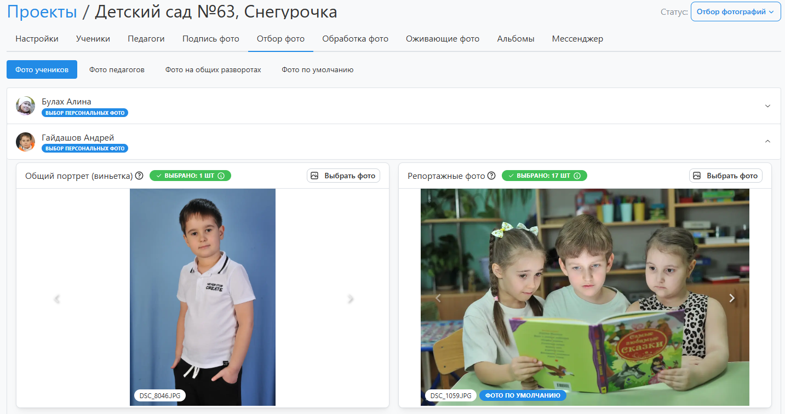
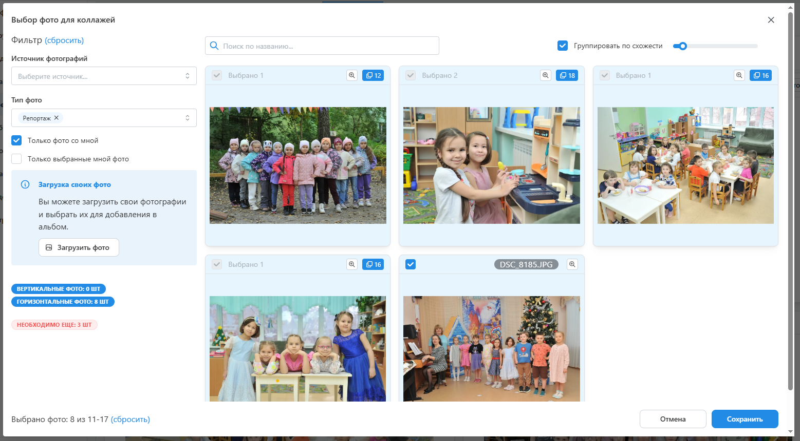

# 4. Отбор фотографий
* Следующим этапом после подписи фотографий является их отбор для формирования дизайнов. Это может сделать фотограф, координатор или сам ученик. Набор необходимых фотографий определяется используемым дизайном. В панели управления работа по выбору фотографий ведется во вкладке “__Отбор фото__”.
* 
* В общем случае интерфейс раздела содержит несколько вкладок:
    + __Фото учеников/педагогов__ - это все портреты, репортажные и групповые снимки на персональных разворотах для каждого ученика.
    + __Фото на общих разворотах__ - это репортажные и групповые снимки на общих разворотах.
    + __Фото по умолчанию__ - это репортажные и групповые снимки на персональных разворотах, которые будут использоваться, если у ученика либо запрещен выбор, либо фотографии не выбраны и включена функция автодобора.
* Однако если в дизайне все развороты персональные, то вкладка "Фото на общих разворотах" будет отсутствовать.

:::tip[Часто задаваемые вопросы]
[Как настроить персональный или общий альбом](/faq/project-work#как-настроить-дизайн-альбома)?
:::
* Интерфейс выбора файлов для фотографа, учеников и координаторов отличается тем, что для ученика в личном кабинете доступен выбор лишь его персональных фотографий, а для фотографа и координатора доступен выбор для всех учеников, плюс выбор для общих разворотов и фото по умолчанию.
* 
* При этом само модальное окно выбора одинаковое: в правой части отображаются фотографии, а в левой расположен фильтр, возможность загрузки собственных файлов, а также подсказки по количеству и ориентации выбранных снимков. 
* 
* При переводе проекта в этот статус предусмотрено уведомление координатора и учеников о необходимости выбрать фотографии. Аналогичное уведомление также будет отправлено за сутки до истечения соответствующего дедлайна, если у кого-то не будут выбраны фотографии.
* По истечении дедлайна выбора фотографий статус проекта изменяется на “__Подготовка дизайнов__”.