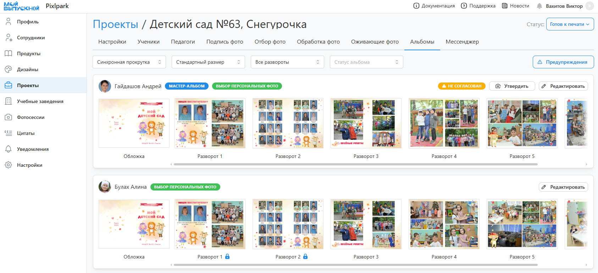
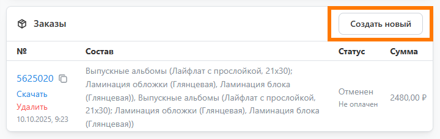
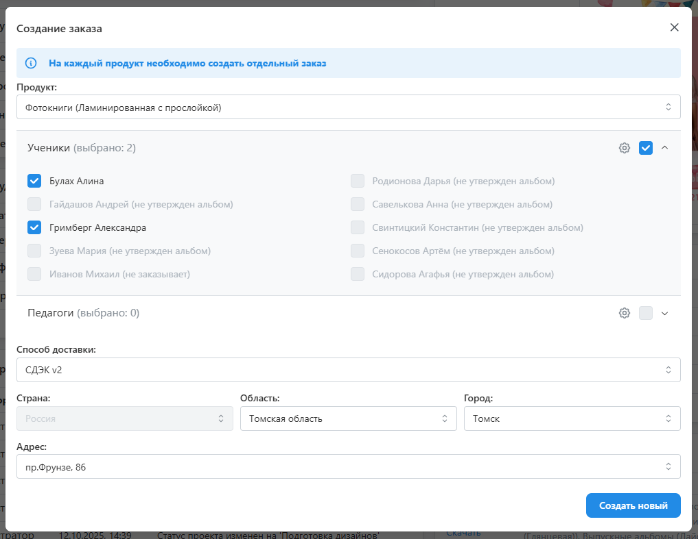
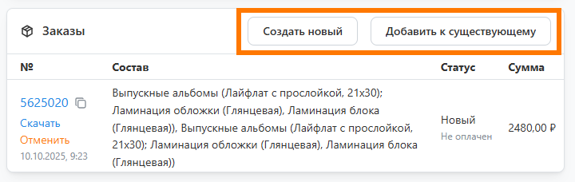

# 7. Печать альбомов
* После утверждения альбомов статус проекта должен быть изменен на "__Готов к печати__". На этом этапе необходимо проверить все альбомы, а затем отправить их на печать в типографию.

## Подготовка к печати
* Проверку на ошибки удобнее всего проводить в специальном разделе "__Альбомы__", в котором отображаются превью разворотов всех заказываемых альбомов. 
* 
Помимо этого здесь отображаются предупрежднения на потенциальные ошибки дизайна (также они дублируются в профиле ученка):
    + Использование одной фотографии дважды.
    + Использование фотографии низкого разрешения.
    + Наличие незаполненной рамки для фото.
    + Несоответствие ориентации рамки и фотографии.
    + Размещение фотографии в рамке таким образом, что некоторые лица на снимке выходят за область видимости.
* 

## Создание заказа
* После внесения правок в альбомы можно перейти к созданию заказа во вкладке "__Настройки__". Для этого необходимо:
    + В блоке ”__Заказы__” Нажать кнопку "__Создать новый__".
    

    + В открывшемся модальном окне:
        + __Выбрать продукт__ (тип альбома).
        + __Указать учеников и педагогов__ - выбрать можно лишь тех, кто заказывает и утвердил альбом. Для изменения количества нужно нажать на иконку шестеренки и задать количество напротив ученика.
        + __Задать адрес доставки__ и примечание (опционально), которое будет напечатано на коробке отправления.
        + Нажать кнопку "Создать новый".
        
    + Если в проекте для дизайнов выбирались разные продукты, то остальные альбомы можно либо оформить отдельными заказами, либо добавить к существующему, пока он не ушел в печать. Последнее удобно тем, что все альбомы будут упакованы в одну коробку.
    
* После оплаты заказа он уйдет на производство, а проекту назначится статус “__В печати__”. Далее, после доставки заказа на пункт выдачи вам придет уведомление от транспортной компании или типографии. А по истечении недели проект получит статус “__Выдан__”.

## Оплата заказа

## Получение заказа