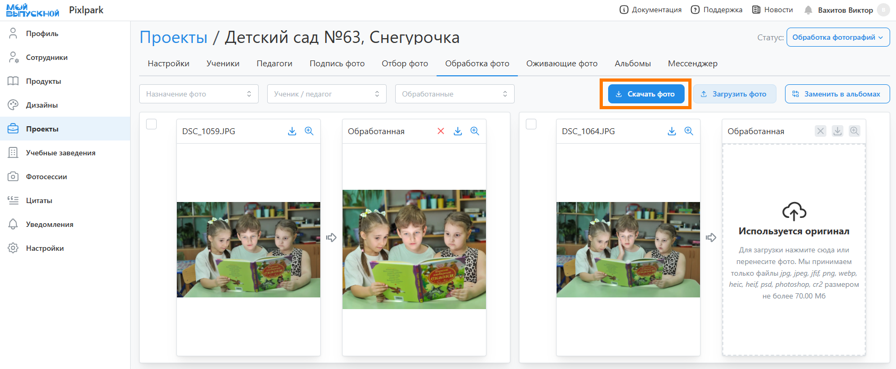
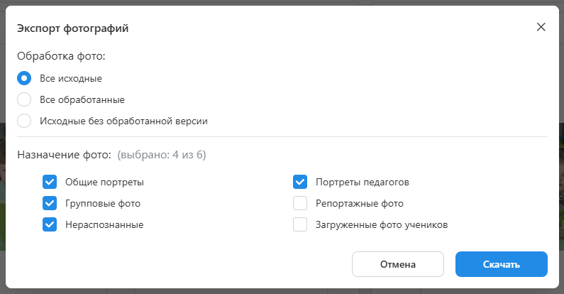

# 4. Обработка фотографий
:::info[Информация]
Данный этап работы можно пропустить, если в фотосессии загружались обработанные снимки.
:::
* Следующим этапом после согласования дизайнов является "__Обработка фотографий__". Он состоит из нескольких шагов, которые рассмотрим ниже.

## Скачивание фотографий
* Для скачивания используемых в альбомах фотографий необходимо:
    + Перейти в раздел "__Обработка фото__" и нажать кнопку "__Скачать фото__".
   
    + В открывшемся модальном окне задать фильтр по фотографиям и нажать кнопку "__Скачать__".
    
    + Также допускается поштучное скачивания фотографий со страницы списка.

## Обрбаотка фотографий
* При пакетном скачивании фотографий все портреты будут находиться в одной папке, а остальные снимки - в другой. После обработки файлов их необходимо загрузить обратно через кнопку “__Загрузить фото__”, не изменяя при этом их названия.
* Для автоматизации процессе обработки фотографий можно подключить внешние сервисы вырезки фона и ретуши портретов. Вырезка фона осуществляется автоматически при генерации альбомов, а ретушь - при ручном выделении файлов и нажатии кнопки "__Ретушировать__". Подробную информацию по подключению данных сервисов можно найти в [отдельной статье](/faq/integrations).

## Замена в альбомах
* После загрузки фотографий необходимо нажать кнопку "__Заменить в альбомах__". Если пропорция обработанных снимков была изменена более чем на 10%, то сервис предложит обновить используемые раскладки коллажей.
* После изменение используемых раскладок мы рекомендуем проверить корректность альбомов через раздел "__Подготовка к печати__". Встроенный механизм проверки на ошибки (кнопка "__Педупреждения__") сообщит, если на какой-то фотографии голова вышла за пределы зоны видимости.