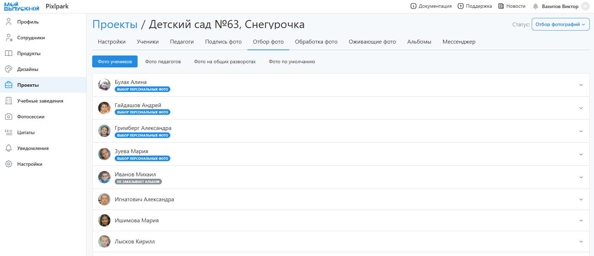

# 2. Отбор фотографий
## Набор фотографий
* Следующим этапом после настройки проекта является отбор фотографий и задание цитат для формирования дизайнов. Это может сделать фотограф/координатор или сам ученик. 
* Набор необходимых фотографий определяется используемым дизайном. В панели управления работа по выбору фотографий ведется во вкладке "__Отбор фото__" или в профиле каждого участника.
* 
* В общем случае интерфейс раздела содержит несколько вкладок:
    + __Фото учеников/педагогов__ - это портретные, репортажные и групповые снимки для персональных разворотов альбомов участников.
    + __Фото на общих разворотах__ - это репортажные и групповые снимки для общих разворотов альбома. Вкладка будет отсутствовать, если в дизайне все развороты персональные.
    + __Фото по умолчанию__ - это репортажные и групповые снимки для персональных разворотов альбома, которые будут использоваться в двух случаях:
        + Если в настройках доступа в ЛК запрещен выбор персональных фото.
        + Если в разделе "Настройка" включена функция автодобора персонлаьных фотографий.
* Некоторые блоки выбора могут быть скрыты, если в настройках доступа в ЛК задано ограничение выбора портретов.
* Выбираемые общие фотографии во вкладке "__Фото по умолчанию__" копируются всем участникам. Однако этот выбор может быть изменен. Данный подход упрощает процесс отбора, т.к. зачастую общие фотографии у всех одинаковые.

## Выбор фотографий
* Для отбора фотографий у конретной рамки необходимо:
    1. Нажать кнопку "__Выбрать фото__", откроется модальное окно.
    2. Загрузить собственные снимки, если это разрешено в разделе "Настройка".
    3. Выставить необходимый фильтр по фото и, если требуется, сгруппировать снимки по схожести.
    4. Выделить понравишиемся фотографии и нажать кнопку "__Сохранить__".
    5. Для выбора снимков из группы необходимо нажать на соответствующую иконку.
    6. Если какие-то из снимков уже выбраны для общих разворотов, сервис предупредит об этом.
    7. В нижней части окна так же будет информационное сообщение об ошибках.

## Проверка выбора
* При формировании альбомов часто персональные фотографии выбирают сами ученики. Для отслеживания завершения отбора в сервисе предусмотрена цветовая индикация как в столбце раздела "__Участники__", так и напротив участника в разделе "__Отбор фото__".
* Сами иконки могут быть нескольких типов:
    + __Зеленая галочка__ - фотографии выбраны.
    + __Красный крестик__ - фотографии не выбраны.
    + __Серая галочка__ - выбор фотографий не требуется.
    + __Оранжевый минус__ - фотографии пока не выбраны (этап отбора).
