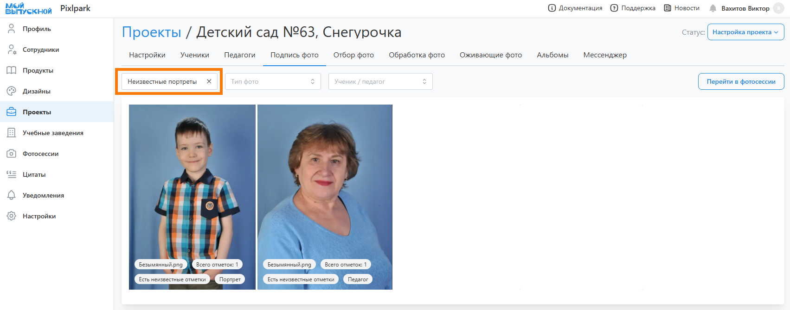
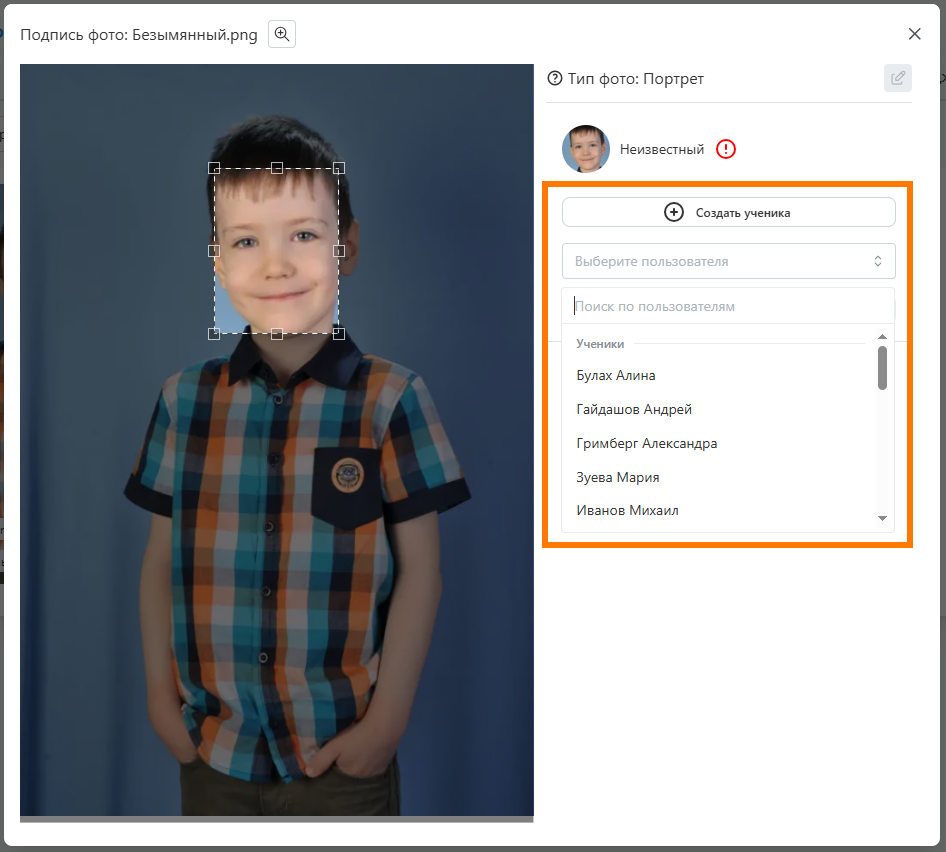
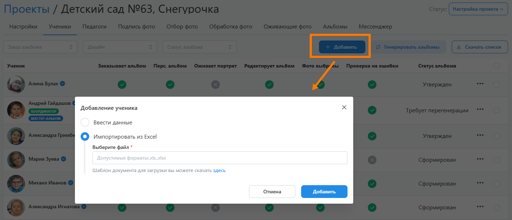

# 3. Подпись фотографий
:::info[Информация]
Данный этап работы является опциональным и настраивается в разделе "__Настройка__". По умолчанию он __выключен__.
:::
* Следующим этапом работы над проектом после его настройки и загрузки фотографий является "__Подпись фотографий__" - идентификация учеников на портретных снимках.
* Вне зависимости от активации этапа существует несколько способов подписи фотографий:
    1. Загрузить в фотосессии проименованные портреты через ФИО.
    2. Подписать все уникальные портреты фотографу или координатору.
    3. Оставить выбор своего портрета ученикам при регистрации.
:::tip[Часто задаваемые вопросы]
[Как предоставить доступ к проекту координатору](/faq/project-work#как-предоставить-доступ-к-проекту)?
:::
* Для подписи снимков необходимо:
    + Перейти во вкладку “__Подпись фото__” - здесь отображаются снимки со всех фотосессий, которые можно отфильтровать по наличию ошибок, типу и персонажу (ученику или педагогу).
    + Используя фильтр "__Ошибки__" проверить и исправить все неправильно заданные типы фотографий, последовательно выбирая значения: Фото без типа, Портрет с 2 персонами, Репортаж с 1 персоной.
    + В фильтре "__Ошибки__" выбрать значение "__Неизвестные портреты__", а затем нажать на первую фотографию.
    
    + В открывшемся модальном окне справа от снимка выбрать ученика из списка или добавить нового. Нажать "__Сохранить__". Повторить действие для других фотографий.
    

* Для удобства работы можно предварительно завести списки учеников и педагогов в соответствующих вкладках проекта. Их профили могут быть добавлены вручную, импортированы из excel-файла или автоматически созданы при загрузке поименованных портретов. При этом педагоги в проект могут быть добавлены еще из базы учебных заведений.

* При переводе проекта в этот статус предусмотрено уведомление координатора о необходимости подписать фотографии. Аналогичное уведомление также будет отправлено за сутки до истечения соответствующего дедлайна, если в проекте будут оставаться неподписанные портреты.
