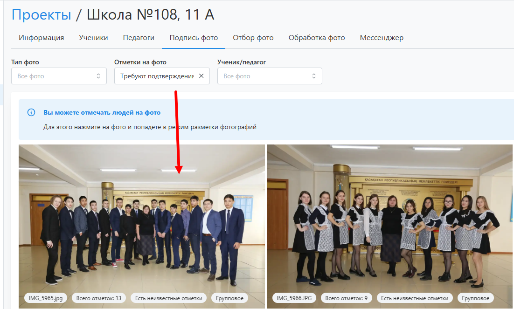
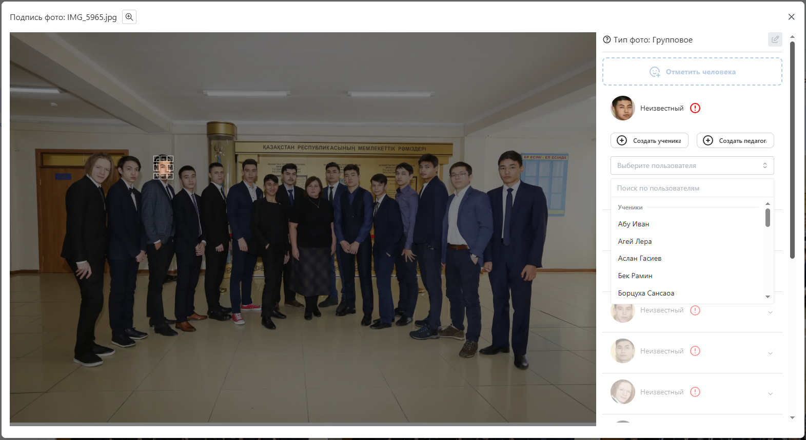
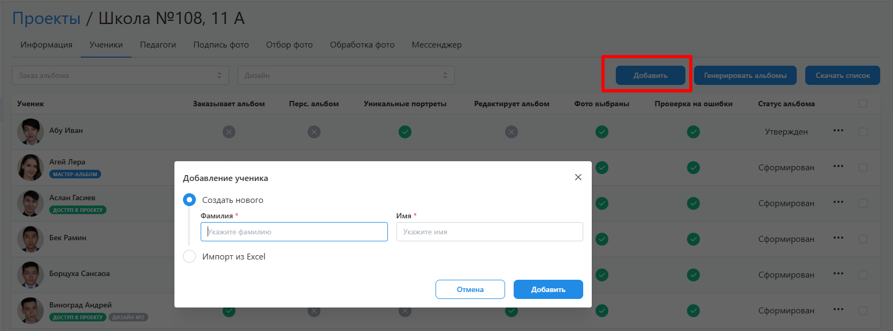

# 3. Подпись фотографий
:::info[Информация]
Данный этап работы яляется опциональным, т.к. подпись фотографий может осуществляться либо при заргузке проименованных портретов, либо в процессе регистрации ученика в личном кабинете.
:::
* Следующим этапом работы над проектом после его настройки и загрузки фотографий является __подпись уникальных портретов__. Это позволит сервису распределить все снимки по ученикам где они присутствуют для удобства их последующего выбора в альбом. 
* Существует несколько способов подписи фотографий:
    1. Загрузить в фотосессии проименованные портреты через ФИО.
    2. Оставить ученикам выбор себя из списка уникальных портретов при регистрации.
    3. Подписать все уникальные портреты за раз. Далее будем рассматривать этот вариант.
:::tip[Часто задаваемые вопросы]
[Как предоставить доступ к проекту координатору](/faq/project-work#как-предоставить-доступ-к-проекту)?
:::
* Во вкладке “__Подпись фото__” отображаются снимки со всех фотосессий, которые можно отфильтровать по типу, наличию неизвестных лиц на фото (или вообще их отсутствию) и ученику.

* Самостоятельно подписать учеников можно нажатием на фото с неизвестными отметками, а затем в открывшемся модальном окне справа указать учеников и педагогов, которые присутствуют на снимке. Если на каких-то снимках система не найдет человека, то его можно отметить самостоятельно. После сохранения система автоматически подпишет отмеченных людей на всех остальных фотографиях.

* Для удобства можно предварительно завести списки учеников и педагогов в соответствующих вкладках проекта. Их профили могут быть добавлены вручную поштучно, импортированы из excel-файла или автоматически созданы при загрузке поименованных портретов. При этом педагоги вместе с фотографиями еще могут быть добавлены из базы учебных заведений.

* У координаторов аналогичная функция есть в ЛК во вкладке “Подпись фото”. Для удобства имеющиеся фильтры позволяют оставить уникальные неподписанные портреты. Например, если в классе 20 учеников и для каждого было сделано по 10 снимков, то система предложит подписать лишь 20 разных фотографий.
* После того как все портретные фото будут подписаны, в профиле каждого ученика во вкладке “Фотографии” будут отображаться все снимки, на которых он присутствует. Помимо снимков с фотосессий сервис позволяет загрузить собственные фотографии. Это может сделать менеджер проекта, координатор и ученик в своем ЛК.
* При переводе проекта в этот статус предусмотрено уведомление координатора о необходимости подписать фотографии. Аналогичное уведомление также будет отправлено за сутки до истечения соответствующего дедлайна, если в проекте будут оставаться неподписанные портреты.
