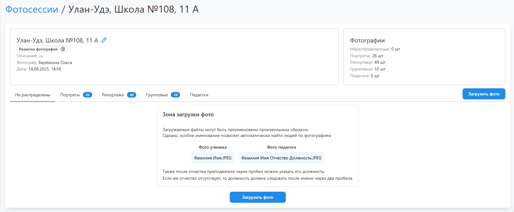

# 2. Загрузка фотографий
* После настройки проекта можно перейти к загрузке фотографий через раздел “__Фотосессии__”. Каждая фотосессия фактически является папкой с фотографиями после съемки, их может быть несколько для одного проекта. Поддерживаются следующие форматы файлов для загрузки: __JPEG, PNG, HEIC, HEIF, JFIF, PDF, PSD__.
* Все фотографии делятся на четыре типа:
    + __Портрет__ - портреты учеников;
    + __Педагог__ - портреты педагогов;
    + __Репортаж__ - сюжетные снимки с одним или несколькими учениками;
    + __Групповое__ - групповые фотографии со всеми учениками.
* Если перед загрузкой файлы не были рассортированы, то их необходимо загружать во вкладку “__Не распределены__”. После завершения загрузки система запустит процесс поиска лиц на фото для последующего распределение файлов по типам по следующей логике:
    + если на снимке находится одно лицо, то фотография считается портретной (в том числе сюда по умолчанию попадают портреты педагогов);
    + если на снимке находится несколько лиц, то фотография считается репортажной;
    + если на снимке находится более 80% лиц, которые есть в фотосессии и в проекте, то фотография считается групповой.
* Также перед загрузкой допускается именовать портреты специальным образом:
    + Портреты учеников - Фамилией и Именем (пример: ```Фамилия Имя.jpg```);
    + Портреты педагогов - Фамилией, Именем, Отчеством и Должностью, где “должность” является необязательной (пример: ```Фамилия Имя Отчество.jpg``` или ```Фамилия Имя Отчество Должность.jpg```).
* В этом случае после загрузки система автоматически создаст в проекте аккаунты учеников и педагогов, а сами ученики будут отмечены на всех фотографиях, где встречаются (на основании подписанного портретного снимка).
* Если перед загрузкой файлы были рассортированы по типам, то их рекомендуется загружать по своим вкладкам.

